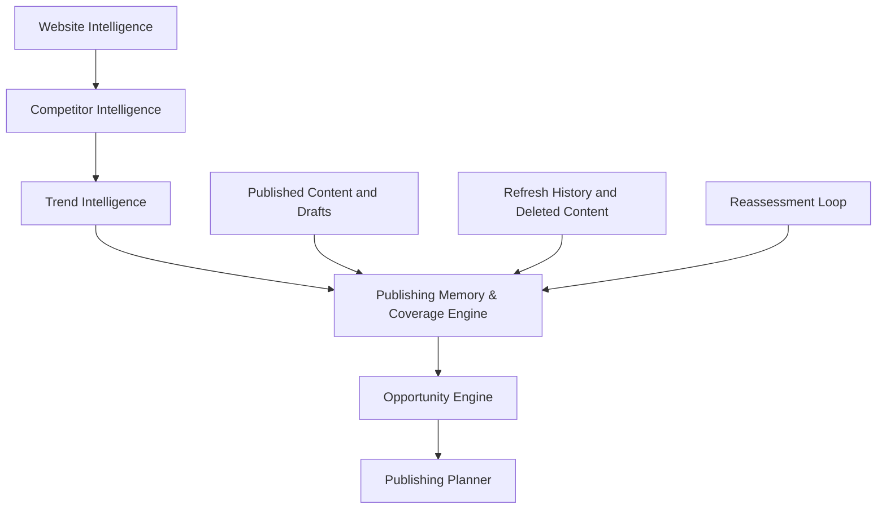

# Trend Intelligence v1 Plan

## Goal

Move Trendplot from mostly website-derived opportunities to market-derived publishing opportunities.

Today, Website Intelligence discovers opportunities mainly from:

- Site content.
- Competitor content.
- Inferred entities.

Trend Intelligence v1 should add a separate market intelligence layer that discovers:

- What people search for.
- What topics appear to be growing.
- What competitors are discussing.
- What audiences are asking.
- What content opportunities currently exist.

This layer must not hardcode niches. It must work for ecommerce, software, local business, education, media, research sites, and future verticals.

## Core Principle

Website Intelligence answers:

> What is this website about?

Trend Intelligence answers:

> What does the market currently care about around this niche?

Publishing Memory answers:

> What have we already covered, and what should we avoid repeating?

The systems should remain separate but connected. Website Intelligence provides context. Trend Intelligence uses that context to discover external demand. Publishing Memory & Coverage Engine uses published content, drafts, refresh history, deleted content, freshness, entities, clusters, audiences, search intent coverage, and future performance signals to decide whether Trendplot should create new content, refresh existing content, merge competing pages, or choose a different angle.

## High-Level Flow

```text
Website Intelligence
  -> detected niche
  -> entities
  -> products/services
  -> audiences
  -> competitor themes
  -> AI trend query generation
  -> provider fan-out
  -> normalized trend signals
  -> trend scoring
  -> Publishing Memory & Coverage Engine
  -> opportunity enrichment
  -> Trend Insights UI
  -> content calendar planning
```

Expanded planning flow:



## Backend Architecture

Add and evolve these modules:

```text
app/trends/
  service.py
  query_builder.py
  scoring.py
  models.py
  providers/
    __init__.py
    base.py
    null.py
    search_console.py
    bing_webmaster.py
    google_trends.py
    youtube.py
    web_search.py
    ahrefs.py
    semrush.py
    dataforseo.py
app/publishing_memory/
  service.py
  coverage.py
  freshness.py
  clustering.py
  models.py
```

Responsibilities:

- `service.py`: orchestrates trend discovery for a workspace.
- `query_builder.py`: generates trend discovery queries from niche/entities/audiences using AI.
- `scoring.py`: scores freshness, velocity, niche relevance, audience relevance, and opportunity value.
- `models.py`: shared internal DTOs.
- `providers/`: optional provider implementations and stubs.
- `app/publishing_memory/service.py`: orchestrates workspace publishing memory and coverage summaries.
- `app/publishing_memory/coverage.py`: calculates entity, cluster, audience, and intent coverage.
- `app/publishing_memory/freshness.py`: calculates content age, staleness, refresh candidacy, and freshness scores.
- `app/publishing_memory/clustering.py`: groups published and draft content into stable topic clusters.
- `app/publishing_memory/models.py`: shared DTOs for coverage records, refresh candidates, and cannibalization risks.

## Provider Architecture

All providers should be optional. Trendplot must still work when none are configured.

Provider interface:

```python
class TrendProvider(Protocol):
    provider_name: str
    provider_type: str

    async def fetch_signals(
        self,
        queries: list[TrendDiscoveryQuery],
        context: TrendDiscoveryContext,
    ) -> TrendProviderResult:
        ...
```

Provider result shape:

```python
{
    "provider": "google_trends",
    "status": "ok | degraded | not_configured | failed",
    "signals": [],
    "warnings": [],
    "raw": {}
}
```

Initial providers:

- `NullTrendProvider`: always available, returns low-confidence inferred signals.
- `SearchConsoleProvider`: stub for owned-site search query data.
- `BingWebmasterProvider`: stub for owned-site Bing query/index data.
- `GoogleTrendsProvider`: stub for trend freshness and velocity.
- `YouTubeProvider`: adapter for YouTube topic/video demand.
- `WebSearchProvider`: stub for web/search result discovery.

Future provider stubs:

- `AhrefsProvider`
- `SemrushProvider`
- `DataForSEOProvider`

Do not implement premium integrations yet. Only create stable interfaces and config boundaries.

## Trend Query Generation

After Website Intelligence, Trendplot should build a `TrendDiscoveryContext` from:

- Detected niche.
- Entities.
- Products/services.
- Audiences.
- Competitor themes.
- Content gaps.
- Optional user context.

Then AI generates trend discovery queries.

Example input:

```json
{
  "detected_niche": "running shoes",
  "entities": ["marathon shoes", "trail shoes", "carbon plate"],
  "audiences": ["marathon runners", "trail runners"]
}
```

Example generated queries:

- `running shoe trends`
- `marathon shoe technology`
- `trail shoe trends`
- `carbon plate shoes`

Example input:

```json
{
  "detected_niche": "peptides",
  "entities": ["MOTS-C", "Kisspeptin", "Retatrutide"],
  "audiences": ["research-oriented readers"]
}
```

Example generated queries:

- `mitochondrial peptide research`
- `longevity research peptides`
- `AMPK signaling research`
- `metabolic peptide research`

These examples are illustrative only. The code must not contain niche mappings.

## Trend Signal Model

A normalized trend signal should contain:

- `topic`
- `query`
- `source`
- `provider`
- `confidence`
- `freshness`
- `velocity`
- `niche_relevance`
- `audience_relevance`
- `business_relevance`
- `opportunity_score`
- `why_it_matters`
- `recommended_angle`
- `evidence`
- `raw_signal`
- `status`
- `expires_at`

User-facing UI should show labels and explanations, not raw numeric scores by default.

## Publishing Memory & Coverage Engine

Publishing Memory & Coverage Engine is a separate planning layer. It should not replace Trend Intelligence. It answers what Trendplot already knows about the site’s publishing history before the system decides what to create next.

Coverage is one output of publishing memory. The broader layer should eventually track:

- Published articles.
- Draft articles.
- Refresh history.
- Deleted content.
- Content age.
- Entities.
- Clusters.
- Audiences.
- Search intent coverage.
- Performance signals.

Core question:

```text
What have we already covered?
```

Planning question:

```text
Given trend demand, coverage, freshness, business value, and cannibalization risk, should we create, refresh, merge, skip, or choose another angle?
```

### Coverage Dimensions

Track coverage across entities, clusters, audiences, and search intent.

Entity examples:

- `MOTS-C`
- `Kisspeptin`
- `Carbon Plate Shoes`
- `Paris Fashion Week`

Entity coverage fields:

- `entity`
- `article_count`
- `published_count`
- `draft_count`
- `freshness`
- `coverage_score`
- `saturation_score`
- `cannibalization_risk`

Cluster examples:

- `mitochondrial peptides`
- `longevity research`
- `running shoes`
- `luxury handbags`

Cluster coverage fields:

- `cluster`
- `coverage_score`
- `freshness_score`
- `opportunity_gap`
- `saturation_score`
- `last_published`
- `last_updated`

Audience examples:

- `beginners`
- `researchers`
- `enthusiasts`
- `buyers`

Audience coverage fields:

- `audience`
- `coverage_score`
- `content_count`
- `underserved`

Search intent coverage:

- `informational`
- `comparison`
- `transactional`
- `navigational`

The engine should track balance across intent types so Trendplot does not overproduce one format while ignoring others.

### Refresh Candidate Planning

Publishing Memory must support refresh opportunities, not only new content opportunities.

Planned concepts:

- `refresh_score`
- `refresh_candidate`
- `refresh_reason`
- `last_major_update`

Planning rule: when an existing article has strong topical coverage but is old, stale, or newly relevant because of trend demand, the planner should prefer refreshing the existing article over creating a near-duplicate.

Example:

- Existing article: `What Is MOTS-C?`
- Published: `11 months ago`
- Trend relevance: `high`
- Coverage: `already strong`
- Recommendation: `refresh existing article`, not `create another MOTS-C overview`

### Cannibalization Detection

Publishing Memory should identify risks before new opportunities enter the calendar.

Planned concepts:

- `cannibalization_risk`
- `duplicate_topic_risk`
- `saturation_score`

Detection should consider:

- Topic duplication.
- Entity saturation.
- Cluster saturation.
- Near-identical opportunity titles or intents.
- Keyword cannibalization.

Planner behavior:

- Prefer refresh when an existing page already owns the topic.
- Prefer merge when multiple existing pages compete.
- Prefer alternate angle when the entity is saturated but adjacent subtopics are underserved.

Example:

- Existing content: `What Is MOTS-C?`, `MOTS-C Overview`, `Understanding MOTS-C`
- New opportunity: `MOTS-C Explained`
- Result: high cannibalization risk
- Recommended action: refresh, merge, or choose an alternate angle

### Future Performance-Aware Coverage

Do not implement performance-aware coverage in v1, but preserve the architecture.

Future versions may incorporate:

- Search Console.
- Bing Webmaster.
- Impressions.
- Clicks.
- Rankings.
- Engagement metrics.
- Conversion metrics.

Coverage should eventually mean `coverage quality`, not article count. Ten articles about a cluster should not automatically mean strong coverage if rankings are weak, impressions are low, engagement is poor, or conversions are absent.

## Database Changes

Extend the current `trend_signals` persistence and add discovery run tracking.

### `trend_discovery_runs`

Fields:

- `id`
- `workspace_id`
- `analysis_job_id`
- `status`
- `summary`
- `context_json`
- `provider_status_json`
- `warnings_json`
- `created_at`
- `updated_at`

Purpose:

- Track each market discovery pass.
- Store provider health/degradation.
- Make trend discovery auditable in Developer/Admin UI.

### `trend_discovery_queries`

Fields:

- `id`
- `run_id`
- `query`
- `query_type`
- `target_entity`
- `target_audience`
- `reason`
- `created_at`

Purpose:

- Store AI-generated market research queries.
- Explain why a query was used.
- Support debugging and future query refinement.

### Extend `trend_signals`

Add fields:

- `run_id`
- `query_id`
- `topic`
- `query`
- `source`
- `provider`
- `confidence`
- `freshness`
- `velocity`
- `niche_relevance`
- `audience_relevance`
- `business_relevance`
- `opportunity_score`
- `why_it_matters`
- `recommended_angle`
- `evidence_json`
- `raw_signal_json`
- `status`
- `expires_at`

Existing fields can be retained for compatibility during rollout.

### `content_entities`

Fields:

- `id`
- `workspace_id`
- `post_id`
- `job_id`
- `content_plan_item_id`
- `entity`
- `entity_type`
- `confidence`
- `source`
- `created_at`

Purpose:

- Track which entities are already covered by published content and drafts.
- Support entity saturation and entity gap analysis.
- Support duplicate-topic and cannibalization checks.

### `content_clusters`

Fields:

- `id`
- `workspace_id`
- `post_id`
- `job_id`
- `content_plan_item_id`
- `cluster`
- `confidence`
- `source`
- `created_at`

Purpose:

- Track which topic clusters are already covered.
- Support cluster freshness, saturation, and underserved-cluster detection.
- Connect publishing history to future calendar planning.

### `content_coverage`

Fields:

- `id`
- `workspace_id`
- `coverage_type`
- `name`
- `coverage_score`
- `freshness_score`
- `content_count`
- `published_count`
- `draft_count`
- `gap_score`
- `saturation_score`
- `cannibalization_risk`
- `duplicate_topic_risk`
- `refresh_score`
- `refresh_candidate`
- `refresh_reason`
- `last_published`
- `last_updated`
- `last_major_update`
- `updated_at`

Purpose:

- Store summarized coverage for entities, clusters, audiences, and search intents.
- Feed planning priority with coverage gap, saturation, freshness, and refresh signals.
- Support the workspace `Your Coverage` summary.

### Future Publishing Memory Records

Future schema may add:

- Deleted content history.
- Merge recommendations.
- Redirect/canonical relationships.
- Refresh action history.
- Performance snapshots from Search Console, Bing Webmaster, rank providers, and analytics.

## Opportunity Enrichment

Trend Intelligence should enrich opportunities, not replace the Opportunity Engine.

Add trend-aware scoring fields to opportunities or opportunity metadata:

- `trend_relevance`
- `trend_velocity`
- `niche_fit`
- `audience_fit`
- `business_fit`
- `semantic_gap`
- `competitor_gap`
- `coverage_gap`
- `publishing_history_fit`
- `freshness_need`
- `refresh_score`
- `refresh_candidate`
- `cannibalization_risk`
- `duplicate_topic_risk`
- `saturation_score`
- `planning_priority`

Planning priority should combine:

```text
trend relevance
+ trend velocity
+ audience fit
+ business fit
+ coverage gap
+ publishing history fit
+ freshness need
+ semantic gap
+ competitor gap
+ refresh score
- cannibalization risk
- saturation risk
- verification risk
```

High `refresh_score` should increase the priority of the `refresh_existing_content` action, not the priority of creating another new article on the same topic.

The user UI should not expose these raw values by default. Developer/Admin UI can show them.

Planner action should not always be `create_new_content`. Based on Publishing Memory, each opportunity should be classified as one of:

- `create_new_content`
- `refresh_existing_content`
- `merge_existing_content`
- `expand_existing_content`
- `skip_duplicate`
- `alternate_angle`

Trendplot should stop thinking only:

```text
What is trending?
```

and start planning from:

```text
Trend Demand
+ Coverage Gap
+ Business Value
+ Publishing Memory
+ Content Freshness
+ Cannibalization Risk
+ Future Performance Signals
```

## API Design

User-facing APIs:

- `POST /autopilot/workspaces/{workspace_id}/trend-discovery`
  Runs Trend Intelligence for a workspace.

- `GET /autopilot/workspaces/{workspace_id}/trend-insights`
  Returns simplified trend cards.

- `POST /autopilot/workspaces/{workspace_id}/enrich-opportunities`
  Applies trend signals to opportunity planning scores.

- `GET /autopilot/workspaces/{workspace_id}/coverage`
  Returns simplified coverage summaries for entities, clusters, audiences, and search intent.

- `GET /autopilot/workspaces/{workspace_id}/refresh-candidates`
  Returns existing pages that should be refreshed instead of creating new content.

Developer/Admin APIs:

- `GET /developer/trends/providers`
  Lists configured trend providers and health.

- `GET /developer/trends/runs/{run_id}`
  Shows a trend discovery run, generated queries, provider statuses, and warnings.

- `GET /developer/trends/signals/{signal_id}`
  Shows raw signal details and evidence.

- `GET /developer/publishing-memory/workspaces/{workspace_id}`
  Shows raw coverage maps, saturation, freshness, cannibalization risks, and refresh candidates.

Optional:

- `GET /autopilot/workspaces/{workspace_id}/trend-signals`
  Returns raw signals for debugging or admin views.

## User UI Design

Update the existing `Trend Insights` panel.

Show:

- Trending topic.
- Rising opportunity.
- Source/provider.
- Confidence label.
- Freshness label.
- Suggested content angle.
- “Why we think this matters.”

Avoid showing:

- Raw provider payloads.
- Raw score formulas.
- Debug JSON.
- Internal query generation unless Developer/Admin mode is active.

Example card:

```text
Mitochondrial peptide research

Freshness: Medium
Confidence: Medium
Source: YouTube + inferred market query
Suggested angle: Research explainer

Why we think this matters:
This topic connects to detected peptide entities, recurring longevity/metabolic research questions,
and gaps in the current content footprint.
```

Add a `Your Coverage` section to the user workspace.

Show:

- Coverage by important clusters.
- Gaps identified.
- Refresh candidates.
- Recommended next content.

Example:

```text
Your Coverage

Mitochondrial Peptides: 82%
Metabolic Peptides: 44%
Longevity Research: 18%

Gaps Identified

- Retatrutide
- Kisspeptin
- AMPK Signaling

Recommended Next Content

1. Retatrutide Overview
2. Kisspeptin FAQ
3. AMPK Research Guide
```

If cannibalization risk is high, the UI should explain the decision in plain language:

```text
We recommend refreshing your existing MOTS-C article instead of creating another overview, because this topic is already strongly covered and a new page may compete with your current content.
```

## Developer/Admin UI

Add diagnostics for:

- Trend discovery runs.
- Generated queries.
- Provider statuses.
- Raw provider warnings.
- Normalized trend signals.
- Opportunity enrichment scores.
- Publishing memory snapshots.
- Coverage maps.
- Refresh candidates.
- Cannibalization risks.
- Saturated entities and clusters.

This should remain outside the default user workspace.

## Configuration

Add provider-level config flags:

```env
TREND_INTELLIGENCE_ENABLED=true
TREND_DISCOVERY_MAX_QUERIES=20
TREND_DISCOVERY_MAX_SIGNALS=50
TREND_PROVIDER_SEARCH_CONSOLE_ENABLED=false
TREND_PROVIDER_BING_WEBMASTER_ENABLED=false
TREND_PROVIDER_GOOGLE_TRENDS_ENABLED=false
TREND_PROVIDER_YOUTUBE_ENABLED=false
TREND_PROVIDER_WEB_SEARCH_ENABLED=false
TREND_PROVIDER_AHREFS_ENABLED=false
TREND_PROVIDER_SEMRUSH_ENABLED=false
TREND_PROVIDER_DATAFORSEO_ENABLED=false
PUBLISHING_MEMORY_ENABLED=true
COVERAGE_REFRESH_THRESHOLD_DAYS=180
COVERAGE_SATURATION_THRESHOLD=0.8
CANNIBALIZATION_RISK_THRESHOLD=0.7
```

Provider credentials should be added later only when the provider is implemented.

## Reassessment Loop

Weekly reassessment should use Publishing Memory and coverage data, not only trend movement.

Reassessment questions:

- Are we overpublishing one cluster?
- Are we ignoring important entities?
- Which clusters are stale?
- Which clusters are growing?
- Which articles should be refreshed?
- Which clusters are saturated?
- Which opportunities create cannibalization risk?
- Which entities are overrepresented?
- Which entities are underrepresented?
- Which existing pages should be expanded instead of creating new ones?

Reassessment outputs should include:

- Refresh candidates.
- Saturated clusters.
- Underserved entities.
- Cannibalization risks.
- Merge or expansion recommendations.
- New content opportunities only where coverage gap and business value justify them.

## Rollout Plan

### Phase 1: Foundation

- Add trend provider protocol.
- Add `NullTrendProvider`.
- Add trend discovery context models.
- Add trend query model.
- Add discovery run persistence.
- Keep current app behavior working without provider credentials.

### Phase 2: AI Query Generation

- Add AI trend query builder.
- Use detected niche/entities/products/audiences.
- Store generated queries.
- Add prompt template for trend query generation.
- Ensure there are no hardcoded niche mappings.

### Phase 3: Provider Fan-Out

- Implement provider registry for trend providers.
- Run all configured providers.
- Normalize provider results into one signal shape.
- Persist provider status and warnings.

### Phase 4: Trend Scoring

- Score confidence, freshness, velocity, niche relevance, audience relevance, business fit, and opportunity score.
- Generate `why_it_matters`.
- Mark low-confidence signals as needing verification.

### Phase 5: Opportunity Enrichment

- Match trend signals to opportunities.
- Add trend-aware and coverage-aware planning priority.
- Use Publishing Memory to identify coverage gaps, saturation, refresh candidates, and cannibalization risks.
- Assign planner actions such as `create_new_content`, `refresh_existing_content`, `merge_existing_content`, `expand_existing_content`, `skip_duplicate`, or `alternate_angle`.
- Feed enriched opportunities into the content calendar.

### Phase 6: Publishing Memory & Coverage UI/API

- Add coverage summary API.
- Add refresh candidate API.
- Add Publishing Memory developer diagnostics.
- Add `Your Coverage`, `Gaps Identified`, and `Recommended Next Content` workspace sections.
- Add user-facing explanations when Trendplot recommends refresh or alternate angles because of cannibalization risk.

### Phase 7: Trend UI/API

- Add trend discovery API.
- Add Trend Insights API.
- Update workspace Trend Insights panel.
- Add Developer/Admin diagnostics.

### Phase 8: Optional Providers

- Add real YouTube trend adapter first because the project already has YouTube plumbing.
- Add Search Console and Bing Webmaster provider skeletons.
- Keep Google Trends/Web Search/premium providers as stubs until credentials and API choices are finalized.

### Phase 9: Future Performance-Aware Coverage

- Integrate Search Console, Bing Webmaster, rank, engagement, and conversion signals when providers exist.
- Move coverage from article-count coverage toward coverage quality.
- Use performance data to recommend refreshes, merges, expansions, or new content.

## Acceptance Criteria

- Trendplot can run Trend Intelligence with no external providers configured.
- Trendplot can generate market discovery queries from niche/entities/audiences without hardcoded vertical mappings.
- Trend signals are persisted and traceable to discovery runs and queries.
- Publishing Memory can describe what entities, clusters, audiences, and intents are already covered.
- Coverage summaries can identify gaps, saturation, stale clusters, and refresh candidates.
- Opportunity planning can prefer refreshing, merging, expanding, skipping, or choosing alternate angles when new content would create duplication or cannibalization.
- Trend Insights show “why this matters,” source, confidence, and freshness.
- Opportunity planning can use trend relevance, velocity, coverage gap, freshness, publishing history, business value, and cannibalization risk.
- Developer/Admin UI can inspect provider statuses, raw trend run details, publishing memory snapshots, and coverage diagnostics.
- The default user workspace stays simple and does not expose raw scores or JSON.

