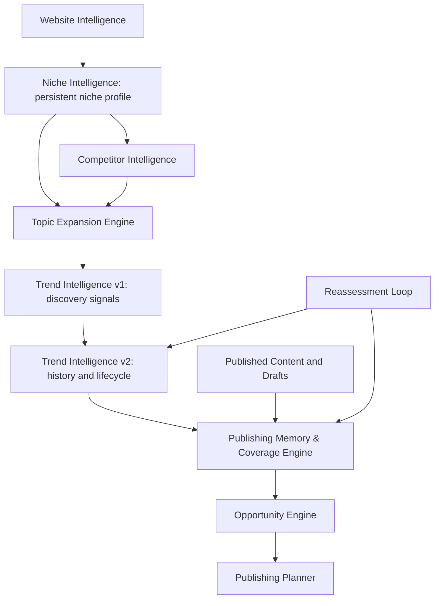

# Trend Intelligence v2 Plan

## Goal

Trend Intelligence v1 discovers market signals.

Trend Intelligence v2 should make Trendplot understand:

> How demand changes over time.

The core value is not static keyword discovery. The core value is detecting movement:

- Rising topics.
- Declining topics.
- Breakout terms.
- Emerging products or services.
- Seasonal patterns.
- Underserved rising demand.
- Competitor topic movement.
- Cross-source confidence.

Trendplot should answer:

> What is becoming more important in this niche?

not only:

> What keywords exist in this niche?

## Core Principle

Trend Intelligence v2 focuses on movement over time, not static volume.

Example:

```text
BPC-157: stable
TB-500: growing
Retatrutide: breakout
Cagrilintide: growing
Sermorelin: declining
```

These examples are illustrative only. The implementation must not contain hardcoded niche logic.

Trendplot should use lifecycle movement to decide whether to:

- Publish now.
- Monitor.
- Refresh existing content.
- Skip.
- Create glossary or support content.
- Create a trend article.
- Update calendar priority.

## Relationship To Existing Architecture

Trend Intelligence v2 extends Trend Intelligence v1. It does not replace v1.

Architectural separation should remain:

```text
Website Intelligence
  -> Niche Intelligence
  -> Competitor Intelligence
  -> Topic Expansion Engine
  -> Trend Intelligence v1
  -> Trend Intelligence v2
  -> Publishing Memory & Coverage Engine
  -> Opportunity Engine
  -> Publishing Planner
```

Expanded flow:



Trend Intelligence v2 must work with:

- Niche Intelligence profiles.
- Topic Expansion Engine outputs.
- Trend Intelligence v1 signals.
- Publishing Memory & Coverage Engine.
- Content Calendar.
- Reassessment Loop.

## Niche Intelligence Layer

Trend Intelligence v2 should plan for a future `Niche Intelligence Layer` between Website Intelligence and Competitor Intelligence.

Purpose:

- Persist understanding of the business between runs.
- Give trend discovery stable context without re-analyzing the same niche facts every time.
- Provide a reusable niche profile for topic expansion, opportunity generation, and publishing planning.
- Separate "what this site is about" from "what the market is doing now."

Questions it should answer:

- What niche is this site in?
- What sub-niches exist?
- What products or services exist?
- What entities matter?
- What audiences matter?
- What terminology is common?
- What categories are important?

Example:

```text
Workspace:
Example Lab

Primary niche:
Research Peptides

Secondary niches:
GLP-1 Research
Longevity
Mitochondrial Peptides

Known entities:
MOTS-C
Retatrutide
TB-500
BPC-157
```

This example is illustrative only. The implementation must remain generic and must not contain peptide-specific mappings.

Niche Intelligence should be updated when:

- Website Intelligence finds new products, services, entities, categories, or audiences.
- Competitor Intelligence reveals repeated category or topic patterns.
- Trend Intelligence repeatedly observes related entities or terminology.
- The user provides additional business context.
- Publishing Memory shows durable content clusters that should become part of the workspace profile.

Niche Intelligence should feed:

- Trend discovery query generation.
- Topic Expansion Engine seed selection.
- Opportunity generation.
- Content calendar prioritization.
- Reassessment recommendations.

## Planned Niche Intelligence Storage

Future planned object:

```text
workspace_niche_profile
```

Possible fields:

- `workspace_id`
- `primary_niche`
- `secondary_niches`
- `known_entities`
- `known_products`
- `known_categories`
- `known_audiences`
- `common_terminology`
- `confidence`
- `last_updated`

Purpose:

- Provide stable context to trend discovery.
- Provide seed topics to the Topic Expansion Engine.
- Reduce repeated rediscovery across trend-analysis runs.
- Help the Opportunity Engine distinguish core business topics from weak adjacent topics.
- Help the Publishing Planner choose content formats that fit the niche and audience.

The profile should support partial confidence. A newly discovered entity can be stored with low confidence until it is corroborated by multiple sources or user confirmation.

## Topic Expansion Engine

Trend tracking alone is insufficient. Trendplot must eventually answer:

> What else should we be tracking?

not only:

> What is already being tracked?

The future-planned `Topic Expansion Engine` should sit between Niche Intelligence and Trend Intelligence.

Position:

```text
Niche Intelligence
  -> Topic Expansion Engine
  -> Trend Intelligence
```

Responsibilities:

- Expand known entities into related topics worth tracking.
- Generate adjacent questions, comparisons, glossary terms, and support topics.
- Create a larger candidate universe before trend scoring and coverage analysis.
- Keep expansion generic across niches.
- Avoid creating final article opportunities until trend and coverage checks have run.

Example:

```text
Retatrutide
  -> Retatrutide mechanism
  -> Retatrutide stability
  -> Retatrutide comparison
  -> Retatrutide FAQ
  -> GLP-1 glossary
  -> Triple agonist overview
```

Generic example:

```text
Running Shoes
  -> Carbon plates
  -> Running economy
  -> Marathon racing shoes
  -> Stack height
  -> Super shoes
```

These examples are documentation examples only. Topic expansion must not depend on niche-specific code paths.

Expansion categories:

- Related entities.
- Related questions.
- Related comparisons.
- Related glossary terms.
- Related research concepts.
- Related support topics.
- Related educational topics.
- Related content clusters.

Expansion sources:

- Website Intelligence.
- Niche Intelligence profile.
- Competitor Intelligence.
- Trend Intelligence v1 signals.
- Trend Intelligence v2 lifecycle history.
- Search Console queries.
- Bing Webmaster Tools queries.
- Google Trends related queries.
- YouTube topics and video titles.
- AI semantic expansion.
- Optional user context.

Expansion outputs:

- New trend topics.
- New entities.
- New questions.
- New glossary terms.
- New comparison ideas.
- New article opportunity candidates.
- New content clusters.

Topic Expansion should occur before opportunity generation.

Example:

```text
Retatrutide
  -> 100 related concepts
  -> Trend analysis
  -> Coverage analysis
  -> Opportunity generation
```

This creates a larger and more intelligent opportunity universe. The Opportunity Engine should receive trend- and coverage-enriched candidates, not raw expansion output alone.

Future goal:

```text
Track existing topics
  -> Continuously discover new topics worth tracking
```

## Data Sources

Trend Intelligence v2 should support free and low-cost sources first. Premium SEO providers should remain optional provider stubs until explicitly implemented.

### Google Trends

Primary trend movement source.

Use for:

- Rising searches.
- Breakout searches.
- Relative trend direction.
- Seasonality.
- Related queries.
- Regional interest when useful.

Important: Google Trends is relative, not absolute volume. A value of `100` means peak relative interest for the selected query, geography, and time range. It should not be treated as search volume.

### Google Search Console

Owned-site demand source.

Use for:

- Impressions.
- Clicks.
- CTR.
- Average position.
- Query growth.
- Page growth.
- Easy-win queries in positions 8-20.
- Pages with rising impressions but weak CTR.

Search Console should be weighted as owned demand. It is especially useful for deciding refreshes, CTR improvements, and support pages for queries where the site is already visible.

### Bing Webmaster Tools

Additional owned-site demand source.

Use for:

- Bing queries.
- Impressions.
- Clicks.
- Indexing signals.
- Keyword opportunities not visible in Google Search Console.

Bing data should follow the same observation normalization model as Search Console.

### Competitor Sitemaps

Competitor sitemaps and RSS feeds should be used for competitor topic movement.

Track:

- Number of competitor articles.
- Newly published competitor pages.
- Competitor topic frequency.
- Competitor publishing cadence.
- Competitor cluster growth.

Competitor movement should not automatically mean "copy this topic." It should be treated as supporting evidence that a cluster may be active in the market.

### YouTube

Use for:

- Videos appearing around niche terms.
- Recency.
- View velocity where available.
- Titles and topics.
- Educational demand.
- Short-form trend inspiration.

YouTube is especially useful for detecting educational demand and emerging phrasing before it appears in owned search data.

### Reddit And Forum Signals

Optional later provider.

Use only through provider interfaces.

Track:

- Mention counts.
- Discussion growth.
- Emerging product or entity mentions.
- Recurring questions.

Forum sources can be noisy and should increase volatility unless corroborated by independent sources.

### Premium SEO Providers

Plan stubs only:

- Ahrefs.
- Semrush.
- DataForSEO.

Trend Intelligence v2 must not require premium SEO APIs.

## Backend Architecture

Add and evolve these modules:

```text
app/niche_intelligence/
  service.py
  profile.py
  models.py
app/topic_expansion/
  service.py
  expander.py
  scoring.py
  models.py
app/trends/
  history.py
  observations.py
  lifecycle.py
  reporting.py
  provider_observations.py
  providers/
    google_trends.py
    search_console.py
    bing_webmaster.py
    competitor_sitemaps.py
    youtube.py
    reddit.py
    ahrefs.py
    semrush.py
    dataforseo.py
```

Responsibilities:

- `app/niche_intelligence/service.py`: maintains the persistent workspace niche profile.
- `app/niche_intelligence/profile.py`: merges website, competitor, trend, memory, and user context into stable niche facts.
- `app/topic_expansion/service.py`: orchestrates topic expansion before trend discovery and opportunity generation.
- `app/topic_expansion/expander.py`: generates related entities, questions, comparisons, glossary terms, and support topics.
- `app/topic_expansion/scoring.py`: assigns expansion confidence and filters weak adjacent topics before trend checks.
- `history.py`: creates and updates normalized tracked trend topics.
- `observations.py`: stores provider observations and normalizes provider-specific payloads.
- `lifecycle.py`: calculates velocity, acceleration, seasonality, volatility, confidence, lifecycle stage, and recommended action.
- `reporting.py`: builds weekly user and developer reports.
- `provider_observations.py`: converts v1 provider outputs into v2 observation records.
- `providers/`: provider-specific observation fetchers.

V2 should not remove v1 provider signal generation. Instead, v1 signals become one input into the v2 topic history system. Niche Intelligence and Topic Expansion are future-planned upstream layers that provide better seeds for v1 and v2 without replacing either trend layer.

## Trend History Database

Trend Intelligence v2 needs persistent history.

### `workspace_niche_profile`

Future-planned workspace-level niche memory.

Planned fields:

- `workspace_id`
- `primary_niche`
- `secondary_niches`
- `known_entities`
- `known_products`
- `known_categories`
- `known_audiences`
- `common_terminology`
- `confidence`
- `last_updated`

Notes:

- This object should persist the stable niche understanding that Trendplot should not rediscover from scratch on every run.
- Lists can initially be stored as JSON fields, then normalized later if querying across workspaces becomes important.
- The profile should be updated from Website Intelligence, Competitor Intelligence, trend observations, Publishing Memory, and optional user context.
- The profile should feed Topic Expansion before trend observations are refreshed.

### `trend_topics`

Represents normalized tracked terms and topics.

Planned fields:

- `id`
- `workspace_id`
- `topic`
- `normalized_topic`
- `topic_type`
- `entity_type`
- `detected_niche`
- `first_seen_at`
- `last_seen_at`
- `status`
- `created_at`
- `updated_at`

Topic types:

- `product`
- `service`
- `entity`
- `keyword`
- `cluster`
- `question`
- `competitor_topic`
- `trend`

Notes:

- `topic` preserves the display label.
- `normalized_topic` is used for deduplication and matching.
- `topic_type` describes why Trendplot is tracking it.
- `entity_type` is optional provider or AI-derived classification.
- `status` should support `active`, `monitoring`, `ignored`, `merged`, and `retired`.

### `trend_observations`

Stores each measurement from each provider.

Planned fields:

- `id`
- `topic_id`
- `provider`
- `source`
- `observed_at`
- `value`
- `relative_value`
- `rank`
- `impressions`
- `clicks`
- `ctr`
- `position`
- `mentions`
- `views`
- `result_count`
- `raw_json`
- `confidence`
- `created_at`

Important:

Different providers return different data. Use nullable fields and `raw_json` for provider-specific detail.

Examples:

- Google Trends may populate `relative_value`, `rank`, and `raw_json`.
- Search Console may populate `impressions`, `clicks`, `ctr`, and `position`.
- YouTube may populate `views`, `result_count`, and `raw_json`.
- Competitor sitemap tracking may populate `result_count`, `value`, and `raw_json`.

### `trend_lifecycle_snapshots`

Stores calculated trend state over time.

Planned fields:

- `id`
- `topic_id`
- `calculated_at`
- `lifecycle_stage`
- `velocity_score`
- `acceleration_score`
- `seasonality_score`
- `confidence_score`
- `volatility_score`
- `opportunity_score`
- `recommended_action`
- `rationale`
- `created_at`

Lifecycle stages:

- `emerging`
- `growing`
- `stable`
- `declining`
- `seasonal`
- `breakout`
- `saturated`
- `unknown`

Recommended actions:

- `publish_now`
- `schedule_supporting_article`
- `refresh_existing_content`
- `monitor`
- `skip`
- `merge_or_consolidate`
- `create_glossary_page`
- `create_trend_article`
- `schedule_seasonal_content`

## Observation Normalization

All providers should produce normalized observation records.

Internal observation shape:

```python
{
    "topic": "retatrutide",
    "normalized_topic": "retatrutide",
    "provider": "google_trends",
    "source": "related_queries",
    "observed_at": "2026-05-31T18:00:00Z",
    "relative_value": 82.0,
    "impressions": None,
    "clicks": None,
    "mentions": None,
    "views": None,
    "confidence": 0.72,
    "raw": {}
}
```

Provider adapters should be responsible for mapping provider-specific data into this shape. Lifecycle calculation should not need to know every provider's raw schema.

## Trend Metrics

### Velocity

Velocity measures how fast interest is increasing or decreasing.

Signals:

- Query impressions growing week over week.
- Google Trends relative interest rising.
- Competitor publication frequency increasing.
- YouTube results becoming more recent or frequent.
- Reddit or forum mentions increasing.

Initial calculation:

```text
velocity_score = normalized recent slope across observations
```

Use provider-specific series when possible. If only two points exist, velocity should be low-confidence.

### Acceleration

Acceleration measures whether growth itself is speeding up.

Example:

```text
Week 1: +5%
Week 2: +12%
Week 3: +35%
```

This may indicate breakout behavior.

Initial calculation:

```text
acceleration_score = recent_velocity - previous_velocity
```

Breakout classification should require strong acceleration or explicit breakout provider evidence.

### Seasonality

Seasonality identifies recurring demand windows.

Examples:

- Christmas gifts.
- Summer shoes.
- Marathon season.
- Black Friday.
- Fashion week.
- Pre-summer fitness searches.

Initial plan:

- Store enough historical observations to compare the same period across prior cycles.
- Until enough history exists, rely on Google Trends seasonality signals when available.
- Treat AI-inferred seasonality as low-confidence unless supported by observations.

### Volatility

Volatility measures how unstable the trend is.

High volatility may indicate:

- Short hype cycle.
- News spike.
- Temporary social media surge.
- Provider noise.

Initial calculation:

```text
volatility_score = normalized variation in recent observations
```

High volatility should reduce autopublish confidence but may still justify monitoring or a quick trend article.

### Cross-Source Confidence

Confidence should increase when multiple independent sources agree.

High confidence example:

```text
Google Trends rising
+
Search Console impressions rising
+
competitors publishing new pages
+
YouTube videos increasing
```

Low confidence example:

```text
one weak source only
```

Initial calculation:

```text
confidence_score =
  provider_agreement
  + source_independence
  + observation_count
  + recency
  - provider_failures
  - volatility_penalty
```

Provider independence matters. Multiple Google Trends observations should not count the same as Google Trends plus Search Console plus competitor sitemap movement.

## Trend Lifecycle

Each tracked topic should be classified into a lifecycle stage.

### Emerging

New topic appearing in one or more sources.

Typical evidence:

- First seen recently.
- Low history depth.
- One or more fresh observations.
- Not enough data for sustained growth.

### Growing

Topic has sustained upward movement.

Typical evidence:

- Positive velocity over multiple observations.
- Moderate or high confidence.
- Not enough acceleration to classify as breakout.

### Breakout

Topic shows rapid acceleration or explicit breakout provider signal.

Typical evidence:

- High acceleration.
- Google Trends breakout related query.
- Strong recent growth across multiple sources.
- Competitor publication spike plus search or video corroboration.

### Stable

Topic has consistent demand but little growth.

Typical evidence:

- Low velocity.
- Low acceleration.
- Reasonable observation count.
- Predictable baseline demand.

### Declining

Topic is losing interest.

Typical evidence:

- Negative velocity.
- Decreasing impressions or relative interest.
- Weak recent provider observations.

### Seasonal

Topic rises predictably during certain periods.

Typical evidence:

- Recurring peaks.
- Upcoming seasonal window.
- Historical or provider-supported pattern.

### Saturated

Topic has high existing coverage and low gap value.

This lifecycle stage depends on Publishing Memory. A topic can be growing in the market but saturated for the workspace.

### Unknown

Insufficient history.

Use when:

- Fewer than the configured minimum history points exist.
- Provider data is too sparse.
- Observations conflict without enough confidence.

## Decision Logic

Trendplot should combine trend lifecycle with coverage data.

### Breakout + Low Coverage

Action:

```text
publish now
```

Recommended output:

- Trend article.
- Glossary page if the topic is an entity/product/service.
- Calendar priority boost.

### Growing + Medium Coverage

Action:

```text
schedule supporting article
```

Recommended output:

- Supporting article.
- Comparison page.
- FAQ or guide depending on intent.

### Stable + High Coverage

Action:

```text
maintain, maybe refresh
```

Recommended output:

- Monitor.
- Refresh only if freshness score is low.

### Declining + High Coverage

Action:

```text
deprioritize
```

Recommended output:

- Skip new article.
- Maintain existing content if still strategically important.

### Seasonal + Upcoming Window

Action:

```text
schedule before seasonal peak
```

Recommended output:

- Schedule content ahead of the expected peak.
- Refresh existing seasonal article before publishing a duplicate.

### Growing + Existing Old Article

Action:

```text
refresh article
```

Recommended output:

- Refresh task.
- Add new sections based on recent provider evidence.
- Update internal links from related support pages.

### High Trend + High Cannibalization Risk

Action:

```text
refresh or merge existing pages
```

Recommended output:

- Merge/consolidate.
- Update canonical angle.
- Avoid generating another similar article.

## Planning Priority

The Publishing Planner should use:

```text
Trend lifecycle
+
Velocity
+
Coverage gap
+
Business relevance
+
Audience relevance
+
Freshness
-
Cannibalization risk
=
Planning priority
```

Planned scoring inputs:

- `lifecycle_stage`
- `velocity_score`
- `acceleration_score`
- `seasonality_score`
- `confidence_score`
- `coverage_gap`
- `business_relevance`
- `audience_relevance`
- `freshness_score`
- `cannibalization_risk`
- `duplicate_topic_risk`
- `volatility_score`

Volatility should not always reduce priority. A highly volatile breakout may still deserve monitoring or a short trend article, but should reduce fully autonomous publishing confidence.

## Weekly Trend Report

Trend Intelligence v2 should produce a weekly report for each workspace.

User-facing example:

```text
Emerging:
- Retatrutide
- Peptide calculator

Growing:
- Cagrilintide
- TB-500

Stable:
- BPC-157

Declining:
- Sermorelin

Recommended Actions:
1. Publish Retatrutide glossary page
2. Refresh GLP-1 research overview
3. Add comparison article: Cagrilintide vs Retatrutide
```

The user UI should show a simplified version:

```text
Retatrutide is rising quickly.
Coverage is low.
Recommended: publish glossary page this week.
```

Developer/Admin report should include:

- Provider evidence.
- Observation counts.
- Velocity and acceleration scores.
- Lifecycle snapshots.
- Raw observations.
- Confidence reasoning.
- Provider failures.
- Query history.

## Content Calendar Integration

Trend Intelligence v2 should feed the Publishing Planner.

Calendar should support:

- Immediate trend posts.
- Scheduled seasonal posts.
- Evergreen support posts.
- Refresh tasks.
- Monitoring-only topics.

Plan item metadata should include:

- `trend_topic_id`
- `trend_lifecycle_snapshot_id`
- `lifecycle_stage`
- `recommended_action`
- `velocity_score`
- `acceleration_score`
- `confidence_score`
- `coverage_gap`
- `refresh_candidate`
- `cannibalization_risk`
- `planning_priority`

Planner behavior:

- Breakout and low coverage can create high-priority immediate posts.
- Growing and partial coverage can create support or comparison content.
- Seasonal topics can be scheduled before the expected demand window.
- Stable and covered topics should usually be monitored or refreshed only when stale.
- Declining topics should not create new content unless business relevance is high.
- High cannibalization risk should trigger refresh, merge, or alternate-angle recommendations.

## Reassessment Loop

Trend Intelligence v2 should run periodically.

Config proposal:

```env
TREND_HISTORY_ENABLED=true
TREND_REASSESSMENT_INTERVAL_DAYS=7
TREND_FAST_REFRESH_INTERVAL_DAYS=1
TREND_MIN_HISTORY_POINTS=3
TREND_BREAKOUT_THRESHOLD=80
TREND_GROWING_THRESHOLD=60
```

Weekly reassessment should:

- Refresh trend observations.
- Update lifecycle snapshots.
- Compare lifecycle against Publishing Memory.
- Update content calendar priorities.
- Create new opportunities.
- Mark stale opportunities.
- Recommend refreshes.
- Identify topics to monitor.
- Record provider failures and confidence changes.

Fast refresh should be optional and conservative. It can refresh breakout-prone providers daily, but should not rebuild the entire calendar without user or policy approval.

## API Plan

### User-Facing APIs

- `GET /autopilot/workspaces/{workspace_id}/trend-report`
- `GET /autopilot/workspaces/{workspace_id}/trend-calendar-recommendations`
- `POST /autopilot/workspaces/{workspace_id}/trend-reassessment`

User-facing responses should avoid raw scoring detail unless needed for explanation.

### Developer/Admin APIs

- `GET /developer/trends/topics`
- `GET /developer/trends/topics/{topic_id}`
- `GET /developer/trends/topics/{topic_id}/observations`
- `GET /developer/trends/topics/{topic_id}/lifecycle`
- `GET /developer/trends/runs`

Developer responses should include:

- Topic normalization.
- Provider observations.
- Lifecycle calculations.
- Raw provider payloads.
- Provider status.
- Confidence rationale.

## UI Plan

### User UI

Show:

- Simplified trend report.
- Trend lifecycle labels.
- Recommended actions.
- Why this matters.
- Next scheduled trend-based posts.

Avoid raw scoring.

Example:

```text
Retatrutide is rising quickly.
Coverage is low.
Recommended: publish glossary page this week.
```

Suggested labels:

- `Breakout`
- `Growing`
- `Emerging`
- `Stable`
- `Declining`
- `Seasonal`
- `Monitor`

Suggested action language:

- `Publish this week`
- `Refresh existing article`
- `Schedule before seasonal peak`
- `Monitor`
- `Skip for now`
- `Merge similar pages`

### Developer/Admin UI

Show:

- Provider observations.
- Velocity charts.
- Lifecycle snapshots.
- Raw observations.
- Confidence reasoning.
- Provider failures.
- Query history.
- Topic normalization decisions.

Developer UI should make it possible to explain why a topic was classified as growing, breakout, stable, or declining.

## Integration With Publishing Memory

Trend Intelligence v2 must not operate alone.

Before recommending a new article, check:

- Already published content.
- Drafts.
- Coverage score.
- Freshness score.
- Cannibalization risk.
- Refresh candidate score.

This prevents generating duplicate content for every rising topic.

Example:

```text
Topic: carbon plate shoes
Lifecycle: growing
Coverage: high
Freshness: low
Cannibalization risk: medium
Recommendation: refresh existing guide instead of creating a new article
```

Publishing Memory should influence lifecycle outputs by allowing `saturated` as a workspace-specific lifecycle classification.

## Genericity Requirement

No hardcoded peptide, fashion, shoe, SaaS, supplement, or other niche-specific rules.

Examples may be included in documentation only.

The system must derive topics from:

- Website Intelligence.
- Niche Intelligence profiles.
- Competitor Intelligence.
- Topic Expansion Engine outputs.
- Provider signals.
- AI-generated query expansion.
- Optional user context.

Topic normalization should be generic:

- Lowercase.
- Trim whitespace.
- Remove simple punctuation variants.
- Preserve display topic separately from normalized topic.
- Use AI/entity extraction only as a generic classifier, not a niche map.

Topic expansion should also be generic:

- Use the workspace niche profile as context, not a hardcoded vertical map.
- Generate related concepts from observed entities, audiences, terminology, and provider signals.
- Score expansion confidence before creating tracked topics.
- Require trend and coverage checks before converting expanded concepts into article opportunities.

## Provider Rollout Notes

### Google Trends First

Start with Google Trends because it directly supports movement, related queries, and breakout detection.

Implementation planning considerations:

- Cache provider responses.
- Respect rate limits.
- Store raw payloads.
- Treat relative values as relative.
- Avoid overinterpreting single-point spikes.

### Search Console And Bing Second

Owned-site providers are strongest for refreshes, easy wins, and real workspace demand.

Implementation planning considerations:

- Connect query and page data to published content.
- Detect rising impressions with weak CTR.
- Detect positions 8-20 for quick-win refreshes.
- Keep owned-site demand separate from market-wide demand.

### Competitor Sitemaps

Competitor sitemap tracking can be low-cost and useful.

Implementation planning considerations:

- Store discovered competitor URLs over time.
- Detect newly published pages.
- Cluster competitor page titles generically.
- Track competitor cadence and cluster growth.

### YouTube

YouTube can provide educational and emerging-topic signals.

Implementation planning considerations:

- Track video recency.
- Track view counts when available.
- Use title/entity extraction.
- Treat video demand as supporting evidence, not direct search volume.

### Optional Premium Providers

Premium providers should plug into the same observation model.

They should not change the lifecycle architecture.

## Rollout Phases

### Phase 1: Niche Intelligence Profile Plan

Plan persistent workspace niche memory.

Deliverables:

- `workspace_niche_profile` schema plan.
- Generic niche profile update rules.
- Confidence model for known entities, products, categories, audiences, and terminology.
- Integration points with Website Intelligence, Competitor Intelligence, Trend Intelligence, Publishing Memory, and optional user context.

### Phase 2: Topic Expansion Engine Plan

Plan generic topic expansion before trend tracking and opportunity generation.

Deliverables:

- Expansion DTOs.
- Expansion source list.
- AI semantic expansion prompt boundaries.
- Expansion confidence scoring.
- Deduplication against existing trend topics and Publishing Memory coverage.

### Phase 3: Trend History Schema Plan

Plan tables for:

- `trend_topics`
- `trend_observations`
- `trend_lifecycle_snapshots`

Define topic status, observation normalization, and lifecycle snapshot retention.

### Phase 4: Provider Observation Normalization

Extend v1 provider signals into persistent observations.

Deliverables:

- Observation DTOs.
- Provider observation protocol.
- Null/inferred observation adapter.
- Mapping from v1 trend signals to v2 topics and observations.

### Phase 5: Lifecycle Calculation

Define and implement calculations for:

- Velocity.
- Acceleration.
- Seasonality.
- Volatility.
- Cross-source confidence.
- Lifecycle classification.
- Recommended action.

Initial implementation can be heuristic and transparent. It should be easy to inspect in Developer/Admin UI.

### Phase 6: Weekly Trend Report

Generate:

- User-facing simplified report.
- Developer-facing evidence report.
- Recommended actions.
- Provider health summary.

### Phase 7: Calendar Integration

Feed lifecycle and coverage gap into Publishing Planner.

Calendar should support:

- Publish-now trend posts.
- Seasonal scheduling.
- Refresh tasks.
- Monitoring-only topics.
- Merge or consolidation recommendations.

### Phase 8: Provider Expansion

Add providers in this order:

1. Google Trends.
2. Search Console.
3. Bing Webmaster Tools.
4. Competitor sitemaps.
5. YouTube.
6. Reddit/forum signals.
7. Optional premium providers.

## Acceptance Criteria

The completed v2 implementation should make clear how Trendplot can:

- Persist niche understanding between runs.
- Use Niche Intelligence as context for trend discovery and planning.
- Expand known entities into new topics worth tracking.
- Run topic expansion before opportunity generation.
- Store trend history.
- Measure trend movement over time.
- Classify lifecycle stages.
- Detect breakout topics.
- Identify declining topics.
- Recognize seasonal patterns.
- Combine trend signals with coverage gaps.
- Recommend publish, refresh, monitor, skip, or merge.
- Stay generic across website niches.
- Work with free providers first.
- Remain useful without premium SEO APIs.
- Feed the content calendar.
- Feed the reassessment loop.
- Explain lifecycle decisions in Developer/Admin UI.
- Continuously discover new topics worth tracking without hardcoded niche rules.

## Non-Goals For v2

V2 should not:

- Replace Trend Intelligence v1.
- Depend on premium SEO providers.
- Hardcode niche-specific rules.
- Rediscover stable niche facts from scratch on every trend run.
- Convert raw topic expansion directly into article plans without trend and coverage checks.
- Treat Google Trends relative values as absolute search volume.
- Automatically publish volatile breakout content without policy and confidence checks.
- Generate duplicate articles without consulting Publishing Memory.
