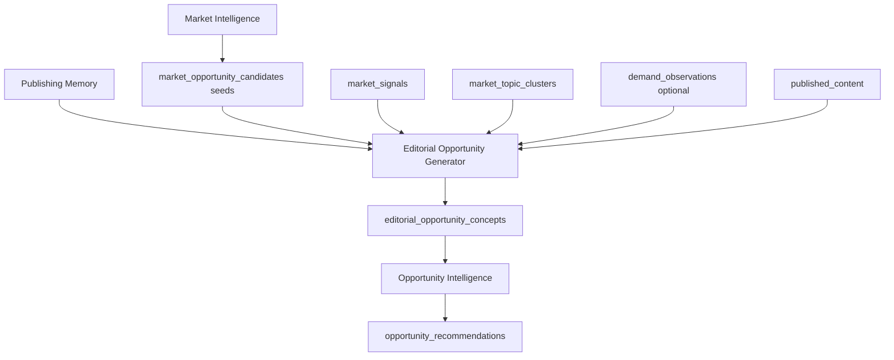

# Editorial Opportunity Generator — Design Plan

## Status

**Design only.** Do not implement until this plan is approved and sequenced after validation iteration on existing Market Intelligence + Opportunity Intelligence.

---

## Problem statement

Validation ([OPPORTUNITY_QUALITY_VALIDATION_PLAN.md](./OPPORTUNITY_QUALITY_VALIDATION_PLAN.md)) showed:

| Stage | Status |
| --- | --- |
| Signal discovery | Works |
| Clustering + candidate backlog | Works |
| CREATE promotion (after OI gate fix) | Works |
| **Editorial quality** | **Weak** |

Current titles are produced by `MarketStrategist` heuristics such as `{topic}: questions answered` and `{topic}: complete guide` (see `app/market_intelligence/strategist.py`). Opportunity Intelligence then ranks those rows. The result reads like **topic detections**, not **publishable article assignments**.

Examples observed in production validation:

| Weak (current) | Why it fails |
| --- | --- |
| BPC-157: Questions Answered | Template; no angle, audience, or scope |
| peptides: Questions Answered | Niche label reused as article |
| CJC-1295: Questions Answered | Entity label only |
| Product Variations & Concentrations | Site-structure concept, not reader need |

Desired quality for the same seed entity **BPC-157**:

- What Is BPC-157? Research Overview
- BPC-157 Frequently Asked Questions
- BPC-157 vs TB-500: Key Research Differences
- Current Research Areas Involving BPC-157
- Understanding the Scientific Interest Around BPC-157

This plan defines an **Editorial Opportunity Generator (EOG)** that converts market truth into editorial concepts—without replacing Market Intelligence discovery.

---

## Purpose

```text
Market Intelligence     →  What matters in the niche?
Editorial Opportunity   →  What should we publish?
Opportunity Intelligence →  What should we do next (rank & select)?
```

EOG sits **after** market signals/clusters/candidates and **before** Opportunity Intelligence scoring and action assignment.

It transforms:

```text
topic + entity + cluster + evidence
```

into:

```text
5–20 publishable article concepts per seed opportunity
```

Each concept is a complete editorial brief, not a database row label.

---

## Scope boundaries

### In scope

- Title and angle generation from clusters and candidates
- Content-type diversity (FAQ, comparison, glossary, guide, etc.)
- Audience and intent assignment per concept
- Dedupe across concepts (no five FAQ clones for one entity)
- Respect publishing memory (refresh/expand vs duplicate CREATE)
- Evidence-backed summaries tied to `source_signal_ids`

### Out of scope

- New external providers or signal ingestion
- Replacing Market Intelligence clustering
- Replacing Opportunity Intelligence decision logic (CREATE / refresh / merge)
- Niche-specific templates (no peptide-only rules)
- Content drafting or calendar scheduling

---

## Position in the pipeline



### Responsibility split

| Layer | Question | Output unit |
| --- | --- | --- |
| Market Intelligence | What matters? | `market_signals`, clusters, **seed** candidates |
| **Editorial Opportunity Generator** | What should we publish? | **editorial concepts** (5–20 per seed) |
| Opportunity Intelligence | What should we do next? | Ranked recommendations with actions |

Today, `MarketStrategist` collapses cluster → single candidate with a template title. **EOG replaces that collapse** (or post-processes seeds) so OI selects among real concepts, not among entity strings.

---

## Inputs

EOG accepts a **generation context** bundle per workspace run:

| Input | Source | Use |
| --- | --- | --- |
| Market brief | `build_market_brief()` | Niche, language, vertical tone |
| Market signals | `market_signals` + evidence | Proof snippets, signal types, URLs |
| Topic clusters | `market_topic_clusters` | Intents, source mix, scores, saturation |
| Seed opportunity candidates | `market_opportunity_candidates` | One row per cluster/topic to expand |
| Entities & audiences | Niche profile + cluster fields | Target reader framing |
| Publishing memory | `content_coverage`, `published_content` | Suppress duplicates; prefer refresh/expand |
| Demand observations | Optional | Strengthen owned-performance concepts |
| Existing recommendations | Optional | Avoid repeating active editorial angles |

### Seed selection

Not every market candidate needs 20 concepts. Rules:

| Seed priority | When |
| --- | --- |
| High | Cluster `opportunity_score` ≥ workspace median; ≥2 signal types in `source_mix`; not nav/product-attribute label |
| Medium | Single strong signal (news, scientific, competitor) with clear intent |
| Low / skip | Nav labels, generic single tokens (`Research`, `focused`), duplicate cluster keys |

Seeds that fail validation filters never enter EOG (reuse `filters.is_navigation_label` and extend product-attribute detection).

---

## Outputs

### Primary artifact: editorial concept

For each accepted seed, generate **5–20** concepts (configurable; default **8–12** for cost control).

| Field | Type | Description |
| --- | --- | --- |
| `id` | UUID | Stable concept id |
| `workspace_id` | FK | Workspace |
| `run_id` | FK | Links to `market_intelligence_runs` or dedicated `editorial_generation_runs` |
| `seed_candidate_id` | FK | `market_opportunity_candidates.id` |
| `cluster_id` | FK | `market_topic_clusters.id` |
| `title` | string | Publishable headline (assignment-ready) |
| `topic` | string | Canonical topic (may match seed) |
| `content_type` | enum | See content types below |
| `audience` | string | Who this is for |
| `intent` | string | informational / commercial / research / compliance-aware (generic) |
| `angle` | string | One-sentence editorial thesis |
| `confidence` | 0–1 | Fit to evidence + business |
| `novelty` | 0–1 | Not already covered on site |
| `authority_value` | 0–1 | Cluster-building potential |
| `evidence_summary` | string | Human-readable proof |
| `source_signal_ids` | string[] | Required persisted ids |
| `target_keyword` | string | Optional SEO focus |
| `action_hint` | create / refresh / expand / monitor | Suggested action before OI |
| `related_content_ids` | string[] | From publishing memory |
| `metadata` | JSON | `why_now`, format notes, comparison pair, etc. |

### Persistence options (implementation phase)

**Option A (recommended):** New table `editorial_opportunity_concepts` with FK to seed candidate.

**Option B:** Expand `market_opportunity_candidates` with child rows via `parent_candidate_id`.

Option A keeps seeds (market truth) separate from concepts (editorial product).

---

## Content types

Generic enum—**no niche hardcoding**. Map from `market_signal.signal_type` + cluster intents, not from vertical name.

| `content_type` | When to use | Title pattern (illustrative, not templates) |
| --- | --- | --- |
| `educational_guide` | `educational_need`, broad entity | "How {audience} approaches {topic}" |
| `beginner_guide` | Low familiarity, glossary-adjacent | "Introduction to {topic} for {audience}" |
| `faq` | `recurring_question` | "{Entity} Frequently Asked Questions" |
| `glossary` | `glossary_need` | "What Is {Entity}? Definition and Context" |
| `comparison` | `comparison_need`, paired entities | "{A} vs {B}: …" |
| `research_overview` | `scientific_development`, research verticals | "Current Research Areas Involving {Entity}" |
| `trend_analysis` | `news_theme`, `trend_velocity` | "What Changed in {topic} (Year/Period)" |
| `ecosystem_map` | `competitor_theme`, many entities | "Landscape of {topic} in {niche}" |
| `timeline` | Regulatory or news velocity | "Timeline of Developments in {topic}" |
| `refresh_candidate` | Covered but stale | "Update: …" |
| `expansion_candidate` | Partial coverage | "Expand coverage of …" |

EOG must assign **at most one primary `content_type` per concept** and enforce **diversity** across the 5–20 pack (see deduplication).

---

## Generation strategy

### Phase 1 — Deterministic concept expansion (no LLM)

For each seed cluster, derive a **concept menu** from signal mix:

| Dominant signal / intent | Concepts to spawn (examples) |
| --- | --- |
| `glossary_need` | glossary, beginner_guide, faq (narrow) |
| `recurring_question` | faq, educational_guide |
| `comparison_need` | comparison (needs second entity from cluster `entities` or brief) |
| `scientific_development` | research_overview, glossary |
| `competitor_theme` | ecosystem_map, comparison |
| `trend_velocity` / `news_theme` | trend_analysis, educational_guide |
| `entity_momentum` | research_overview, faq, comparison (if pair exists) |
| `owned_performance_signal` | refresh_candidate, expansion_candidate |

Use **slot filling** with quality guards:

- Titles must include a verb or question frame (What / How / vs / Understanding)
- Ban suffix patterns: `: questions answered`, `: complete guide` (current strategist anti-patterns)
- Ban raw nav/product-attribute seeds at EOG ingress

### Phase 2 — LLM refinement (optional, config-gated)

When `EDITORIAL_GENERATOR_AI_ENABLED=true`:

- Input: seed + top evidence snippets + brief + coverage summary
- Output: JSON array of concepts matching schema
- Prompt role: **senior editor**, not keyword tool
- Constraints in prompt:
  - 5–12 concepts per seed
  - No duplicate content types for same seed
  - Must cite `source_signal_ids` from input only
  - No invented studies or metrics

Fallback: Phase 1 only (always available).

### Pairing for comparisons

Comparison concepts require a **second entity** from:

1. Same cluster `entities` list
2. Co-occurring signals in cluster
3. Brief `entities` with highest cluster affinity

If no valid pair → **do not** emit comparison type.

---

## Deduplication and diversity

### Within-seed (5–20 pack)

| Rule | Behavior |
| --- | --- |
| Max FAQ per seed | 1 |
| Max glossary per seed | 1 |
| Max same `content_type` | 2 unless cluster has ≥4 distinct intents |
| Title similarity | Block if normalized title Jaccard > 0.85 |
| Angle similarity | Block duplicate thesis strings |

### Across workspace (run-level)

| Rule | Behavior |
| --- | --- |
| Topic key | Normalize entity/topic; max **3 concepts** per topic key entering OI |
| Global FAQ cap | Optional soft cap in top 50 concepts |
| Published match | Drop concepts whose title matches existing published slug/title > 0.9 |

### Promotion policy

From 5–20 concepts per seed, pass **1–3 “finalists”** to Opportunity Intelligence (configurable). Remaining concepts stay in backlog for later runs.

OI should not see 80 near-identical FAQ rows.

---

## Relationship to Opportunity Intelligence

### Data flow change

**Today:**

```text
market_opportunity_candidates (1 per cluster, template title)
  → bridge → OpportunityCandidate
  → OI discover + score + decide_action
```

**Target:**

```text
market_opportunity_candidates (seed only, optional title = topic)
  → EOG → editorial_opportunity_concepts (5–20 per seed)
  → bridge → OpportunityCandidate (one row per concept)
  → OI discover (market concepts first) + score + decide_action
```

### OI changes (minimal, implementation phase)

- `OpportunityCandidateDiscovery.discover()` ingests `editorial_opportunity_concepts` (or finalists) instead of raw market candidate titles
- `source_type` = `editorial_opportunity` (or keep `market_intelligence` with `metadata.concept_id`)
- Scoring: boost `authority_value`, `novelty`; penalize template fingerprints
- `decide_action`: refresh/expand from `content_type` + publishing memory

Market Intelligence **does not** rank editorial quality; OI **does not** invent titles.

---

## Handling publishing memory

| Memory signal | EOG behavior |
| --- | --- |
| Topic already published, fresh | Lower novelty; emit `expansion_candidate` or skip CREATE |
| Topic published, stale | `refresh_candidate` with specific angle |
| High cannibalization risk | Prefer `merge` hint or single expansion concept |
| Coverage gap, no page | Full concept menu |

Concepts must include `related_content_ids` when a coverage row exists.

---

## Example walkthrough

**Seed:** cluster topic `BPC-157`, intents [`glossary_need`, `recurring_question`, `scientific_development`], signals from internal-context + (future) scientific provider.

**EOG output (subset):**

| title | content_type | angle |
| --- | --- | --- |
| What Is BPC-157? Research Overview | glossary | Define the compound and why readers encounter it |
| BPC-157 Frequently Asked Questions | faq | Answer practical questions researchers and buyers ask |
| BPC-157 vs TB-500: Key Research Differences | comparison | Contrast mechanisms and use cases using cited signals only |
| Current Research Areas Involving BPC-157 | research_overview | Summarize themes from evidence, not hype |
| Understanding the Scientific Interest Around BPC-157 | educational_guide | Explain why the niche discusses this entity now |

**Not emitted:** `BPC-157: Questions Answered`, `Product Variations & Concentrations: complete guide`.

**OI:** Picks top 2–3 by score + diversity → recommendations read like assignments.

---

## Configuration (proposed)

| Env key | Default | Purpose |
| --- | --- | --- |
| `EDITORIAL_GENERATOR_ENABLED` | `true` | Master switch |
| `EDITORIAL_GENERATOR_MIN_CONCEPTS_PER_SEED` | `5` | Floor |
| `EDITORIAL_GENERATOR_MAX_CONCEPTS_PER_SEED` | `20` | Ceiling |
| `EDITORIAL_GENERATOR_FINALISTS_PER_SEED` | `2` | Passed to OI |
| `EDITORIAL_GENERATOR_AI_ENABLED` | `false` | LLM refinement |
| `EDITORIAL_BAN_TITLE_PATTERNS` | regex list | Block template titles |

---

## API surface (implementation phase)

| Method | Path | Purpose |
| --- | --- | --- |
| POST | `/developer/editorial/workspaces/{id}/generate` | Run EOG for workspace |
| GET | `/developer/editorial/workspaces/{id}/concepts` | List concepts |
| GET | `/autopilot/workspaces/{id}/editorial-insights` | Summary for UI |

Autopilot `analyze` / `market-intelligence/refresh` should chain EOG before `refresh_opportunity_intelligence`.

---

## Success criteria

Aligned with validation plan and user goal:

| Criterion | Measure |
| --- | --- |
| Assignment-like titles | Human rubric: ≥70% of top 25 score ≥4 on **Editorial value** |
| No template junk | 0 titles matching `: questions answered` or nav labels in top 25 |
| Diversity | ≥4 distinct `content_type` values in top 25 |
| Evidence | 100% of CREATE concepts have `source_signal_ids` |
| Funnel | `concepts / recommendations` ≥ 2.5 |
| Reader test | Non-SEO reviewer can explain what article to write from title alone |

**Top 25 should read like editorial assignments**, not database records or entity labels.

---

## Failure modes and mitigations

| Risk | Mitigation |
| --- | --- |
| LLM invents evidence | Require signal ids; reject concepts without links |
| Concept explosion | Cap seeds + finalists per seed |
| Still generic FAQs | Within-seed FAQ cap + ban patterns |
| Comparison without pair | Gate comparison type |
| OI overwhelmed | Finalists only; OI max recommendations unchanged |
| Cost | Phase 1 deterministic default; AI optional |

---

## Implementation phases (after approval)

1. **Schema** — `editorial_opportunity_concepts` (+ optional `editorial_generation_runs`)
2. **Phase 1 generator** — Deterministic menu + title quality guards + dedupe
3. **Bridge update** — Map concepts → `OpportunityCandidate`
4. **Wire autopilot** — EOG between market discover and OI refresh
5. **Phase 2 AI** — Editor prompt with evidence-only constraint
6. **Validation re-run** — Same script as [OPPORTUNITY_QUALITY_VALIDATION_PLAN.md](./OPPORTUNITY_QUALITY_VALIDATION_PLAN.md); compare rubric scores

**Deprecate** template title functions in `MarketStrategist` (`_title_for`, `_angle_for` defaults) for CREATE seeds; strategist retains seed selection and `action_hint` only.

---

## What we are not doing in this plan

- Building the generator
- Adding intelligence providers
- Changing Market Intelligence clustering logic
- Modifying the attached Market Intelligence design plan file

This document defines **editorial quality layer** design only, targeted at the weakness validation exposed after discovery and CREATE gating were fixed.
