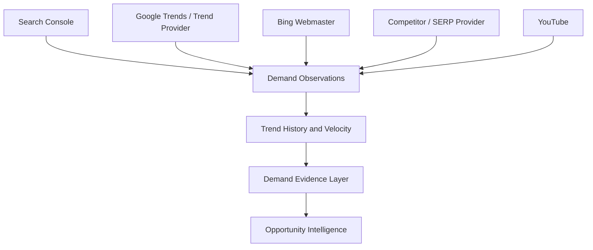
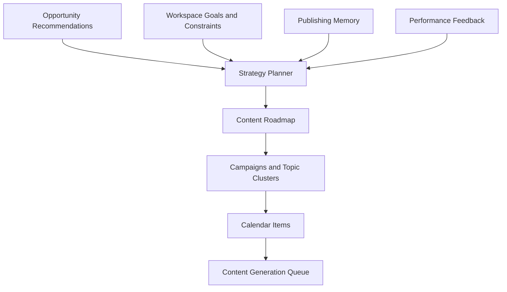

# Trendplot Gap Analysis

This document identifies the three largest gaps preventing the current Trendplot implementation from behaving like a Soro-style autonomous publishing platform.

Scope:

- Focus areas: opportunity discovery quality, external trend intelligence, and content planning quality.
- UI is intentionally ignored.
- No implementation is included.

## Summary

Trendplot already has the right high-level pipeline shape:

1. Analyze a website.
2. Discover opportunities.
3. Score recommendations.
4. Generate content.
5. Publish through WordPress or the connector.

The largest limitation is not workflow coverage. The limitation is decision quality. Today the system can produce recommendations and content, but it does not yet have enough independent market evidence, trend memory, or planning strategy to act autonomously with high confidence.

The three largest gaps are:

| Rank | Gap | Severity | Why it matters |
|---|---|---|---|
| 1 | Opportunity discovery is still too internally derived | Critical | The platform can generate many plausible ideas, but cannot reliably know which opportunities are worth publishing first. |
| 2 | External trend intelligence is mostly scaffolded or inferred | Critical | The system lacks real market demand, velocity, and breakout evidence. |
| 3 | Content planning is a deterministic scheduling layer, not a strategy engine | High | The planner can make a calendar, but it does not yet build campaigns, manage dependencies, or optimize for authority growth. |

## Gap 1: Opportunity Discovery Quality

### Current Behavior

Opportunity discovery currently combines several internal and semi-internal inputs:

- Website crawl signals.
- OpenAI website analysis output.
- Extracted site entities, products, questions, headings, links, and competitor page signals.
- Heuristic opportunity generation from clusters, products, semantic concepts, questions, and competitor gaps.
- Opportunity Intelligence candidates from:
  - niche profile
  - existing opportunities
  - trend signals
  - coverage records
  - competitor snapshots
  - published content
- Demand Evidence Layer scoring from the evidence currently available.

This is a meaningful improvement over simple website scraping. However, most candidate generation still begins with the website and its stored internal memory.

### What Currently Limits It

The main limitation is that opportunity discovery creates plausible editorial candidates before it has enough independent proof that the market wants those topics.

Specific limitations:

- `OpportunityDiscoveryEngine` builds opportunities from site-derived signal inventory, AI website analysis, and fallback generation. This can create many semantically relevant ideas, but relevance is not the same as demand.
- Fallback generation intentionally expands clusters, products, concepts, and related entities. This gives breadth, but it can also produce repetitive or speculative topics.
- Competitor evidence is mostly extracted from competitor snapshots and page themes, not from a durable competitor content index with rankings, traffic, freshness, and topic coverage depth.
- Demand evidence is normalized after candidates exist. It improves decisioning, but it does not yet strongly shape candidate discovery upstream.
- Existing source weights include future providers such as Search Console, Google Trends, and Bing, but those providers are not producing real signals yet.
- Candidate deduplication is mostly topic-string based. It reduces exact duplicates but does not fully solve semantic repetition, search intent overlap, or cannibalization before candidates reach planning.
- Recommendations are balanced by buckets after scoring. This keeps variety, but it is not the same as selecting the next highest business-impact actions.

### Severity

Critical.

This is the most important gap because autonomous publishing depends on choosing the right work before generation starts. If the recommendation layer is weak, better article generation and publishing automation can amplify the wrong topics.

Current recommendation quality is likely acceptable for:

- site understanding
- first-pass ideation
- internal coverage analysis
- editorial assistant workflows

It is not yet strong enough for:

- autonomous create decisions at scale
- market-led publishing
- prioritizing limited publishing capacity
- avoiding repetitive content over multiple cycles
- deciding when not to publish

### Biggest Architectural Improvement

Build a Market Evidence Graph that sits before and beside Opportunity Intelligence.

The Market Evidence Graph should store normalized evidence as first-class records, not just as metadata attached to candidates after discovery.

It should persist:

- topics
- queries
- entities
- audiences
- competitors
- source observations
- evidence source type
- evidence strength
- timestamp
- confidence
- freshness
- velocity
- geographic or market scope if available
- related existing content
- related generated recommendations

Then candidate discovery should pull from this graph, not only from the site profile and generated opportunities.

### Target Architecture

```mermaid
flowchart TD
    site["Website Analysis"] --> graph["Market Evidence Graph"]
    competitors["Competitor Content Index"] --> graph
    trends["Trend and Demand Providers"] --> graph
    coverage["Publishing Memory"] --> graph
    performance["Performance Feedback"] --> graph
    graph --> candidateDiscovery["Evidence-Led Candidate Discovery"]
    candidateDiscovery --> recommendations["Opportunity Intelligence"]
    recommendations --> planner["Content Strategy Planner"]
```

### What This Would Improve

- CREATE recommendations would originate from evidence-backed opportunities, not only internal gaps.
- REFRESH and EXPAND decisions could be tied to both internal coverage and external demand.
- Repetition risk could be reduced by linking semantically equivalent opportunities before recommendation.
- Confidence scores would become auditable because they would point to durable evidence records.
- Trendplot could say "publish this now" with stronger justification.

## Gap 2: External Trend Intelligence

### Current Behavior

Trend Intelligence has a provider-based design, but most providers are not real integrations yet.

Current trend discovery:

- Builds market queries from site understanding and opportunities.
- Attempts AI query generation, but the documented path uses `task_type="trend_query_generation"`, which is not present in `ModelTask`; the exception is swallowed and the system falls back to heuristics.
- Always includes `NullTrendProvider`, which creates inferred trend signals.
- Can optionally use YouTube as a trend source.
- Includes Search Console, Bing Webmaster, Google Trends, Web Search, Ahrefs, Semrush, and DataForSEO classes, but these are `NotConfiguredTrendProvider` stubs.

### What Currently Limits It

The main limitation is that the current trend layer mostly infers market interest from internal context instead of observing market behavior.

Specific limitations:

- The null provider produces inferred trend signals with degraded status. These are useful placeholders, but they are not market evidence.
- Search Console, Bing, Google Trends, web search, Ahrefs, Semrush, and DataForSEO do not fetch real data.
- YouTube can provide some directional demand signals, but it is only one channel and may not map cleanly to search demand or publishing ROI.
- There is no durable trend history table beyond discovery runs/signals. The app stores runs and signals, but it does not yet model long-term velocity, acceleration, decay, breakout stages, or recurring seasonality.
- Trend signals are capped and deduped by topic, but there is no cross-provider consensus model.
- The Demand Evidence Layer can weight sources, but the most valuable sources are not populated.
- Trend query generation has a task routing mismatch, making the AI query path unreliable or effectively disabled.

### Severity

Critical.

This gap blocks Trendplot from being truly market-led. Without real external demand and trend evidence, the platform cannot reliably distinguish:

- topics people actually search for
- topics competitors happen to mention
- topics inferred from the site
- topics with rising demand
- evergreen topics with stable value
- declining topics not worth new content

The current system can simulate trend intelligence, but it cannot yet behave like an autonomous market intelligence engine.

### Biggest Architectural Improvement

Build a Real Demand and Trend Provider Layer with historical evidence storage.

This should not just add providers. It should define a normalized demand observation model that every provider writes into.

Provider observations should include:

- source provider
- source type
- query/topic/entity
- observed metric
- metric value
- normalized demand score
- normalized velocity score
- timestamp
- market/locale
- confidence
- raw payload reference

The first high-value providers should be:

1. Google Search Console for owned query demand and impressions.
2. Google Trends or another trend source for market velocity.
3. Bing/Webmaster or search query data for secondary owned demand.
4. Competitor SERP/content source for external topic pressure.

### Target Architecture



### What This Would Improve

- CREATE recommendations could require real external demand.
- MONITOR recommendations could graduate to CREATE when evidence crosses thresholds.
- Topics could be classified as rising, stable, declining, breakout, seasonal, or unproven.
- Planning could prioritize publishing windows based on momentum.
- Trendplot could learn from repeated observations instead of treating each discovery run as isolated.

## Gap 3: Content Planning Quality

### Current Behavior

Content planning currently uses `ContentCalendarEngine`.

The planner:

- Reads workspace cadence.
- Selects a maximum number of items based on horizon and cadence.
- Combines trend signals and opportunities.
- Sorts by a planning priority derived from score/confidence plus coverage gap/refresh score minus cannibalization risk.
- Avoids repeated clusters early in the plan.
- Assigns schedule dates by interval.
- Uses simple roles and notes.
- Falls back to a generic planned item if no candidates exist.

This produces a usable publishing calendar, but it is not yet a content strategy engine.

### What Currently Limits It

The main limitation is that planning is item selection plus scheduling, not campaign strategy.

Specific limitations:

- The planner does not understand strategic goals such as authority building, conversion support, content refresh debt, product launch support, or seasonal momentum.
- It does not build multi-step campaigns with dependencies between pillar pages, support articles, refreshes, and internal links.
- It does not reserve capacity across content types based on business priorities.
- It does not model expected impact, risk, effort, or time-to-value.
- It does not learn from performance outcomes.
- It does not use a durable editorial roadmap or backlog state beyond generated plan items.
- It schedules by cadence interval only, not by urgency, trend velocity, publication windows, topical sequencing, or production constraints.
- It does not explicitly decide "do nothing" or "wait for more evidence" at the planning level. That mostly happens earlier in recommendation decisions.
- It does not coordinate refresh, merge, create, and expand actions into a coherent site architecture plan.

### Severity

High.

This is slightly less severe than the first two gaps because planning quality depends on opportunity and trend evidence quality. However, it becomes critical as soon as Trendplot is expected to publish autonomously over multiple weeks.

Current planning is acceptable for:

- creating a simple draft calendar
- converting recommendations into scheduled items
- testing the article generation pipeline

It is not enough for:

- autonomous campaign strategy
- compounding topical authority
- preventing long-term content sprawl
- balancing create vs refresh vs merge work
- deciding optimal publishing order

### Biggest Architectural Improvement

Build a Strategy Planner that operates on objectives, constraints, campaigns, and backlog state.

Instead of directly converting recommendations into calendar items, the planner should create a strategic content roadmap.

It should reason over:

- workspace goals
- business priority topics
- evidence-backed opportunities
- coverage gaps
- existing content inventory
- refresh debt
- cannibalization risk
- trend urgency
- content effort
- publishing capacity
- campaign dependencies
- internal linking sequence
- expected impact

### Target Architecture



### What This Would Improve

- Calendar items would have strategic intent, not just source type and notes.
- Trendplot could decide which sequence builds authority fastest.
- Refresh and merge work could be planned alongside new creation.
- The system could prevent overpublishing in one cluster while neglecting another.
- Campaigns could become durable objects that survive multiple runs.
- Performance feedback could adjust future planning.

## Cross-Cutting Gap: No Closed Learning Loop Yet

The three gaps share one underlying limitation: Trendplot does not yet have a strong closed learning loop.

Today:

- Analysis produces opportunities.
- Recommendations produce plans.
- Plans produce articles.
- Publishing can happen.
- Performance refresh exists, but provider integrations are mostly placeholders.

Missing:

- real post-publication performance feedback
- topic-level outcome tracking
- recommendation outcome tracking
- learning which evidence sources were predictive
- learning which content formats worked
- learning which generated articles should influence future planning

This should not replace the three gaps above, but it should influence their design. Every new evidence, trend, and planning object should be built so future outcomes can be attached to it.

## Recommended Priority Order

### 1. Build External Demand Observations

Start with the data foundation that improves both opportunity discovery and planning.

Minimum version:

- Add normalized demand observation persistence.
- Add one real provider, preferably Search Console if credentials are available.
- Feed observations into Demand Evidence Layer.
- Expose provider confidence and source weights to Opportunity Intelligence.

Why first:

- It immediately improves CREATE vs MONITOR decisions.
- It makes recommendation quality less dependent on internal site inference.
- It provides a foundation for trend history.

### 2. Move Candidate Discovery To Evidence-Led Discovery

Once demand observations exist, candidate discovery should begin from evidence clusters, not only from site-derived concepts.

Minimum version:

- Create evidence-backed topic clusters.
- Attach internal coverage and competitor evidence to each cluster.
- Generate candidates from clusters with sufficient evidence.
- Keep internal-only candidates mostly in monitor/refresh paths.

Why second:

- It reduces repetitive speculative opportunities.
- It improves opportunity quality before planning.

### 3. Replace Calendar Sorting With Strategy Planning

After recommendations improve, make planning strategic.

Minimum version:

- Add durable content roadmap/campaign concepts.
- Plan create/refresh/merge/expand together.
- Include effort, urgency, evidence strength, and cluster role in planning priority.
- Track why each item is scheduled now.

Why third:

- Better planning depends on better evidence and recommendations.
- It turns Trendplot from "generator with a calendar" into an autonomous publishing system.

## Soro-Style Platform Readiness

| Capability | Current readiness | Main blocker |
|---|---|---|
| Autonomous topic discovery | Medium | Too much internal/site-derived inference. |
| Market-led recommendations | Low to medium | Real demand providers are missing. |
| Trend velocity and breakout detection | Low | No real trend history or velocity provider. |
| Strategic planning | Medium-low | Calendar engine is deterministic selection/scheduling. |
| Content generation | High | Full generation/review/rendering pipeline exists. |
| Publishing | Medium-high | WordPress and connector paths exist, guarded by quality/sanity. |
| Learning loop | Low | Performance providers and outcome tracking are not yet strong. |

## Final Assessment

Trendplot is structurally close to an autonomous publishing platform, but its intelligence inputs are not yet strong enough for high-confidence autonomy.

The backend can already execute the workflow. The biggest missing piece is a stronger decision substrate:

1. real external demand observations
2. evidence-led opportunity discovery
3. strategic content planning over campaigns and outcomes

Once those are in place, the simplified v2 workflow can stay very small while the backend becomes much more autonomous.
