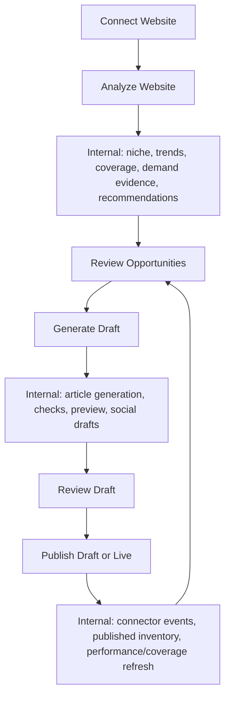

# Trendplot v2 Simplified Workflow

This document reviews the current UI behavior from `docs/UI_WORKFLOW_MAP.md` and proposes the simplest possible user workflow for Trendplot v2.

Goal: let a user connect a website, analyze it, discover opportunities, generate content, and publish content while preserving the current backend capabilities as internal jobs or developer/admin controls.

No implementation is included here.

## Executive Summary

The current app already has the backend pieces for an autonomous publishing workflow, but the UI exposes too many implementation steps as buttons. A user should not have to know when to refresh niche memory, trend discovery, coverage memory, opportunity intelligence, reassessment, or performance providers.

Trendplot v2 should reduce the user workflow to five primary actions:

1. Connect Website
2. Analyze Website
3. Review Opportunities
4. Generate Content
5. Publish Content

Everything else should either run automatically as part of those actions, run on a schedule, or move to the Developer/Admin UI.

## Current Button AI Classification

### Buttons That Actually Invoke AI

| Button/action | Current surface | AI usage | User-facing v2 treatment |
|---|---|---|---|
| Analyze Site | Workspace UI | Calls website analysis through the content provider/OpenAI. Also triggers downstream intelligence refreshes. | Keep as `Analyze Website`. |
| Analyze Website And Suggest Opportunities | Developer/Admin UI | Calls website analysis through OpenAI. | Move out of User UI; same backend as Analyze Website. |
| Generate calendar item | Workspace UI | Calls article generation pipeline, which invokes OpenAI for article generation, repair, expansion, humanization, narrative editing, sanity review, and YouTube evaluation. | Replace with `Generate Draft` on an opportunity/content item. |
| Generate Article | Developer/Admin UI | Calls the full article generation pipeline. | Move to Developer/Admin; users should generate from an opportunity, not a blank technical form. |
| Generate opportunity article | Developer/Admin UI | Calls the full article generation pipeline from an opportunity. | Replace with user-facing `Generate Draft`. |
| Generate suggestion article | Developer/Admin UI | Calls the full article generation pipeline from a legacy suggestion. | Retire from User UI; keep legacy/admin only if needed. |
| Rerun Job | Developer/Admin UI | Calls the full article generation pipeline again from saved input. | Developer/Admin only. |
| Run Sanity Check | Developer/Admin UI | Calls semantic sanity review with OpenAI when rewrite is enabled; has deterministic fallback. | Internal retry/repair detail; expose only a simple "Needs review" state to users. |

### AI-Adjacent Or Conditional AI Paths

| Button/action | Current behavior | Recommendation |
|---|---|---|
| Discover Trends | Intended to use AI for trend query generation, but the documented path is unclear because `trend_query_generation` is not in `ModelTask`; it falls back to heuristics. It may also call YouTube if configured. | Do not expose as a separate user button. Run inside Analyze Website / Refresh Opportunities after the task routing issue is fixed. |
| Generate Article with unattended publish | Article generation may run an AI-assisted publish metadata decision only when unattended mode is enabled. Manual publish does not call OpenAI. | Keep as internal publish preparation. |
| AI image generation | Optional internal article generation step when configured. | Keep internal; expose only generated image preview/approval if needed. |
| Generate social post drafts | No standalone button exists; social drafts come from the generated article JSON. | Keep as an output of Generate Content. |

## Mostly Deterministic Buttons

These buttons either update state, read data, or run deterministic services. They should not be presented as separate AI actions.

| Button/action | Current surface | Deterministic behavior | v2 treatment |
|---|---|---|---|
| Create Workspace | Workspace UI | Creates workspace and config-derived connection/provider status. | Rename/merge into `Connect Website`. |
| Select workspace | Workspace UI | Loads existing workspace data. | Keep as workspace switcher if multiple workspaces exist. |
| Refresh Niche | Workspace UI | Rebuilds persistent niche profile from stored inputs. | Internal to Analyze/Refresh Intelligence. |
| Refresh Coverage | Workspace UI | Rebuilds publishing memory/coverage. | Internal to Analyze, Publish, and scheduled refresh. |
| Refresh Recommendations | Workspace UI | Recomputes Opportunity Intelligence deterministically. | Internal to Discover Opportunities. |
| Generate Plan | Workspace UI | Builds content plan/calendar from recommendations and signals. | Merge into opportunity queue/planning flow. |
| Reassess Strategy | Workspace UI | Builds deterministic strategy report from stored data. | Internal/scheduled, with user-facing insights only. |
| Refresh Performance | Workspace UI | Checks placeholder/degraded performance providers. | Internal/scheduled; Developer/Admin until real providers exist. |
| Approve calendar item | Workspace UI | Updates plan item state. | Merge with `Generate Draft` or use as optional review gate. |
| Skip calendar item | Workspace UI | Updates plan item state. | Keep as `Dismiss` or `Skip` on recommendations/items. |
| Publish as Draft | Developer/Admin UI | Publishes to WordPress after quality/sanity gates; manual publish path is deterministic. | Keep as `Publish Draft`. |
| Publish Live | Developer/Admin UI | Publishes live after gates, setting, and confirmation. | Keep as `Publish Live` behind confirmation. |
| Open local preview | Developer/Admin UI | Reads rendered HTML artifact. | Keep as `Preview`. |
| Check API keys | Developer/Admin UI | Reads loaded settings. | Developer/Admin only. |
| Filters, tabs, sort, pagination, bulk status actions | Developer/Admin UI | Client-side or status updates. | Developer/Admin only, not core user workflow. |

## Buttons That Can Be Merged

| Current buttons | Merge into | Why |
|---|---|---|
| Create Workspace, workspace connection status, optional connector setup | `Connect Website` | Users think in terms of connecting a site, not creating a workspace row. |
| Analyze Site, Refresh Niche, Discover Trends, Refresh Coverage, Refresh Recommendations | `Analyze Website` or `Refresh Intelligence` | Analysis already orchestrates most of these steps. Separate buttons expose backend stages. |
| Discover Trends, Refresh Recommendations | `Discover Opportunities` | Trend signals are only useful to the user after they influence recommendations. |
| Generate Plan, Approve calendar item, Queue opportunity | `Plan Content` or automatic queue state inside `Review Opportunities` | The plan/calendar is a presentation of selected opportunities, not a separate mental model for most users. |
| Generate calendar item, Generate opportunity article, Generate suggestion article, Generate Article | `Generate Draft` | All paths converge on article generation. The user should pick an opportunity and generate. |
| Publish as Draft, Publish Live | `Publish` with status choice | Same publish flow with different WordPress status and safeguards. |
| Reassess Strategy, Refresh Performance | `Update Insights` or scheduled background refresh | Both are post-publication intelligence updates, not core authoring tasks. |
| Legacy suggestion Use/Approve/Reject/Generate and opportunity Use/Approve/Reject/Bookmark/Queue/Generate | Single opportunity card actions: `Generate Draft`, `Skip`, `Save for later` | Legacy suggestions duplicate the newer opportunity model. |

## Redundant Workflow Steps

| Current step | Why it is redundant for users | v2 treatment |
|---|---|---|
| Refresh Niche after Analyze Site | Analyze Site already refreshes the niche profile. | Internal background step. |
| Discover Trends immediately after Analyze Site | Analyze Site already runs trend discovery. | Show trend evidence inside opportunities. |
| Refresh Coverage immediately after Analyze Site | Analyze Site already refreshes publishing memory. | Internal background step. |
| Refresh Recommendations immediately after Analyze Site | Analyze Site already refreshes Opportunity Intelligence. | Internal background step. |
| Generate Plan as a separate required step | Users want content to create, not a separate plan-building operation. | Automatically maintain an opportunity queue/calendar after analysis. |
| Approve then Generate calendar item | For manual review mode this can be useful, but for the simplest flow it is an extra click. | Use `Generate Draft`; keep approval state as optional workflow setting. |
| Developer analysis workbench plus Workspace analysis | Two UI surfaces can analyze websites using overlapping services. | Keep Developer/Admin workbench for inspection; User UI uses one Analyze Website action. |
| Legacy suggestions alongside opportunities | Suggestions are preserved for compatibility but duplicate the opportunity workflow. | Hide/retire from User UI. |
| Manual article generation form | Bypasses the intelligence workflow and asks users for too much. | Developer/Admin only. |
| Refresh Performance before real providers exist | Current providers are mostly not configured/placeholders. | Developer/Admin until connected providers produce meaningful user value. |

## Steps That Should Become Internal Implementation Details

These capabilities should remain in the backend but not appear as primary user-facing buttons.

| Capability | Why internal | Where it should surface |
|---|---|---|
| Niche Intelligence refresh | It is context memory, not a user decision. | Show concise "Site profile" summary and confidence. |
| Trend query generation and trend provider status | Users care about demand evidence, not provider mechanics. | Show trend/demand badges on opportunities. |
| Publishing Memory / Coverage refresh | Coverage is an input to decisions. | Show "coverage gap" and "refresh candidate" explanations. |
| Opportunity Intelligence refresh | This is the recommendation engine. | Surface as opportunity cards/lists. |
| Demand evidence normalization | It improves recommendation quality. | Show short demand explanation and evidence labels. |
| Content plan generation | Planning can be automatically derived from selected recommendations. | Show "Upcoming content" or "Content queue". |
| Approval events | Audit implementation detail. | Developer/Admin logs only. |
| Provider status | Useful for debugging, noisy for users. | Developer/Admin, with only critical connection alerts in User UI. |
| Reassessment runs | Strategy reporting should be summarized. | Show "Strategy updated" or "New recommendations available". |
| Performance refresh | Should be scheduled after publish. | Show performance insights when meaningful providers are connected. |
| Quality checks, sanity checks, repair, expansion, humanization, narrative editor | These are content pipeline stages. | Show simple states: Generating, Needs review, Ready to publish, Blocked. |
| WordPress template/category/tag resolution | Publishing metadata detail. | Default automatically; allow advanced edit if needed. |
| Connector inventory sync | Integration maintenance. | Run after connect/publish/schedule; Developer/Admin manual action. |

## Minimum User Workflow For Trendplot v2

### 1. Connect Website

User goal: "Tell Trendplot which website to work on."

Primary UI:

- Website URL
- Optional workspace/site name
- Optional competitor URLs
- Optional WordPress connection status/setup
- Primary button: `Connect Website`

Backend capabilities preserved:

- Create or update workspace.
- Store competitors in workspace settings.
- Check WordPress REST and Trendplot Connector configuration.
- Record provider status.
- Optionally run connector capability discovery/inventory sync in the background.

User sees:

- Site connected.
- WordPress connected/not connected.
- Next action: `Analyze Website`.

Implementation note:

- Current `Create Workspace` becomes `Connect Website`.
- Connector sync should not be a primary user button; it can run automatically when connector credentials exist.

### 2. Analyze Website

User goal: "Understand my website and find what I should publish."

Primary UI:

- Button: `Analyze Website`
- Progress states: Crawling website, understanding business, finding demand signals, building recommendations.

Backend capabilities preserved:

- Website crawl and page signal extraction.
- OpenAI website analysis.
- Opportunity discovery.
- Niche profile refresh.
- Trend discovery.
- Publishing memory/coverage refresh.
- Demand Evidence Layer.
- Opportunity Intelligence refresh.
- Provider status updates.

User sees:

- Site Understanding summary.
- Top audiences/products/topics.
- Opportunity count and recommendation groups.
- Any blocking setup warnings, such as missing OpenAI key or unreachable website.

Implementation note:

- This replaces separate user buttons for `Refresh Niche`, `Discover Trends`, `Refresh Coverage`, and `Refresh Recommendations`.
- Advanced users can still access each sub-step in Developer/Admin UI.

### 3. Discover Opportunities

User goal: "Choose what to create or improve."

Primary UI:

- Opportunity cards grouped by action:
  - Create new content
  - Refresh existing content
  - Expand existing coverage
  - Merge/consolidate
  - Monitor
- Each card should show:
  - Title/topic
  - Recommended action
  - Confidence
  - Demand evidence summary
  - Why this is recommended
  - Primary action: `Generate Draft`
  - Secondary actions: `Save for later`, `Skip`

Backend capabilities preserved:

- Opportunity recommendations remain persisted.
- Coverage, trend, competitor, niche, and demand evidence remain in metadata.
- Content plan/calendar can still be generated in the background.

User sees:

- A focused set of recommended next actions, not raw trend/coverage/provider tables.

Implementation note:

- "Discover Opportunities" can be a screen/state, not necessarily a separate backend call if Analyze Website already refreshed recommendations.
- If a manual refresh is needed, call it `Refresh Opportunities`, not four separate refresh buttons.

### 4. Generate Content

User goal: "Turn the selected opportunity into a draft."

Primary UI:

- Button on an opportunity: `Generate Draft`
- Optional lightweight settings:
  - Draft type or format
  - Publish mode default
  - Target date if scheduling is desired

Backend capabilities preserved:

- Calendar item generation path.
- Opportunity/suggestion/manual generation paths can remain in Developer/Admin.
- Full article generation pipeline:
  - article generation
  - repair
  - expansion
  - humanization
  - narrative editor
  - YouTube enrichment
  - image generation if enabled
  - quality checks
  - sanity checks
  - rendered preview
  - social draft artifacts

User sees:

- Generation status.
- Draft preview.
- Quality/safety state:
  - Ready to review
  - Needs review
  - Blocked
- Social post drafts as secondary artifacts.

Implementation note:

- Do not expose the full manual article generation form in the primary User UI.
- Do not expose pipeline internals unless the draft is blocked and needs explanation.

### 5. Publish Content

User goal: "Publish the reviewed draft."

Primary UI:

- `Preview`
- `Publish Draft`
- `Publish Live` if live publishing is enabled
- Optional advanced metadata:
  - Category
  - Tags
  - Template
  - Featured image

Backend capabilities preserved:

- WordPress REST publisher.
- Trendplot Connector publisher.
- Connector fallback behavior.
- Tag/category/template/featured-image resolution.
- Quality and sanity gates.
- Publish decision metadata.
- Connector events/inventory updates.

User sees:

- Clear publish gate:
  - Ready to publish
  - Cannot publish because quality/sanity failed
  - WordPress connection missing
- WordPress post link after publish.

Implementation note:

- Manual publish can remain deterministic.
- Live publishing must remain behind explicit confirmation and config gates.

## Proposed v2 User Navigation

| Navigation item | Purpose | Primary actions |
|---|---|---|
| Website | Connect/manage website and WordPress connection. | `Connect Website`, `Analyze Website` |
| Opportunities | Review recommendations. | `Generate Draft`, `Save for later`, `Skip` |
| Drafts | Review generated content. | `Preview`, `Publish Draft`, `Publish Live` |
| Published | See published inventory and performance summary. | `Refresh insights` only if needed |
| Settings | Credentials, publishing defaults, advanced controls. | Developer/Admin boundary |

## Recommended User-Facing Buttons

The future User UI should have as few primary buttons as possible.

| Button | Screen | Calls current capability | AI? |
|---|---|---|---|
| Connect Website | Website | `create_workspace` plus connection checks/sync when configured | No |
| Analyze Website | Website | `analyze_workspace` orchestration | Yes |
| Refresh Opportunities | Opportunities | `discover_trends`, `refresh_publishing_memory`, `refresh_opportunity_intelligence` as one orchestrated action | Mixed; should be mostly internal, AI only if trend query path is fixed |
| Generate Draft | Opportunity card | `generate_calendar_item` or opportunity-based `generate_article` | Yes |
| Preview | Draft | `job_preview` | No |
| Publish Draft | Draft | `publish_existing_job(status="draft")` | No |
| Publish Live | Draft | `publish_existing_job(status="publish")` | No |
| Skip | Opportunity/card/calendar item | State update | No |
| Save for later | Opportunity/card | State update/bookmark | No |

## Developer/Admin Capabilities To Preserve

These should remain accessible, but outside the minimum user flow.

| Capability | Reason to preserve |
|---|---|
| Individual refresh buttons | Useful for debugging pipeline stages. |
| Manual article generation form | Useful for testing and one-off generation. |
| Recent jobs and analysis jobs | Useful for inspection and support. |
| Raw artifacts, prompts, model pipeline, token/cost metrics | Critical for debugging AI behavior. |
| Bulk opportunity workbench | Useful for operators managing large analyses. |
| API key checks and provider status | Useful for setup/support. |
| Connector contract/health/inventory endpoints | Required for plugin integration. |
| Run due items, enable/pause workspace | Useful for automation/admin. |
| Rerun job and manual sanity check | Useful for recovery and QA. |

## Simplified End-To-End Flow

## State Model For Users

Instead of exposing backend stages as buttons, the user should see simple states.

| User state | Backend reality |
|---|---|
| Not connected | No workspace or missing website URL. |
| Connected | Workspace exists; provider status is known. |
| Analyzing | Crawl, OpenAI website analysis, intelligence refreshes are running. |
| Opportunities ready | Opportunity recommendations exist. |
| Draft generating | Article generation pipeline is running. |
| Needs review | Draft exists but quality/sanity or human review requires attention. |
| Ready to publish | Quality and sanity gates passed. |
| Published | WordPress publish succeeded or connector event/inventory confirms content. |
| Needs setup | Required credentials/providers are missing. |

## Product Principles For v2

- One user action should trigger a complete meaningful outcome.
- Backend stages should be visible as progress, not as separate decisions.
- AI-powered actions should be clearly labeled because they take longer, cost money, and may fail differently.
- Deterministic refresh actions should be automatic, scheduled, or admin-only.
- The user should pick from recommendations, not fill in a blank article form first.
- Publishing should remain explicit and guarded.
- Developer/Admin UI should preserve the current observability and manual controls.

## Final Recommended Minimum Workflow

The simplest Trendplot v2 user workflow is:

1. `Connect Website`
   - Creates the workspace and verifies available integrations.

2. `Analyze Website`
   - Runs site understanding and all internal intelligence refreshes.

3. `Review Opportunities`
   - Shows create/refresh/expand/merge/monitor recommendations with concise evidence.

4. `Generate Draft`
   - Generates content from a selected recommendation and creates preview/social artifacts.

5. `Publish`
   - Publishes draft or live to WordPress after quality and sanity gates pass.

This preserves all current backend capabilities while removing most implementation-stage buttons from the user workflow.
