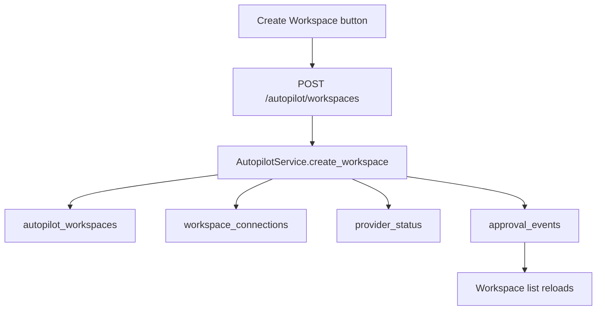
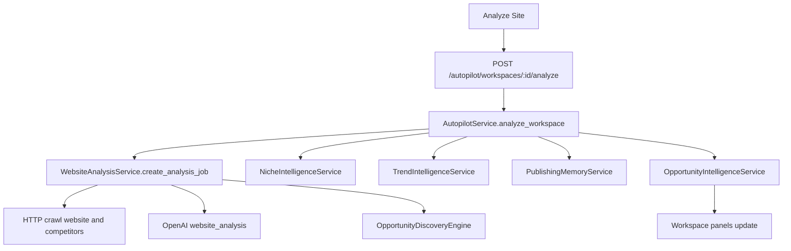
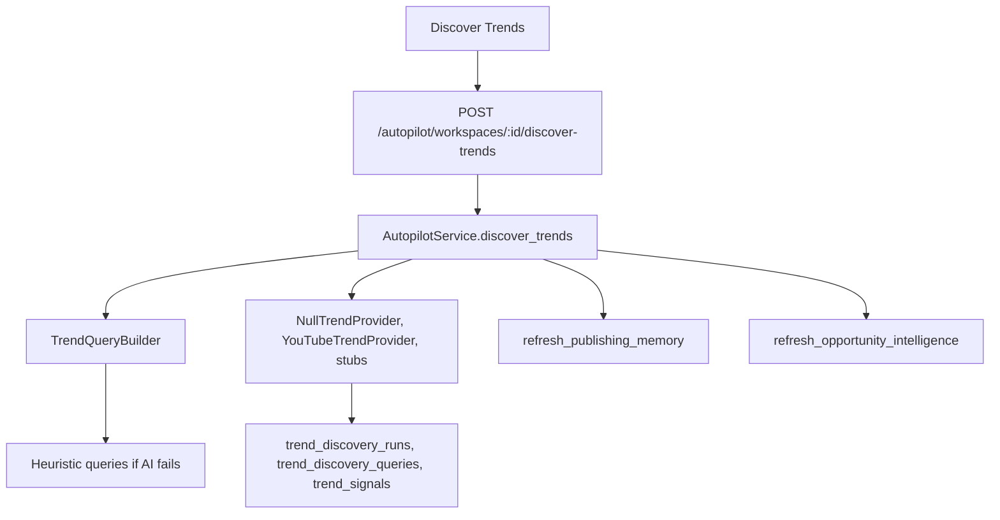
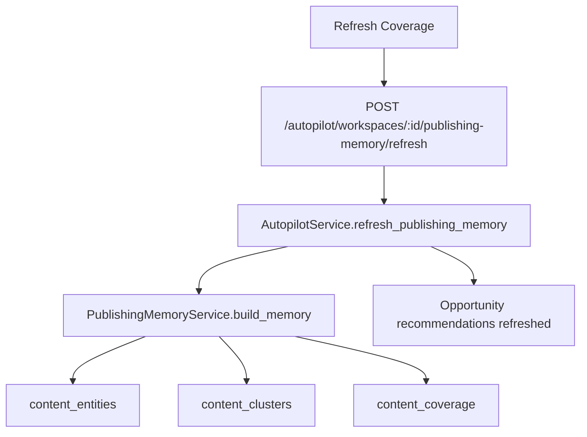
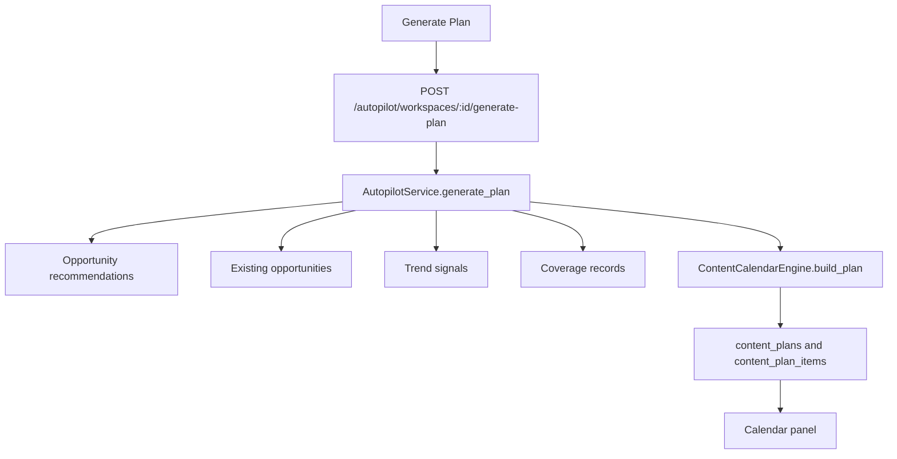
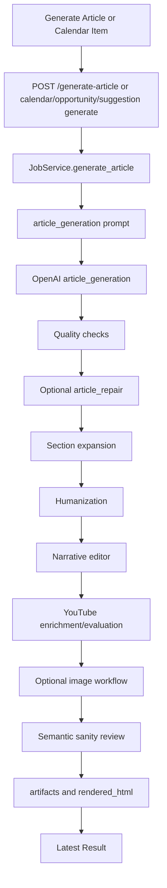
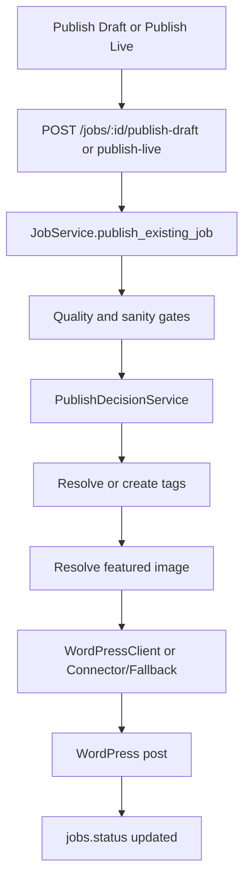
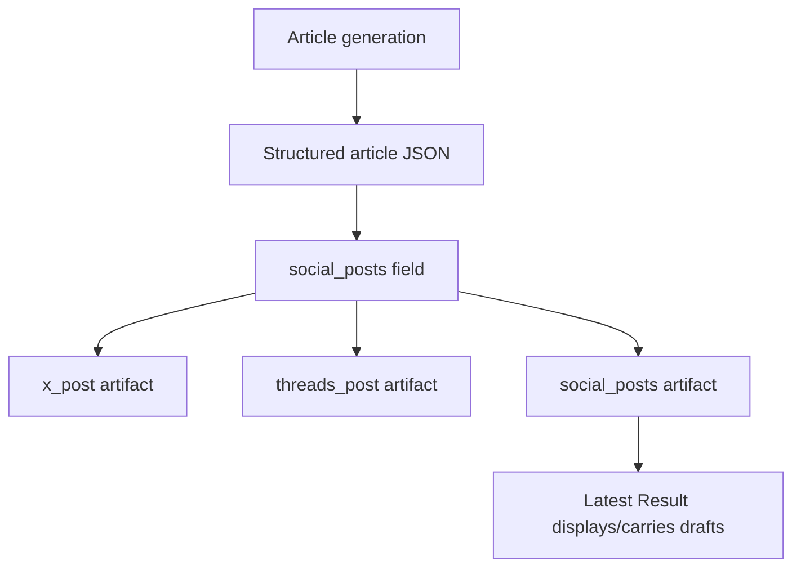

# Trendplot UI Workflow Map

This document maps the current Trendplot application as implemented in code. It documents visible UI panels, buttons, actions, backend routes, provider usage, AI usage, database effects, and known unclear areas.

Scope: documentation only. No UI redesign or behavior change is implied.

## Current UI Surfaces

| Surface | Route | Source | Purpose | Classification |
|---|---:|---|---|---|
| Trendplot Workspace | `/`, `/app` | `app/trendplot_ui.py` | Simplified workspace flow: create workspace, analyze site, refresh intelligence, generate plan, run calendar items. | Suitable for future User UI, with some advanced buttons likely moved later. |
| Developer/Admin UI | `/developer`, `/admin` | `app/ui.py` | Full diagnostic and generation workbench: website analysis, opportunity explorer, article generation, preview, WordPress publishing, API key checks, job inspection. | Developer/Admin UI. |
| API Docs | `/docs` | FastAPI | OpenAPI explorer. | Developer/Admin UI. |
| Health | `/health` | `app/main.py` | Returns `{"status":"ok"}`. | Internal/debug. |

## High-Level Workflow Map

| Step | Depends On | Produces | Required? | User should do next |
|---|---|---|---|---|
| Create workspace | Website URL; optional name, competitors, mode, cadence. | `autopilot_workspaces`, `workspace_connections`, `provider_status`, `approval_events`. | Required for Workspace UI flow. | Select workspace, then analyze site. |
| Analyze site | Workspace exists; OpenAI configured; website reachable. | Website analysis job, pages, site understanding, competitor snapshots, niche profile, trend run/signals, publishing memory, opportunity recommendations. | Strongly recommended. | Review Site Understanding and Opportunity Intelligence. |
| Refresh niche | Workspace exists; ideally site analysis already exists. | Updated `workspace_niche_profiles`, `approval_events`. | Optional; analysis already refreshes it. | Discover trends or refresh recommendations. |
| Discover trends | Workspace plus site understanding; trend providers optional. | `trend_discovery_runs`, `trend_discovery_queries`, `trend_signals`, provider status, refreshed coverage/recommendations. | Optional; analysis already discovers trends. | Review Trend Insights or generate plan. |
| Refresh coverage | Workspace plus site understanding/published content/plan items/trends. | `content_entities`, `content_clusters`, `content_coverage`, refreshed recommendations. | Optional; useful after publishing or connector sync. | Refresh recommendations or generate plan. |
| Refresh recommendations | Workspace plus any available niche/trends/coverage/opportunities/content. | `opportunity_recommendations`, `approval_events`. | Optional; analysis and coverage refresh already do this. | Generate plan. |
| Generate plan | Workspace plus site understanding/recommendations/opportunities/trends/coverage. | `content_plans`, `content_plan_items`, `approval_events`. | Required before calendar item workflow. | Approve/generate/skip calendar items. |
| Reassess strategy | Workspace; plan/trends/published content/provider status/coverage improve output. | `reassessment_runs`, `approval_events`. | Optional. | Review Performance Summary. |
| Refresh performance | Workspace; published content if available. | `provider_status`, `approval_events`; summary only. | Optional. | Reassess or adjust plan. |
| Approve calendar item | Existing content plan item. | Updates `content_plan_items.state`, writes `approval_events`. | Optional manual gate. | Generate calendar item. |
| Generate calendar item | Existing content plan item. | Article generation job and artifacts; updates plan item generated job/state; writes `approval_events`. | Required to produce article from calendar. | Open preview or publish if quality/sanity passes. |
| Skip calendar item | Existing content plan item. | Updates `content_plan_items.state`, writes `approval_events`. | Optional. | Continue with another item. |
| Generate article | Manual article form or opportunity/suggestion/calendar generation. | `jobs`, `job_logs`, many `artifacts`, optional WordPress post if policy allows. | Required to create content. | Review local preview, sanity, quality, then publish. |
| Preview article | Generated job with `rendered_html`. | HTML preview only; no DB changes. | Recommended before publish. | Publish draft/live if appropriate. |
| Publish draft | Generated job with passing final quality and sanity checks; WordPress configured. | WordPress draft, `wordpress_post`/publish artifacts, job status. | Optional. | Review in WordPress. |
| Publish live | Same as draft plus `ALLOW_LIVE_PUBLISH=true` and UI confirmation. | Live WordPress post, job status. | Optional and guarded. | Monitor post externally. |
| Generate social post drafts | Article generation only; no standalone button found. | `x_post`, `threads_post`, `social_posts` artifacts from article JSON. | Optional output of article generation. | Copy/review manually. |
| Connector inventory sync | API route exists, no visible button found in current UI. | `published_content`, `workspace_connections`, `approval_events`. | Optional/admin. | Refresh coverage. |

## Workspace UI Panels

| Panel | Source | Visible elements | Data source | Classification |
|---|---|---|---|---|
| Hero | `app/trendplot_ui.py` | Running status, Developer/Admin UI link, API Docs link. | Static. | User UI. |
| Create Trendplot Workspace | `app/trendplot_ui.py` | Website URL, workspace name, competitors, publishing mode, cadence, `Create Workspace`. | Form input. | User UI. |
| Workspaces | `app/trendplot_ui.py` | Workspace list buttons. | `GET /autopilot/workspaces`. | User UI. |
| Workspace Actions | `app/trendplot_ui.py` | Analyze Site, Refresh Niche, Discover Trends, Refresh Coverage, Refresh Recommendations, Generate Plan, Reassess Strategy, Refresh Performance. | Selected workspace. | Mixed: user-facing now; some buttons may move to Admin later. |
| Site Understanding | `app/trendplot_ui.py` | Detected niche, summary, products/services, audiences. | `GET /autopilot/workspaces/{id}`. | User UI. |
| Niche Intelligence | `app/trendplot_ui.py` | Primary niche, confidence, secondary niches, entities, audiences. | Workspace payload. | User UI if simplified. |
| Trend Insights | `app/trendplot_ui.py` | Trend topic cards. | Workspace payload trend signals. | User UI. |
| Signals | `app/trendplot_ui.py` | Trend query/signal/coverage counts. | Workspace payload. | User UI summary. |
| Opportunity Intelligence | `app/trendplot_ui.py` | Recommended Now, Refresh Existing Content, Monitor, collapsed Ignore. | Workspace payload recommendations. | User UI. |
| Your Coverage | `app/trendplot_ui.py` | Coverage count, gaps, refresh candidates. | Workspace payload coverage. | User UI summary; raw scores may become Admin detail. |
| This Week's Publishing Plan | `app/trendplot_ui.py` | Calendar items with Approve, Generate, Skip. | Workspace payload plan items. | User UI. |
| Performance Summary | `app/trendplot_ui.py` | Reassessment summary, published post count, provider status. | Workspace payload. | User UI summary. |

## Developer/Admin UI Panels

| Panel | Source | Visible elements | Data source | Classification |
|---|---|---|---|---|
| Hero | `app/ui.py` | Health link, API docs link, WordPress/manual publish status. | Static. | Developer/Admin. |
| Unattended Mode | `app/ui.py` | Loaded unattended settings and last publish decision. | `GET /config/unattended-status`. | Developer/Admin. |
| Analyze A Website First | `app/ui.py` | Website URL, pages per site, vertical, competitors, Analyze, Stop Analysis. | `/analysis-jobs`. | Developer/Admin; too detailed for future User UI. |
| Intelligence Explorer | `app/ui.py` | Opportunity workbench, tabs, filters, sort, bulk actions, legacy suggestion editor. | Analysis job detail. | Developer/Admin. |
| Generate Article | `app/ui.py` | Article fields, publish policy, unattended mode, WordPress category/template/tags/image inputs, Generate Article. | `/generate-article`. | Developer/Admin. |
| Latest Result | `app/ui.py` | Job actions, publish controls, metrics, quality/sanity, prompts, artifacts, preview link. | Job generation response or `GET /jobs/{id}`. | Developer/Admin. |
| Guide | `app/ui.py` | Static operator hints. | Static. | Developer/Admin. |
| Recent Analyses | `app/ui.py` | Clickable analysis jobs. | `GET /analysis-jobs`. | Developer/Admin. |
| Recent Jobs | `app/ui.py` | Clickable generation jobs. | `GET /jobs/recent`. | Developer/Admin. |
| API Keys | `app/ui.py` | Check API keys button/result. | `GET /config/api-keys`. | Developer/Admin/debug. |

## UI Action Map

Abbreviations in the table:

- AI: OpenAI/content provider path.
- Ext: external non-OpenAI providers or HTTP calls.
- WP: WordPress REST or Trendplot Connector.
- DB: database tables affected.

### Workspace UI Actions

| Button/action | Location | Frontend handler | API | Payload | Backend route | Backend service | AI | Ext | WP | DB/artifacts affected | Success/UI change | Failure modes | Classification |
|---|---|---|---|---|---|---|---|---|---|---|---|---|---|
| Create Workspace | Create Trendplot Workspace panel | `create-workspace` click | `POST /autopilot/workspaces` | `{website_url,name,competitor_urls,mode,cadence}` | `create_autopilot_workspace` | `AutopilotService.create_workspace` | No | No | No | `autopilot_workspaces`, `workspace_connections`, `provider_status`, `approval_events` | Workspace selected and loaded. | Invalid URL, DB error. | User-facing |
| Select workspace | Workspaces panel | `selectWorkspace(id)` | `GET /autopilot/workspaces/{workspace_id}` | None | `get_autopilot_workspace` | `AutopilotService.get_workspace` | No | No | No | None | Panels re-render from workspace payload. | Workspace not found. | User-facing |
| Analyze Site | Workspace Actions | `analyze-site` click | `POST /autopilot/workspaces/{workspace_id}/analyze` | `{max_pages_per_site:3}` | `analyze_autopilot_workspace` | `AutopilotService.analyze_workspace` -> `WebsiteAnalysisService.create_analysis_job` | Yes | Website crawl, optional YouTube/research providers, trend providers | No direct WordPress publish | `analysis_jobs`, `analysis_pages`, `analysis_suggestions`, `opportunities`, `audience_profiles`, `opportunity_clusters`, `authority_graph_*`, `site_understanding_snapshots`, `competitor_snapshots`, `workspace_niche_profiles`, `trend_*`, `content_*`, `opportunity_recommendations`, `approval_events`, `analysis_intelligence_artifacts` | Site/Niche/Trend/Coverage/Opportunity panels update. | OpenAI missing/fails, site fetch fails, invalid workspace, external provider errors. | User-facing |
| Refresh Niche | Workspace Actions | `refresh-niche` click | `POST /autopilot/workspaces/{workspace_id}/niche-profile/refresh` | `{}` | `refresh_autopilot_niche_profile` | `AutopilotService.refresh_niche_profile` | No | No | No | `workspace_niche_profiles`, `approval_events` | Niche Intelligence panel updates. | Workspace not found, feature disabled returns existing/empty profile. | User-facing |
| Discover Trends | Workspace Actions | `discover-trends` click | `POST /autopilot/workspaces/{workspace_id}/discover-trends` | `{}` | `discover_autopilot_trends` | `AutopilotService.discover_trends` -> `TrendIntelligenceService.discover` | Attempted for query generation but currently unclear: `task_type="trend_query_generation"` is not in `ModelTask`, and exceptions are swallowed in `TrendQueryBuilder`. | YouTube if enabled; trend stubs return `not_configured`; null trend provider always used. | No | `trend_discovery_runs`, `trend_discovery_queries`, `trend_signals`, `provider_status`, `content_*`, `opportunity_recommendations` | Trend Insights and recommendations update. | No workspace, invalid/failed provider, query generation silently falls back to heuristics. | User-facing |
| Refresh Coverage | Workspace Actions | `refresh-memory` click | `POST /autopilot/workspaces/{workspace_id}/publishing-memory/refresh` | `{}` | `refresh_autopilot_publishing_memory` | `AutopilotService.refresh_publishing_memory` | No | No | No | `content_entities`, `content_clusters`, `content_coverage`, `opportunity_recommendations`, `approval_events` | Coverage and recommendations update. | Workspace missing, sparse input creates limited memory. | User-facing |
| Refresh Recommendations | Workspace Actions | `refresh-opportunities` click | `POST /autopilot/workspaces/{workspace_id}/opportunity-intelligence/refresh` | `{}` | `refresh_autopilot_opportunity_intelligence` | `AutopilotService.refresh_opportunity_intelligence` -> `OpportunityIntelligenceService.build_recommendations` | No | No | No | `opportunity_recommendations`, `approval_events` | Opportunity Intelligence panel updates. | Missing workspace; limited inputs create limited/monitor recommendations. | User-facing |
| Generate Plan | Workspace Actions | `generate-plan` click | `POST /autopilot/workspaces/{workspace_id}/generate-plan` | `{horizon_days:30}` | `generate_autopilot_plan` | `AutopilotService.generate_plan` -> `ContentCalendarEngine.build_plan` | No | No | No | `content_plans`, `content_plan_items`, `approval_events`, workspace status fields | Calendar panel shows planned items. | No workspace, no analysis leads to fallback plan. | User-facing |
| Reassess Strategy | Workspace Actions | `reassess` click | `POST /autopilot/workspaces/{workspace_id}/reassess` | `{}` | `reassess_autopilot_workspace` | `AutopilotService.reassess_workspace` -> `ReassessmentService.build_report` | No | No | No | `reassessment_runs`, `approval_events`, workspace last reassessment | Performance Summary updates. | Missing workspace; limited data creates generic report. | User-facing |
| Refresh Performance | Workspace Actions | `performance-refresh` click | `POST /autopilot/workspaces/{workspace_id}/performance-refresh` | `{}` | `refresh_autopilot_performance` | `AutopilotService.refresh_performance_feedback` -> `PerformanceFeedbackService.summarize` | No | No configured external feedback provider in inspected path | No | `provider_status`, `approval_events` | Provider status/performance summary updates. | Missing workspace. | User-facing/Admin |
| Approve calendar item | Calendar item card | `updateItem(id,{state:"approved"})` | `PATCH /autopilot/calendar-items/{item_id}` | `{state:"approved"}` | `update_autopilot_calendar_item` | `AutopilotService.update_calendar_item` | No | No | No | `content_plan_items`, `approval_events` | Calendar item state updates after workspace reload. | Missing item, invalid state. | User-facing |
| Generate calendar item | Calendar item card | `generateItem(id)` | `POST /autopilot/calendar-items/{item_id}/generate` | `{}` | `generate_autopilot_calendar_item` | `AutopilotService.generate_calendar_item` -> `JobService.generate_article` | Yes | YouTube, optional image generation, optional WordPress depending policy | Possible if workspace mode maps to auto draft/live and gates pass | `jobs`, `job_logs`, `artifacts`, `content_plan_items`, `approval_events`, possible `published_content` | Calendar item gets generated job/state; article job returned. | OpenAI/provider failure, quality/sanity failure, WordPress publish failure. | User-facing |
| Skip calendar item | Calendar item card | `updateItem(id,{state:"skipped"})` | `PATCH /autopilot/calendar-items/{item_id}` | `{state:"skipped"}` | `update_autopilot_calendar_item` | `AutopilotService.update_calendar_item` | No | No | No | `content_plan_items`, `approval_events` | Calendar item state updates. | Missing item. | User-facing |

### Developer/Admin UI Actions

| Button/action | Location | Frontend handler | API | Payload | Backend route | Backend service | AI | Ext | WP | DB/artifacts affected | Success/UI change | Failure modes | Classification |
|---|---|---|---|---|---|---|---|---|---|---|---|---|---|
| Sample: running shoes / coffee grinder | Generate Article quick actions | `setFormValues(samples[...])` | None | None | None | None | No | No | No | None | Form fields filled. | None. | Developer-facing |
| Analyze Website And Suggest Opportunities | Developer analysis form | `analysis-form` submit | `POST /analysis-jobs` | `{website_url, competitor_urls, max_pages_per_site, vertical}` | `create_analysis_job` | `WebsiteAnalysisService.create_analysis_job` | Yes | Website crawl; optional research/YouTube providers | No | `analysis_jobs`, `analysis_pages`, `analysis_suggestions`, opportunity/audience/cluster/authority tables, `analysis_intelligence_artifacts` | Intelligence Explorer and legacy suggestions render. | OpenAI missing/fails, network fetch failure, prompt error, cancellation. | Developer-facing |
| Stop Analysis | Developer analysis form | `stop-analysis-button` click | `POST /analysis-jobs/cancel-active` | None | `cancel_active_analysis_jobs` | `WebsiteAnalysisService.cancel_active_analyses` | No | No | No | `analysis_jobs.status` possibly updated | Summary says stopped/no active job. | Race if job already finished. | Developer-facing/debug |
| Click recent analysis | Recent Analyses | `showAnalysisJob(id)` | `GET /analysis-jobs/{analysis_job_id}` | None | `get_analysis_job` | `WebsiteAnalysisService.get_analysis_job` | No | No | No | None | Loads prior analysis into explorer. | Missing analysis. | Developer-facing |
| Search/filter/sort opportunities | Intelligence Explorer | `renderOpportunityRows`, `visibleOpportunities` | None | None | None | Client-only | No | No | No | None | Rows filter/sort locally. | None. | Developer-facing |
| Opportunity tabs | Intelligence Explorer | `renderWorkspaceTab` | None | None | None | Client-only | No | No | No | None | Shows opportunities/clusters/audiences/authority graph/campaigns/queue. | None. | Developer-facing |
| Opportunity row inspector | Intelligence Explorer | `renderOpportunityDetail` | None | None | None | Client-only | No | No | No | None | Drawer opens with rationale/evidence/raw JSON. | None. | Developer-facing |
| Bulk approve/reject/queue | Opportunity workbench | `bulkUpdateOpportunities(status)` | `PATCH /opportunities/{id}` for each selected | `{status}` | `update_opportunity` | `WebsiteAnalysisService.update_opportunity` | No | No | No | `opportunities` | Row statuses update locally. | Missing opportunity, invalid status. | Developer-facing |
| Use opportunity | Opportunity row | `setFormValues(payload)` | None | None | None | Client-only | No | No | No | None | Article form populated. | None. | Developer-facing |
| Approve/Reject/Bookmark/Queue opportunity | Opportunity row | `patchOpportunity` | `PATCH /opportunities/{opportunity_id}` | Status and sometimes title/keyword/product fields | `update_opportunity` | `WebsiteAnalysisService.update_opportunity` | No | No | No | `opportunities` | Status updates in table. | Missing opportunity, invalid status. | Developer-facing |
| Generate opportunity article | Opportunity row | `fetch /opportunities/{id}/generate-article` | `POST /opportunities/{opportunity_id}/generate-article` | None | `generate_article_from_opportunity` | `WebsiteAnalysisService.generate_article_from_opportunity` -> `JobService.generate_article` | Yes | YouTube, optional image generation, possible WordPress depending policy | Possible | `jobs`, `job_logs`, `artifacts`, opportunity status/generated job | Latest Result shows article job and artifacts. | Opportunity not approved/invalid, OpenAI/provider failure, quality/sanity failure. | Developer-facing |
| Use suggestion | Legacy suggestion editor | `setFormValues(payload)` | None | None | None | Client-only | No | No | No | None | Article form populated. | None. | Developer-facing/legacy |
| Approve/Reject suggestion | Legacy suggestion editor | `patchSuggestion` | `PATCH /analysis-suggestions/{suggestion_id}` | Edited fields plus status | `update_analysis_suggestion` | `WebsiteAnalysisService.update_suggestion` | No | No | No | `analysis_suggestions` | Suggestion status persists. | Unsaved/missing suggestion, invalid status. | Developer-facing/legacy |
| Generate suggestion article | Legacy suggestion editor | `PATCH` then `POST /analysis-suggestions/{id}/generate-article` | `POST /analysis-suggestions/{suggestion_id}/generate-article` | None after approval patch | `generate_article_from_suggestion` | `WebsiteAnalysisService.generate_article_from_suggestion` -> `JobService.generate_article` | Yes | YouTube, optional image generation, possible WordPress depending policy | Possible | `jobs`, `job_logs`, `artifacts`, suggestion generated job/status | Latest Result shows job. | Suggestion not approved/missing, OpenAI/provider failure. | Developer-facing/legacy |
| Generate Article | Generate Article panel | `generate-form` submit | `POST /generate-article` | Title, keyword, product, URL, publish policy, category/template/tags/image fields, unattended flag | `generate_article` | `JobService.generate_article` | Yes | YouTube, optional image generation, optional WordPress | Possible | `jobs`, `job_logs`, many `artifacts`, possible `published_content` via connector events later | Latest Result shows generation summary, local preview link, publish controls if gates pass. | OpenAI key missing, quality/sanity failure, provider failures, WordPress failures. | Developer-facing |
| Rerun Job | Latest Result | Document click handler `[data-rerun-action]` | `POST /jobs/{job_id}/rerun` | None | `rerun_job` | `JobService.rerun_job` -> `generate_article` | Yes | Same as article generation | Possible | New `jobs`, `job_logs`, `artifacts` | Latest Result switches to new job. | Missing job, same generation failures. | Developer-facing/debug |
| Run Sanity Check | Latest Result | `[data-sanity-action]` | `POST /jobs/{job_id}/run-sanity-check` | `{apply_rewrite:true}` | `run_job_sanity_check` | `JobService.run_sanity_check_for_job` | Yes when `apply_rewrite=true`; deterministic fallback exists | No | No | `artifacts` for sanity, structured article, rendered HTML, quality; `jobs.status`, `job_logs` | Job reloads with updated sanity/quality. | Missing job/artifact, OpenAI failure fallback, sanity still fails. | Developer-facing |
| Open local preview | Latest Result link | Browser link | `GET /jobs/{job_id}/preview` | None | `job_preview` | Repository artifact lookup and HTML wrapper | No | No | No | None | Opens rendered article preview. | Missing job or `rendered_html`. | User-facing after simplification; currently Developer-facing |
| Publish as Draft | Latest Result publish controls | `[data-publish-action="draft"]` | `POST /jobs/{job_id}/publish-draft` | Category/template/tags/featured image fields | `publish_job_draft` | `JobService.publish_existing_job(status="draft")` | No for manual publish decision path (`content_provider=None`) | No except WordPress | Yes | `jobs.status`, publish decision artifacts, `wordpress_post` artifact/logs | Result shows WordPress link; job reloads. | Quality/sanity missing/fail, WP config/network/auth/template/tag/image failure. | Developer-facing; future User UI with safeguards |
| Publish Live | Latest Result publish controls | `[data-publish-action="live"]` plus browser confirm | `POST /jobs/{job_id}/publish-live` | Same as draft plus `confirm_live_publish:true` | `publish_job_live` | `JobService.publish_existing_job(status="publish")` | No for manual publish decision path | No except WordPress | Yes | `jobs.status`, publish decision artifacts, `wordpress_post` artifact/logs | Result shows live WordPress link; job reloads. | `ALLOW_LIVE_PUBLISH` false, no confirm, quality/sanity fail, WP failure. | Developer-facing/admin-gated |
| Check API keys | API Keys panel | `checkApiKeys` | `GET /config/api-keys` | None | `check_api_keys` | Settings inspection only | No | No | No | None | Shows configured/missing OpenAI, YouTube, WordPress. | None except route error. | Internal/debug |
| Recent job click | Recent Jobs | `showJob(jobId)` | `GET /jobs/{job_id}` | None | `job_detail` | Repository lookup | No | No | No | None | Latest Result loads job artifacts/logs. | Missing job. | Developer-facing |
| WordPress category/template loading | Generate Article form startup and publish controls | `loadWordPressCategories`, `loadWordPressTemplates` | `GET /wordpress/categories`, `GET /wordpress/templates` | None | `wordpress_categories`, `wordpress_templates` | `registry.wordpress.list_*` | No | No | Yes | None | Form selects populate or fallback to unavailable/default. | WordPress config/auth/network failure. | Developer-facing |
| Unattended Mode status load | Unattended Mode panel | `loadUnattendedStatus` | `GET /config/unattended-status` | None | `unattended_status` | Settings plus latest artifact scan | No | No | No | None | Panel shows settings/last report. | Route/data error. | Developer/Admin |

### Existing API Actions Without Current Visible UI Buttons

| Action | API | Backend service | Notes |
|---|---|---|---|
| Enable workspace | `POST /autopilot/workspaces/{workspace_id}/enable` | `AutopilotService.enable_workspace` | No visible button found in `app/trendplot_ui.py` or `app/ui.py`. |
| Pause workspace | `POST /autopilot/workspaces/{workspace_id}/pause` | `AutopilotService.pause_workspace` | No visible button found. |
| Connector sync inventory | `POST /autopilot/workspaces/{workspace_id}/connector-sync` | `AutopilotService.sync_connector_inventory` | No visible button found; important admin action. |
| Run due items | `POST /autopilot/workspaces/{workspace_id}/run-due` | `AutopilotService.run_due_items` | No visible button found; likely automation/admin. |
| Connector contract/health/capability/inventory/media endpoints | `/connectors/wordpress/*` | `TrendplotWordPressConnectorClient` | No visible UI buttons found; exposed for connector/admin integration. |
| Connector event ingestion | `POST /api/connectors/wordpress/events` | Repository event handling | Intended for WordPress plugin, not browser user. |
| WordPress tags list | `GET /wordpress/tags` | `registry.wordpress.list_tags` | Route exists; no direct visible UI caller found except tags are typed manually. |
| Generated image serving | `GET /generated-images/{filename}` | Static file response from configured image dir | Used by generated image display if artifact URL references it. |

## Backend Flow Diagrams

### Workspace Creation

### Site Analysis

### Trend Discovery

### Coverage Refresh

### Publishing Plan Generation

### Article Generation

### WordPress Publishing

### Social Draft Generation

There is no standalone browser button or API route found for generating social drafts outside the article generation pipeline.

## AI Usage Map

OpenAI is accessed through `OpenAIContentGenerationProvider` in `app/content_generation.py`, except image generation, which directly uses `AsyncOpenAI` in `app/media/image_generation.py`.

Model tiers come from `app/providers/model_router.py`:

- Light: simple extraction, category lookup, cleanup, classification.
- Standard: website analysis, audience intelligence, authority graph mapping, YouTube evaluation, social post generation, SEO metadata, backlink planning, FAQ generation, image prompt generation.
- Premium: article generation, article repair, section expansion, humanization, quality review, sanity review, biomedical review.

| Path/action | Prompt template id | Model task type | Tier | Expected output | Artifact written |
|---|---|---|---|---|---|
| Developer Analyze Website / Workspace Analyze Site | `website_analysis` | `website_analysis` | Standard | JSON summary/signals used by OpportunityDiscoveryEngine. | Stored on `analysis_jobs.prompt/raw_response`; exposed as `website_analysis_prompt`, `website_analysis_raw_response`, `website_analysis_summary`. |
| Trend discovery query generation | Ad hoc prompt in `TrendQueryBuilder._prompt`, no registry id | `trend_query_generation` string | Unclear from code inspection: not present in `ModelTask`; exception is swallowed and heuristic queries are used. | Intended JSON query list. | No direct artifact; queries persisted if generated. |
| Article generation | `article_generation` | `article_generation` | Premium | Structured article JSON. | `structured_article_initial`, later `structured_article_json`, `structured_article`, `article_markdown`, `rendered_html`, many derived artifacts. |
| Article repair | `article_repair` | `article_repair` | Premium | Repaired article JSON. | `article_repair_prompt`, `article_repair_raw_response`, `article_repair_summary`. |
| Section expansion | `section_expansion` | `section_expansion` | Premium | Expanded article section JSON. | `section_expansion_prompt`, `section_expansion_raw_response`, `section_expansion_summary`, word-count artifacts. |
| Humanization | `humanization` plus section-level prompts from `EditorialRewriter` | `humanization` | Premium | Rewritten article sections/article JSON. | `humanization_prompt`, `humanization_section_prompts`, `humanization_raw_response`, `humanization_summary`, `rewritten_sections`, `reverted_sections`, `rewrite_attempts`, quality reports. |
| Narrative editor | `narrative_editor` | `humanization` | Premium | Final narrative edits/article JSON. | `narrative_editor_prompt`, `narrative_editor_raw_response` and narrative summary/edit artifacts. |
| Semantic sanity review during generation or manual Run Sanity Check | `sanity_check` | `sanity_review` | Premium | Corrected article plus issues/summary. | `sanity_check_results` prompt/raw response and final sanity artifacts. |
| YouTube candidate evaluation during article generation | `youtube_evaluation` | `youtube_evaluation` | Standard | Selected/rejected video candidate. | YouTube prompt/evaluation/video artifacts. |
| Publish decision for unattended generation only | Ad hoc prompt in `PublishDecisionService._ai_suggestion` | `classification` | Light | Template/category/tags/featured image suggestions. | `ai_category_decision`, `ai_tag_decision`, `ai_template_decision`, `publish_decision_report`. Manual publish uses `content_provider=None`. |
| Image prompt generation | `image_prompt_generation` | `image_prompt_generation` | Standard | Image prompt JSON and placement/safety details. | `image_prompt`, `image_placement_plan`, image workflow artifacts. |
| AI image generation | No prompt template; uses image prompt payload | `ai_image_model` setting, not `ModelTask` | Separate OpenAI image model setting | Image files/URLs/base64 decoded into configured output dir. | `image_generation_result`, `generated_images`, `approved_images`, `rejected_images`. |
| Social draft generation | No separate call in current article pipeline; generated as part of `article_generation` structured JSON | `article_generation` | Premium | `x` and `threads` text inside article JSON. | `x_post`, `threads_post`, `social_posts`. |
| `SocialContentService.generate_post` | `social_posts` | `social_post_generation` | Standard | Standalone social post text. | Unclear from code inspection: service exists, but no visible route/button calls it. |

### Actions That Do NOT Call OpenAI

- Workspace list/select/create, except create initializes provider status only.
- Refresh Niche.
- Refresh Coverage.
- Refresh Recommendations.
- Generate Plan.
- Reassess Strategy.
- Refresh Performance.
- Approve/skip/update calendar item.
- Opportunity/suggestion approve/reject/bookmark/queue/use.
- Client-side filters, sorts, tabs, pagination, inspectors.
- Check API keys.
- Load jobs/analysis jobs/job details/local preview.
- WordPress category/template/tag listing.
- Manual Publish Draft/Live path in `publish_existing_job` uses deterministic publish decision because `content_provider=None`.
- Connector contract/health/capabilities/inventory/event endpoints do not call OpenAI.

## Provider Usage Map

| Provider | Code | Configured behavior | Not configured/fallback behavior | UI signal shown |
|---|---|---|---|---|
| OpenAI content generation | `app/content_generation.py`, `app/providers/registry.py` | Required at app provider registry construction; used for website analysis and article generation pipeline. | `OpenAIContentGenerationProvider` raises if `OPENAI_API_KEY` missing. | Developer API Keys panel shows OpenAI configured/missing. |
| OpenAI images | `app/media/image_generation.py` | Used only when `ENABLE_AI_IMAGE_GENERATION=true`; writes generated images. | Disabled result artifacts are returned. | Latest Result Media panel shows enabled/disabled/status. |
| WordPress REST | `app/wordpress.py`, `app/providers/registry.py` | Used when connector disabled or fallback configured; lists categories/templates/tags and publishes posts. | Raises if base URL/credentials missing. | API Keys panel; category/template selects show unavailable/default on failure. |
| Trendplot Connector | `app/connectors/wordpress.py` | Used when `WORDPRESS_CONNECTOR_ENABLED=true`; can be wrapped by fallback publisher. | Connector endpoints raise disabled/config errors; fallback to REST only if enabled and REST configured. | Workspace provider status/connection data; no visible connector sync button found. |
| YouTube video provider | `app/providers/youtube.py`, `app/trends/providers/youtube.py` | Uses YouTube API key to fetch video candidates for article enrichment and trend signals if trend provider enabled. | Returns no candidates/not configured/degraded signals. | API Keys panel; Trend provider status; Latest Result YouTube/video sections. |
| Null trend provider | `app/trends/providers/null.py` | Always produces inferred trend signals from generated queries. | N/A; this is fallback. | Trend Insights source provider `trendplot-null`; provider status degraded. |
| Search Console/Bing/Google Trends/Web Search/Ahrefs/Semrush/DataForSEO stubs | `app/trends/providers/stubs.py` | Currently return `not_configured`; no API integration implemented. | Always no signals plus warnings. | Provider status rows in Workspace Performance Summary. |
| External research providers | `app/intelligence/research_enrichment.py`, `app/intelligence/providers.py` | Optional research enrichment; only YouTube adapter can be real if video provider exists. | Null providers return `not_configured`; external research can be disabled. | Developer analysis artifacts show external research status/source results. |
| Placeholder image provider | `app/providers/images.py` | Used by enrichment service for placeholder/non-AI image behavior. | No real external image provider. | Latest Result Media artifacts. |
| Placeholder social publishers | `app/publishers/placeholders.py` | Registry contains Instagram/TikTok placeholders. | No real social publishing. | No visible publish-to-social UI found. |

## Data and Artifact Map

### Main Database Tables

| Table | Created/updated by | Meaning |
|---|---|---|
| `jobs` | `JobService.generate_article`, rerun, publish, sanity | Article generation job state and request input. |
| `artifacts` | `JobService` pipeline and publish/sanity/preview operations | Prompt records, LLM raw responses, article JSON/HTML, quality/sanity reports, social drafts, WordPress metadata, metrics. |
| `job_logs` | `JobService`, publish/sanity paths | Operational logs and failure details. |
| `analysis_jobs` | `WebsiteAnalysisService.create_analysis_job` | Website/opportunity analysis run. |
| `analysis_pages` | Website analysis crawl persistence | Lightweight page signals from website and competitors. |
| `analysis_suggestions` | Website analysis | Legacy suggestion cards. |
| `audience_profiles`, `opportunity_clusters`, `opportunities`, `opportunity_audiences`, `authority_graph_nodes`, `authority_graph_edges`, `opportunity_relationships` | Opportunity discovery persistence | Structured opportunity intelligence output from website analysis. |
| `analysis_intelligence_artifacts` | Website analysis | Vertical detection, external research, metrics, and other analysis intelligence artifacts. |
| `autopilot_workspaces` | Workspace creation/update | Workspace settings, status, mode, cadence, last analysis/plan/reassessment. |
| `workspace_connections` | Workspace create, connector sync | WordPress REST/connector connection status/capabilities. |
| `site_understanding_snapshots` | Workspace analysis | Persisted site understanding summary. |
| `workspace_niche_profiles` | Refresh niche / analysis | Persistent niche memory. |
| `competitor_snapshots` | Workspace analysis | Competitor topics/products/gap notes. |
| `trend_discovery_runs`, `trend_discovery_queries`, `trend_signals` | Discover trends / workspace analysis | Trend query and signal history for current v1 trend intelligence. |
| `content_entities`, `content_clusters`, `content_coverage` | Refresh coverage / analysis / trend refresh | Publishing memory and content coverage state. |
| `opportunity_recommendations` | Refresh recommendations / analysis / coverage refresh | Decision-layer recommendations grouped into create/refresh/expand/merge/monitor/ignore. |
| `content_plans`, `content_plan_items` | Generate plan / calendar item updates | Publishing plan and calendar items. |
| `published_content` | Connector sync/event ingestion and possibly publishing follow-up | Inventory of published WordPress/content items. |
| `reassessment_runs` | Reassess Strategy | Workspace health/strategy reports. |
| `provider_status` | Workspace create, trend discovery, performance refresh | Provider availability/capability status. |
| `approval_events` | Most workspace actions | Audit trail for workspace/user/system events. |
| `connector_events` | WordPress connector event ingestion | Incoming plugin events. |

### Major Article Artifacts

| Artifact | Meaning |
|---|---|
| `structured_article_initial`, `structured_article_json`, `structured_article` | Article JSON at generation/final stages. |
| `article_markdown`, `rendered_html`, `article_html` | Rendered content for preview/publishing. |
| `initial_quality_check_results`, `final_quality_check_results`, `quality_check_results`, `quality_check` | Deterministic quality gate output. |
| `sanity_check_results`, `sanity_rewrite_summary` | Semantic/deterministic domain safety review. |
| `article_repair_*`, `section_expansion_*` | Repair and expansion prompts/raw responses/summaries. |
| `humanization_*`, `narrative_editor_*`, `post_*_redundancy_review` | AI pattern cleanup and final editorial pass artifacts. |
| `youtube_video`, `youtube_evaluation*` | Selected video enrichment/evaluation results. |
| `image_prompt`, `image_placement_plan`, `image_generation_result`, `generated_images`, `approved_images`, `rejected_images`, `image_rendering_summary` | Image planning/generation/rendering artifacts. |
| `seo_metadata`, `meta_title`, `meta_description`, `schema_jsonld` | SEO/rendering metadata. |
| `x_post`, `threads_post`, `social_posts` | Social draft outputs generated inside article JSON. |
| `wordpress_presentation_metadata`, `wordpress_template_selection`, `wordpress_category_selection`, `wordpress_tag_suggestions`, `publish_decision_report` | WordPress publish metadata and decisions. |
| `wordpress_post` / `wordpress_publish_response` | WordPress publish response. |
| `job_run_metrics`, `stage_timing_summary`, `model_cost_summary` | Runtime/cost metrics. |

## User vs Developer UI Classification

| Panel/action | Classification recommendation |
|---|---|
| Workspace creation/list/select | Suitable for future User UI. |
| Analyze Site | Suitable for future User UI, but hide page-count technicality. |
| Refresh Niche / Discover Trends / Refresh Coverage / Refresh Recommendations | Useful but may be simplified into one "Refresh Intelligence" user action; current separate buttons are developer/operator-facing. |
| Generate Plan | Suitable for future User UI. |
| Reassess Strategy / Refresh Performance | Suitable as user-facing summary action if simplified; current provider detail is Developer/Admin. |
| Opportunity Intelligence grouped recommendations | Suitable for future User UI. |
| Coverage raw scores | Should mostly move to Developer/Admin UI; keep high-level gaps/refresh candidates in User UI. |
| Calendar Approve/Generate/Skip | Suitable for future User UI. |
| Developer analysis workbench/opportunity table/filter/sort/bulk actions | Developer/Admin UI. |
| Legacy suggestion editor | Should move to hidden/debug-only or be retired after migration. |
| Generate Article manual form | Developer/Admin UI now; future User UI should probably be calendar/recommendation driven. |
| Latest Result detailed artifact panels | Developer/Admin UI. |
| Preview Article | Suitable for future User UI. |
| Publish Draft/Live | User-facing only with simplified safeguards; currently Developer/Admin. |
| API Keys panel | Developer/Admin/debug. |
| Connector endpoints/events | Internal/admin/integration. |
| Campaigns tab scaffold | Hidden/debug-only until implemented. |

## Common Failure Modes By Area

| Area | Failure modes |
|---|---|
| OpenAI/LLM | Missing `OPENAI_API_KEY`, model/task routing error, prompt template missing/invalid, response not valid JSON, HTTP timeout/status error. |
| Website analysis | Website fetch blocked/timeout, invalid URL, too many pages, cancellation, OpenAI failure. |
| Trend discovery | Query generation currently falls back silently if AI path fails; many trend providers are stubs/not configured; YouTube may fail if key missing. |
| Coverage/recommendations | Sparse input data produces generic/limited recommendations; no external providers required. |
| Article generation | Quality gate fail, sanity gate fail, repair/expansion/humanization model failure, image generation disabled/fails, YouTube unavailable. |
| Preview | Missing `rendered_html` artifact. |
| Publishing | Quality/sanity not passed, `ALLOW_LIVE_PUBLISH` false for live, WordPress credentials missing, auth/network/template/tag/featured-image errors. |
| Connector | Disabled by config, invalid token/site id, connector HTTP failure. |

## Unclear Or Follow-Up Items

- `TrendQueryBuilder._ai_queries` calls `generate_article(..., task_type="trend_query_generation")`, but `trend_query_generation` is not present in `ModelTask`. The exception is swallowed and heuristic queries are used. Files: `app/trends/query_builder.py`, `app/providers/model_router.py`.
- A standalone social draft generation service exists in `app/social.py`, but no visible route/button was found that calls it. Social drafts currently come from the main article generation JSON.
- `Campaigns` tab in the Developer opportunity workbench is scaffold text only; no campaign creation workflow found in UI.
- `connector-sync`, `enable`, `pause`, and `run-due` backend routes exist but no visible browser buttons were found.
- Some prompt/artifact paths are generated by helper services (`EditorialRewriter`, `NarrativeEditor`, `SectionExpansionService`) and are documented by their observable artifacts, not every internal retry branch.

## Files Inspected

- `app/trendplot_ui.py`
- `app/ui.py`
- `app/api/routes.py`
- `app/main.py`
- `app/autopilot/service.py`
- `app/services/jobs.py`
- `app/services/publish_decisions.py`
- `app/website_analysis.py`
- `app/analysis_prompts.py`
- `app/content_generation.py`
- `app/providers/model_router.py`
- `app/providers/registry.py`
- `app/providers/youtube.py`
- `app/wordpress.py`
- `app/connectors/wordpress.py`
- `app/trends/service.py`
- `app/trends/query_builder.py`
- `app/trends/providers/null.py`
- `app/trends/providers/youtube.py`
- `app/trends/providers/stubs.py`
- `app/intelligence/research_enrichment.py`
- `app/intelligence/providers.py`
- `app/review/semantic_sanity.py`
- `app/social.py`
- `app/models.py`
- `app/prompts/__init__.py`
- `app/prompts/prompt_registry.py`
- `app/prompts/templates/*.yaml`

## Verification Performed

No full tests were run. Code inspection used read/search commands only, plus creation of this documentation file.
