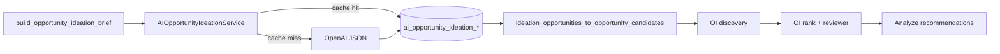

# AI Opportunity Ideation

Catalog-aware AI article opportunity generation that replaces the AI Editorial Strategist when `AI_OPPORTUNITY_IDEATION_ENABLED=true`.

## Purpose

Generate 40–60 structured article opportunities per analyze run using a compact site/product brief, then feed them into the existing Opportunity Intelligence (OI) pipeline and AI Recommendation Reviewer — without bypassing safety, review, or publishing gates.

## Feature flag

```env
AI_OPPORTUNITY_IDEATION_ENABLED=false   # default OFF
AI_OPPORTUNITY_IDEATION_MODEL=          # defaults to OPENAI_LIGHT_MODEL
AI_OPPORTUNITY_IDEATION_MIN_IDEAS=40
AI_OPPORTUNITY_IDEATION_MAX_IDEAS=60
AI_OPPORTUNITY_IDEATION_TEMPERATURE=0.3
AI_OPPORTUNITY_IDEATION_INCLUDE_SITEMAP=true
AI_OPPORTUNITY_IDEATION_CACHE_ENABLED=true
AI_OPPORTUNITY_IDEATION_CACHE_TTL_HOURS=24
```

When enabled, **AI Editorial Strategist is skipped**; EOG and OI scoring/decision logic are unchanged.

## Schema

Each opportunity includes:

- `headline`, `abstract` (1–2 sentences)
- `search_intent`, `content_type`
- `recommendation_type`: `create` | `refresh` | `expand` | `follow_up`
- `related_products`, `related_topics`, `target_audience`, `priority_reason`, `safety_notes`

## Integration



- **Source type:** `ai_opportunity_ideation`
- **Bridge:** [`app/ai_opportunity_ideation/bridge.py`](../app/ai_opportunity_ideation/bridge.py)
- **Discovery hook:** optional `ai_opportunity_ideation_opportunities` param (takes precedence over strategist ideas)

## Caching

Runs store `brief_cache_key` (hash of catalog, analysis job, existing titles, competitor gaps). When `AI_OPPORTUNITY_IDEATION_CACHE_ENABLED=true`, a completed run with matching key within `AI_OPPORTUNITY_IDEATION_CACHE_TTL_HOURS` returns persisted opportunities without a new LLM call.

## Fallback

On timeout, parse failure, or missing OpenAI client, the service returns an empty opportunity list. Analyze continues with EOG and other OI sources (fail-open).

## Safety

Prompt and parser enforce research/lab framing, no medical/dosing claims, and flag obvious safety violations in run warnings.

## vs deterministic EOG

| | EOG | AI Opportunity Ideation |
|---|-----|-------------------------|
| Input | Market signals + seeds | Compact catalog/site brief |
| Output | Editorial concepts | 40–60 full opportunities with abstract + intent |
| Strength | Research-backed breadth | Product/intent depth, catalog coverage |
| When OFF | Always runs (if enabled) | N/A — strategist runs instead |

## Article generation

Selecting an ideation recommendation and generating a draft passes `opportunity_context` (headline, abstract, intent, products, safety notes) into `article_generation.yaml` as editorial brief context.
