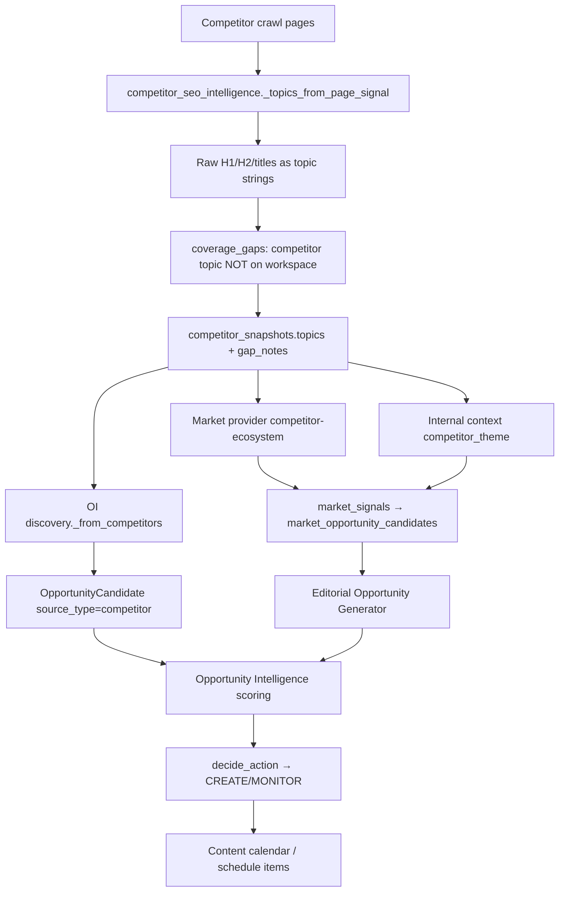

# Competitor Signal Usage Audit

Date: 2026-06-02

## Executive summary

**Conclusion: A) Competitor signals now drive target-site SEO gaps correctly.**

Competitor page text is no longer promoted directly into CREATE recommendations. Signals pass through a **target-site relevance gate** and are normalized into **SEO gap opportunities** mapped to the analyzed site's entities, categories, and coverage gaps.

---

## Part 1 — Signal flow (before fix)

### End-to-end path (legacy)



### How a competitor fragment became CREATE (failure mode)

1. **Crawl** — Competitor page `"3.2 Preise"` scraped from checkout/legal section H2.
2. **Topic extraction** — `_topics_from_page_signal()` normalized heading → `"3.2 Preise"`.
3. **Gap detection** — Topic absent from workspace → added to `coverage_gaps`.
4. **Snapshot persistence** — Stored in `competitor_snapshots.topics` (or raw H2 fallback).
5. **Market layer** — `CompetitorEcosystemMarketProvider` emitted `competitor_theme` market signal.
6. **Editorial layer** — EOG generated concepts from market signals (e.g. "Guide to 3.2 Preise").
7. **OI discovery** — `_from_competitors()` created candidate with `competitor_gap=0.8`, moderate niche scores.
8. **Scoring** — External/competitor evidence boosted score despite weak niche alignment.
9. **Action** — `_market_backed_create()` or high composite score → **CREATE**.

**Root cause:** Competitor text was treated as a **topic seed**, not as **SEO intelligence** requiring mapping back to the target site.

---

## Part 2 — Reclassified outputs (after fix)

### Allowed competitor-derived signals

| Signal type | Example | Output |
|---|---|---|
| Mapped SEO gap | Competitor has Retatrutide FAQ; site sells Retatrutide | `Retatrutide FAQ` CREATE candidate |
| FAQ pattern | Competitor FAQ page for mapped entity | `seo_pattern: faq` |
| Glossary / guide pattern | Competitor category guide | `seo_pattern: category_guide` |
| Benchmark only | Avg word count, internal links | `benchmark_metrics` (no direct topic) |

### Disallowed as direct recommendation topics

Filtered by `is_competitor_chrome_signal()` and quality gates:

- Numbered section labels (`6.5 Verlustrisiko`, `3.2 Preise`)
- Checkout / legal / shipping / payment terms (`Versandkosten`, `Zahlungsmethoden`)
- Platform / social noise (`Facebook`, `LinkedIn`, `Internet`)
- Generic competitor nouns (`Analysis`, `Characteristics`, `Adhesives`)
- Unmapped competitor-only strings with no target entity

---

## Part 3 — Target-site relevance gate

Module: `app/competitor_target_mapping.py`

Before a competitor signal can become a recommendation topic, `map_competitor_signal_to_target()` requires mapping to:

| Mapping basis | Source |
|---|---|
| `target_entity` | `niche_profile.known_entities` + workspace crawl entities |
| `target_category` | `niche_profile.known_categories` |
| `coverage_gap` | Publishing memory coverage topics |
| `niche_profile` | Primary niche token overlap |
| `operator_niche_note` | Workspace user context |

**Rule:** `create_allowed = True` only when `alignment_score >= 0.58` on the mapped entity.

If no mapping → signal suppressed upstream; if it reaches OI → `_competitor_derived_without_target_mapping()` forces **MONITOR/IGNORE**, never CREATE.

---

## Part 4 — Structured SEO extraction

`app/competitor_seo_intelligence.py` continues to extract per page:

- title, meta description, H1/H2/H3, schema types, FAQ presence, content type, URL slug depth

Coverage gaps now emit structured records:

```json
{
  "topic": "Retatrutide FAQ",
  "raw_signal": "Retatrutide FAQ",
  "mapped_entity": "Retatrutide",
  "seo_pattern": "faq",
  "mapping": { "create_allowed": true, "mapping_basis": "target_entity" },
  "competitors": ["rival.com"]
}
```

---

## Part 5 — Action assignment changes

| File | Change |
|---|---|
| `decisions.py` | `_competitor_derived_without_target_mapping()` blocks CREATE |
| `decisions.py` | `_market_backed_create()` rejects competitor-only unmapped editorial backlog |
| `scoring.py` | −0.25 penalty when competitor-derived without valid mapping |
| `discovery.py` | `_from_competitors()` only emits mapped SEO gap candidates |
| `market_intelligence/providers/competitor.py` | Emits `competitor_seo_gap` not raw `competitor_theme` |
| `market_intelligence/providers/internal_context.py` | Same mapping gate for snapshot themes |
| `autopilot/service.py` | Removed raw H2 fallback topics on snapshots |

**Correct rule implemented:**

```
target entity + competitor SEO pattern → CREATE candidate (if alignment proven)
competitor term alone → MONITOR / suppressed
```

---

## Part 6 — Regression fixtures

Tests: `tests/test_competitor_target_mapping.py`

| Input | Expected |
|---|---|
| 6.5 Verlustrisiko, Versandkosten, Adhesives, Facebook, … | Suppressed — not CREATE |
| GHK-CU, MOTS-C, Retatrutide FAQ, Research Peptides, … | Mapped to target entity — eligible CREATE |

No hardcoded allowlists — rules are generic; fixtures prove behavior on peptide-shop-like profiles.

---

## Part 7 — Diagnostics

`metadata.explainability` now includes for competitor-derived recommendations:

- `competitor_mapping` — full mapping object
- `competitor_raw_signal` — original competitor text
- `competitor_mapped_entity` — target site entity
- `competitor_create_allowed` — boolean gate result

Example MONITOR reason: *"Competitor signal has no valid target-site mapping; CREATE blocked."*

---

## Part 8 — Tests

| Test | Status |
|---|---|
| Competitor-only unmapped term cannot CREATE | ✅ |
| Mapped competitor term can CREATE | ✅ |
| FAQ pattern maps to target entity | ✅ |
| Checkout/legal/shipping suppressed | ✅ |
| Generic nouns suppressed | ✅ |
| Niche entities outrank junk | ✅ |
| Diagnostics show raw → mapping | ✅ |
| Existing OI flow (`test_recommendation_scoring.py`) | ✅ |

---

## Part 9 — Conclusion

**A) Competitor signals now drive target-site SEO gaps correctly.**

Competitor intelligence is used for **pattern and gap detection** mapped to the analyzed site's entities. Raw competitor page chrome, checkout terms, and unmapped fragments no longer become CREATE recommendations. Relevant shop/niche entities (GHK-CU, MOTS-C, Retatrutide, etc.) remain eligible when coverage gaps and alignment support CREATE.
