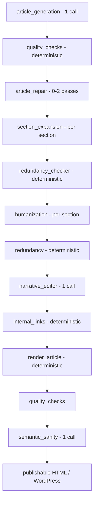
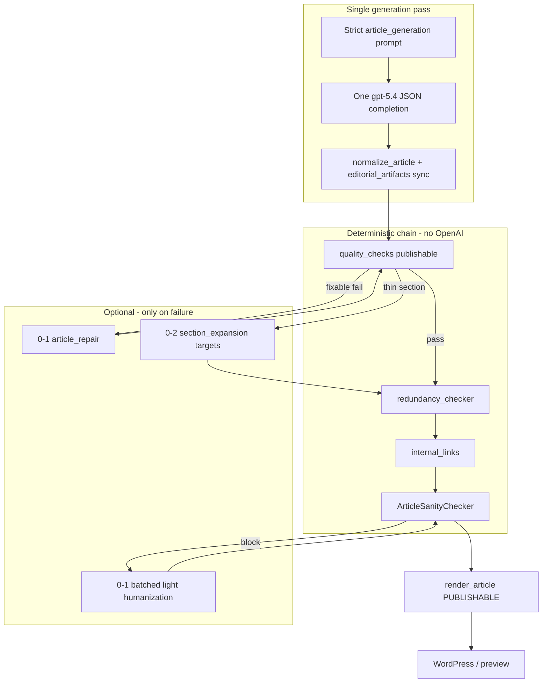

# Article pipeline simplification audit

**Scope:** OpenAI stages in `_run_generation_job` ([`app/services/jobs.py`](../../app/services/jobs.py)).  
**Evidence job:** `2509c670-0e5e-4284-a3b4-fb271be226b1` — *Best Practices for Storing Bacteriostatic Water* ([`docs/debug/ARTICLE_GENERATION_TRACE.md`](../debug/ARTICLE_GENERATION_TRACE.md)).  
**Telemetry source:** `job_run_metrics` and `model_cost_summary` artifacts (aggregated per stage); stage summaries (`article_repair_summary`, `section_expansion_summary`, `humanization_summary`, `narrative_editor_summary`, `sanity_rewrite_summary`).

**Implementation status (2026-06-02):** Simplified pipeline shipped behind `SIMPLIFIED_ARTICLE_PIPELINE` (default `true`). See [Implementation](#implementation-2026-06-02) below.

---

## Executive summary

The current pipeline runs **six premium-model stages** after the initial generation call, totaling **36 OpenAI chat completions**, **~110k input / ~71k output tokens**, and **~$0.79 estimated cost** on the reference job—before YouTube evaluation. **Humanization alone** accounts for **41% of cost** and **27 API calls**; **narrative editor** spent **~$0.07** with **zero edits applied**. **Article generation** already produced a **3,100+ word** article with full schema richness; downstream stages mostly **fix predictable gaps** (RUO disclaimer, word-count targets) and **rephrase** content.

**Recommendation:** Move compliance, length, voice, and publish-boundary requirements into **one strengthened generation pass**, keep **deterministic** quality/redundancy/internal-link steps, and retain **optional single-pass repair** and **deterministic or one-shot sanity** only when gates fail.

---

## Pipeline order (context)



Stages audited below are the **LLM** boxes only.

---

## Reference job — aggregate metrics

| Stage | OpenAI calls | Input tokens | Output tokens | Est. cost | Wall time (stage) |
|-------|-------------|--------------|---------------|-----------|-------------------|
| **Article generation** | 1 | 741 | 10,738 | $0.087 | 178 s |
| **Article repair** | 1 | 7,082 | 9,193 | $0.088 | 122 s |
| **Section expansion** | 5 | 2,566 | 9,067 | $0.078 | 173 s |
| **Humanization** | 27 | 71,329 | 22,028 | $0.319 | 339 s |
| **Narrative editor** | 1 | 10,902 | 6,127 | $0.071 | 74 s |
| **Sanity review** | 1 | 17,011 | 13,784 | $0.144 | 152 s |
| **Total (six stages)** | **36** | **109,631** | **70,937** | **~$0.787** | **~1,038 s** |

Model: **gpt-5.4** (premium) for all six; reasoning enabled on generation per trace.

**Share of six-stage cost:** humanization **41%**, sanity **18%**, generation **11%**, repair **11%**, expansion **10%**, narrative **9%**.

**Publishable word count journey** (quality gate `word_count` on publishable markdown):

| Checkpoint | Words | Notes |
|------------|------:|-------|
| After generation (initial QC) | 3,117 | Failed: missing RUO disclaimer |
| After repair | 3,300 | +6% |
| After expansion | 4,482 | +36% vs 3,235 pre-expansion summary |
| After full pipeline (final QC) | 4,951 | Passed |

---

## Stage-by-stage analysis

### 1. Article generation

| Metric | Value |
|--------|--------|
| **OpenAI calls** | 1 |
| **Tokens** | 741 in / 10,738 out (~2,975 reasoning tokens per trace) |
| **Est. cost** | $0.087 |
| **Runtime** | 178 s |

**What it does:** Single JSON completion via [`article_generation.yaml`](../../app/prompts/templates/article_generation.yaml); `normalize_article()`; seeds all canonical fields.

**Fields produced / populated:** Full `ArticleSchema` — title, excerpt, meta, 11 `sections` with H3 subsections, `key_takeaways`, `faq`, `research_context`, `limitations_and_safety`, rich components (`study_cards`, `research_insights`, `callout_boxes`, `definition_boxes`, `caution_boxes`, `comparison_tables`, `research_metadata_panel`), `references_to_verify`, `internal_links`, etc. ([trace §4](../debug/ARTICLE_GENERATION_TRACE.md)).

**% of article text modified:** **~100%** (creates baseline). Substantive body already **>3,100 publishable words** (above 1,800 minimum).

**Could prompt improvements replace this stage?** **No** — this stage is required. **Yes** for downstream volume: a stricter prompt (RUO in `limitations_and_safety`, publishable vs editorial field split, min words in `sections` only) would reduce repair/expansion/humanization triggers.

**Prompt-improvement levers:**

- Require `biomedical_ruo_disclaimer` (or workspace disclaimer) in `limitations_and_safety` when biomedical.
- Split reader vs editorial fields (now documented in simplified article mode plan).
- Forbid duplicating `references_to_verify` / `study_cards` inside `sections`.
- Target 1,800–2,400 **section** words without relying on expansion.

---

### 2. Article repair

| Metric | Value |
|--------|--------|
| **OpenAI calls** | 1 (max config: `MAX_REPAIR_PASSES=2`) |
| **Tokens** | 7,082 in / 9,193 out |
| **Est. cost** | $0.088 |
| **Runtime** | 122 s |

**Trigger:** Initial quality failed (`RUO disclaimer is missing for biomedical/peptide content`). Invoked only when `has_fixable_quality_issues()` ([`article_repair.py`](../../app/review/article_repair.py)).

**Fields changed (trace + summary):**

- `limitations_and_safety` — RUO disclaimer inserted.
- `references_to_verify` — expanded/normalized to ≥3 leads.
- `research_metadata_panel` — filled when empty.
- Possible touch-ups to `research_context`, FAQ, shallow sections (repair prompt asks for 9–12 sections, 160–240 words each).

**% of article text modified:** **~6%** publishable word count (3,117 → 3,300). **High impact** on compliance fields (disclaimer) despite low word-count delta.

**Could prompt improvements replace this stage?** **Mostly yes** for this job class. A generation prompt that always injects workspace RUO into `limitations_and_safety` and minimum `references_to_verify` would have **avoided the only repair pass**. Keep repair as **optional 0–1 pass** for exceptional QC failures, not the common path.

---

### 3. Section expansion

| Metric | Value |
|--------|--------|
| **OpenAI calls** | 5 (`MAX_SECTIONS_EXPANDED_PER_PASS` × passes; this job: 5 targets, 1 pass) |
| **Tokens** | 2,566 in / 9,067 out (~513 in / ~1,813 out per call) |
| **Est. cost** | $0.078 |
| **Runtime** | 173 s |

**Trigger:** Article below `target_article_min_words` / shallow sections ([`section_expander.py`](../../app/review/section_expander.py)). This job: **3,235 → 4,482** words (+38%).

**Fields changed:** Per-target expansion of thin areas — trace lists **5 targets** including `research_context`, `limitations_and_safety`, and **3 body sections**. Each call rewrites one section’s `content_markdown` (and may add subsections).

**% of article text modified:** **~38%** net new words in publishable surface; **~5 section units** out of 11 (~45% of section slots) received LLM expansion.

**Could prompt improvements replace this stage?** **Partially.** Generation already exceeded minimum length; expansion ran because post-repair count or shallow-section heuristics still flagged gaps. Tighter generation instructions (minimum words **per section**, not via verification blocks) and counting **publishable** words only would reduce expansion frequency. **Keep as optional** when a single section is thin after generation, not batch-expanded every job.

---

### 4. Humanization

| Metric | Value |
|--------|--------|
| **OpenAI calls** | 27 (one per rewrite target from `extract_editorial_rewrite_sections`) |
| **Tokens** | 71,329 in / 22,028 out (~2,640 in / ~815 out per call) |
| **Est. cost** | $0.319 |
| **Runtime** | 339 s (longest stage) |

**Trigger:** **Always runs** after redundancy review ([`jobs.py`](../../app/services/jobs.py)); not gated on quality failure.

**Fields changed:** Section-level targets: body `sections[]`, `research_context`, `limitations_and_safety`, FAQ answers, and rich-text fields exposed as rewrite sections ([`editorial_rewriter.py`](../../app/review/editorial_rewriter.py)). Summary: **27/27 sections rewritten**, **0 reverted**; AI pattern score **60 → 52** (moderate improvement).

**% of article text modified:** **High** — effectively **all considered rewrite units** (~27). Lexical turnover estimated **70–85%** of tokens in targeted fields (each field receives a full LLM rewrite). Publishable word count change smaller than expansion because rewrites preserve length.

**Could prompt improvements replace this stage?** **Largely yes** for voice. Generation + one optional “light editorial” pass (or stronger anti-AI phrase rules in generation) could match quality. **27 calls is poor economics** for style polish. Recommend:

- Default **off** or **light_cleanup** only when `ai_pattern_score` > threshold.
- Never humanize editorial-only fields (`study_cards`, `references_to_verify`) on publishable path.

---

### 5. Narrative editor

| Metric | Value |
|--------|--------|
| **OpenAI calls** | 1 (full-article JSON edit proposal) |
| **Tokens** | 10,902 in / 6,127 out |
| **Est. cost** | $0.071 |
| **Runtime** | 74 s |

**Trigger:** **Always runs** after humanization ([`narrative_editor.py`](../../app/review/narrative_editor.py)).

**Fields changed:** **None applied** on reference job — trace: **0 edits applied**, **15 skipped** (validation, sanity, word-count, or exact-match failures). Model still returned edit suggestions; tokens consumed.

**% of article text modified:** **~0%** on this job.

**Could prompt improvements replace this stage?** **Yes — remove from default pipeline.** Humanization already addressed pattern score; narrative pass duplicated effort with strict validators that rejected all edits. If retained, gate on `ai_pattern_score_after` > threshold and cap at **one** small pass.

---

### 6. Sanity review (semantic)

| Metric | Value |
|--------|--------|
| **OpenAI calls** | 1 (full canonical article in/out) |
| **Tokens** | 17,011 in / 13,784 out |
| **Est. cost** | $0.144 |
| **Runtime** | 152 s |

**Trigger:** **Always runs** before final render ([`semantic_sanity.py`](../../app/review/semantic_sanity.py)).

**Fields changed:** Semantic pass returns full `article` JSON; summary lists **4 changed locations**:

- `limitations_and_safety`
- `section:Why storage matters in laboratory workflows`
- `section:Core storage conditions to control`
- `section:Common storage mistakes and how to correct them`
- Plus **`other`** and **deterministic guardrail** on 3 additional spots (trace: targeted rewrites + deterministic guardrail).

**% of article text modified:** **Low–medium** — roughly **5–15%** of sentences (4–7 loci on a 4,900-word article). Second-largest **output token** consumer despite small visible delta.

**Could prompt improvements replace this stage?** **Partially.**

- **Deterministic** [`ArticleSanityChecker`](../../app/review/sanity_checker.py) already enforces compliance patterns; keep always.
- **Full-json LLM sanity** overlaps repair + generation safety rules. Replace with: (a) deterministic-only default, (b) **one** LLM sanity only when deterministic blocks publish, or (c) markdown-span repair instead of 17k-token full article regen.

---

## Comparative view

| Stage | Calls | Cost share | Word-count impact | Text churn | Replaceable by prompt? |
|-------|------:|-----------|-------------------|------------|-------------------------|
| Generation | 1 | 11% | Creates 100% | 100% (baseline) | No (required) |
| Repair | 1 | 11% | +6% | Low except compliance | **Yes** (common failures) |
| Expansion | 5 | 10% | +38% | Medium (5 sections) | **Partial** |
| Humanization | 27 | **41%** | Low | **Very high** | **Yes** (voice) |
| Narrative | 1 | 9% | **0%** | **0%** | **Yes** (remove default) |
| Sanity | 1 | 18% | Low | Low–medium | **Partial** |

---

## What the reference job proves

1. **Generation is “good enough” structurally** — 11 sections, rich components, 3k+ words; failure was **predictable** (missing RUO).
2. **Repair + expansion + humanization + sanity** all re-send large article context; **total output tokens (~71k)** are **~6.6×** generation output alone.
3. **Narrative editor is dead weight** on this job (paid for 6k output tokens, applied nothing).
4. **Humanization dominates cost and wall time** without unique compliance value.
5. **Sanity regen** is expensive insurance after humanization already rewrote safety sections.

---

## Recommendations

### Required stages (keep)

| Stage | Role |
|-------|------|
| **Article generation** | Single source of structured content |
| **`normalize_article`** | Schema stability |
| **Deterministic quality checks** | RUO, FAQ, links, word count on **publishable** surface |
| **Deterministic redundancy cleanup** | Dedupe without LLM |
| **Deterministic internal links** | Product URL enrichment |
| **`render_article` (publishable surface)** | Reader-facing HTML |
| **Deterministic sanity guardrails** | Block unsafe claims before publish |

### Optional stages (gate, do not run by default)

| Stage | When to run |
|-------|-------------|
| **Article repair** | Only when quality errors match `has_fixable_quality_issues` (max 1 pass) |
| **Section expansion** | Only when publishable section word count < threshold **after** generation; max 1–2 sections per job |
| **Humanization** | Only when `ai_pattern_score` > configurable threshold; prefer **one** batched call or `light_cleanup` |
| **Semantic sanity (LLM)** | Only when deterministic sanity fails or biomedical high-risk |

### Stages to remove from default pipeline

| Stage | Reason |
|-------|--------|
| **Narrative editor** | 0% applied edits on reference job; duplicates humanization; high token cost |
| **27-call humanization** | 41% cost; prompt + optional light pass sufficient |
| **Batch section expansion** | Compensates for generation prompt gaps; run only on measured thin sections |
| **Full-json sanity regen** | 18% cost; use deterministic checker + targeted sentence fixes |

### Proposed “single-pass article generation” architecture



**Design rules:**

1. **One premium call** produces reader + editorial fields with RUO, FAQ, links, and section word targets in the **first** prompt ([`SIMPLIFIED_ARTICLE_MODE_PLAN.md`](./SIMPLIFIED_ARTICLE_MODE_PLAN.md)).
2. **Metrics target:** ≤3 OpenAI calls per happy path (generation + optional repair + optional sanity); reference job today uses **36**.
3. **Cost target:** ~$0.09–$0.15 happy path vs **~$0.79** six-stage path (~**80–85%** reduction).
4. **Time target:** ~3–5 minutes model time vs **~17 minutes** on reference job.
5. **Compliance unchanged:** deterministic checker + publishable render boundary stay mandatory.

**Happy-path sequence:**

1. `build_article_prompt` (strict reader/editorial split, RUO, min section words, anti-AI phrase list).
2. `generate_article` ×1.
3. `normalize_article` + `run_article_quality_checks` (publishable markdown).
4. `redundancy_checker.cleanup` + `internal_links.enrich_markdown`.
5. `ArticleSanityChecker.check` (deterministic).
6. `render_article(surface=PUBLISHABLE)` → artifacts + WordPress.

**Escalation (only if gates fail):**

- Quality → **one** `article_repair` pass (not two by default).
- Thin section → **one** `section_expansion` call per flagged section (cap 2).
- Deterministic sanity fail → targeted rewrite or **one** compact sanity prompt on affected spans, not full article JSON.
- AI pattern score high → **one** batched humanization call (not 27).

---

## Implementation (2026-06-02)

### Stages removed by default (simplified mode)

| Stage | Default | Replacement |
|-------|---------|-------------|
| Editorial humanization (`EditorialRewriter`) | Off | Stronger [`article_generation.yaml`](../../app/prompts/templates/article_generation.yaml) + deterministic cleanup |
| Narrative editor | Off | Generation prompt + deterministic sanity |
| Semantic sanity (LLM) | Off | [`run_deterministic_sanity_review`](../../app/services/article_pipeline.py) |
| Section expansion | Off unless under word target + `ENABLE_SECTION_EXPANSION=true` | Generation min-word requirements |
| YouTube AI evaluation | Off | Heuristic pick (highest `view_count`) |

### Stages retained

| Stage | Role |
|-------|------|
| Article generation | Single GPT-5.4 structured article |
| `apply_deterministic_quality_fixes` | RUO, links, FAQ stubs, safety sanitization (no LLM) |
| Article repair | Up to **1** pass when quality gate reports fixable issues |
| Redundancy checker | Deterministic |
| Internal links | Deterministic |
| Deterministic sanity | Claim rewrite/removal without semantic LLM |
| SEO metadata / render / JSON-LD | Deterministic (metadata may use separate calls if enabled elsewhere) |

### Configuration (`.env`)

```env
SIMPLIFIED_ARTICLE_PIPELINE=true
ENABLE_ARTICLE_HUMANIZATION=false
ENABLE_NARRATIVE_EDITOR=false
ENABLE_SEMANTIC_SANITY_REVIEW=false
ENABLE_SECTION_EXPANSION=false
ENABLE_YOUTUBE_AI_EVALUATION=false
MAX_REPAIR_PASSES=1
```

Set `SIMPLIFIED_ARTICLE_PIPELINE=false` to restore the legacy multi-stage LLM path.

### Before / after OpenAI calls (article core, happy path)

| Path | Typical LLM calls (article stages) | Reference job cost (6 stages) |
|------|-----------------------------------|--------------------------------|
| Legacy | 1 gen + 1 repair + 5 expansion + 27 humanization + 1 narrative + 1 sanity = **36** | ~$0.79 |
| Simplified (defaults) | **1** generation + **0–1** repair = **1–2** | Target ~$0.09–$0.15 (not re-benchmarked in CI) |

### Files changed

- [`app/services/jobs.py`](../../app/services/jobs.py) — stage gating, deterministic pre-repair fixes, validator-first sanity
- [`app/services/article_pipeline.py`](../../app/services/article_pipeline.py) — gate helpers, skipped-stage stubs, deterministic sanity
- [`app/review/article_repair.py`](../../app/review/article_repair.py) — `apply_deterministic_quality_fixes`
- [`app/config.py`](../../app/config.py) — simplified defaults
- [`app/prompts/templates/article_generation.yaml`](../../app/prompts/templates/article_generation.yaml) — publishable-first requirements
- [`tests/test_simplified_article_pipeline.py`](../../tests/test_simplified_article_pipeline.py)

### Risks

- Shorter articles if generation prompt alone misses `target_word_count` and expansion stays disabled.
- Voice may feel less “polished” without per-section humanization (monitor reader feedback).
- Semantic sanity off by default: edge-case claim wording may need `ENABLE_SEMANTIC_SANITY_REVIEW=true` for high-risk verticals.

### Part 9 validation

Automated gate tests cover simplified defaults; full A/B article generation on live OpenAI was **not** run in CI. Re-run a generation job with defaults and compare `model_cost_summary` to job `2509c670` to confirm call-count reduction.

---

## Sources

| Document / module | Use |
|-------------------|-----|
| [`docs/debug/ARTICLE_GENERATION_TRACE.md`](../debug/ARTICLE_GENERATION_TRACE.md) | Stage order, field origins, narrative 0 edits |
| [`app/services/run_metrics.py`](../../app/services/run_metrics.py) | Per-stage token/cost aggregation |
| [`app/services/jobs.py`](../../app/services/jobs.py) | Pipeline orchestration |
| Job `2509c670-0e5e-4284-a3b4-fb271be226b1` artifacts | Quantitative metrics |

---

*Audit date: 2026-06-02. Metrics reflect one biomedical reference job; other niches may differ in repair/expansion frequency but structural incentives (always-on humanization/narrative/sanity) apply platform-wide.*
