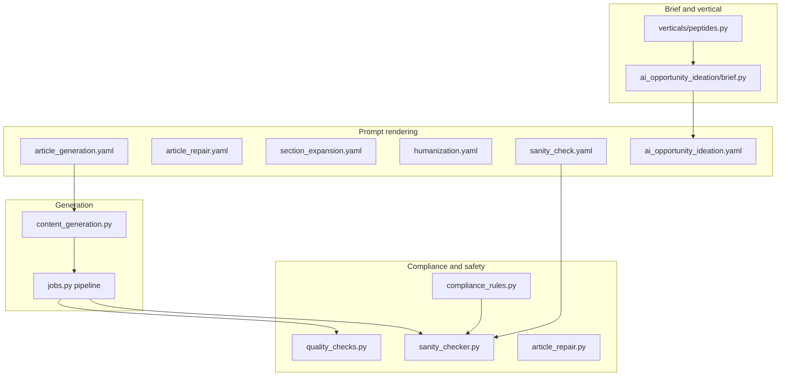

# Hardcoded niche rule audit

Audit of **application code** for hardcoded references to Example Lab, peptides, research-use-only (RUO), reconstitution, storage temperatures, and laboratory handling. Scope: article generation, content generation, prompt rendering, compliance, and safety modules.

**Related:** [ARTICLE_GENERATION_TRACE.md](../debug/ARTICLE_GENERATION_TRACE.md), planned [SIMPLIFIED_ARTICLE_MODE_PLAN.md](./SIMPLIFIED_ARTICLE_MODE_PLAN.md).

**Out of scope:** `docs/validation/runs/**` fixture JSON (Example Lab workspace samples), test fixtures, and README narrative — except where they mirror production coupling.

---

## Classification legend

| Class | Meaning |
|--------|---------|
| **Generic platform rule** | Applies to any regulated / research / YMYL vertical; not tied to one brand or product class |
| **Niche-specific rule** | Tied to peptides / lab compounds / biomedical research commerce |
| **Brand-specific rule** | Tied to Example Lab (or a single hardcoded brand name) |
| **Product-specific rule** | Tied to named SKUs, product families, or catalog skip patterns from one site |

---

## Executive summary

| Finding | Count (app/) | Primary risk |
|---------|----------------|--------------|
| **Example Lab** hardcoded | 3 production files | JSON-LD and sanity rules always assume one brand |
| **Peptides** hardcoded | ~15 modules | Non-peptide workspaces still hit peptide detectors, UI, vertical registry |
| **RUO / research-use-only** | ~12 modules | Duplicated disclaimer strings bypass `BIOMEDICAL_RUO_DISCLAIMER` |
| **Reconstitution** | ~10 modules | Correct as *guardrail topic*; wrong as global ideation mix % |
| **Storage temperatures** | 2 modules (+ prompts) | `-20°C` / `4–8°C` whitelist is peptide-lyophilize folklore in `compliance_rules.py` |
| **Laboratory handling** | ~8 modules | Mix of generic compliance and peptides-vertical templates |

**Recommendation theme:** Keep **generic compliance** global (forbidden claims, source-dependent storage language, configurable RUO). Move **brand name, approved temperature folklore, and peptide entity maps** to **workspace configuration**. Move **angle mix (storage / reconstitution %)** to **article brief / opportunity generation**. Remove **duplicate disclaimer literals** and **default `organization_name="Example Lab"`**.

---

## 1. Example Lab

| Location | Snippet / behavior | Class | Recommendation |
|----------|-------------------|--------|----------------|
| [`app/rules/compliance_rules.py`](../../app/rules/compliance_rules.py) | `"brand_name": "Example Lab"` in `BRAND_RULES` | **Brand-specific** | **Workspace config:** `workspace.compliance.brand_name` (or site profile). Rename module to `brand_compliance_rules.py` loaded by workspace slug/domain |
| [`app/review/sanity_checker.py`](../../app/review/sanity_checker.py) | `from app.rules.compliance_rules import BRAND_RULES, SAFE_STORAGE_HANDLING_FALLBACK` — all sanity passes use this dict | **Brand-specific** (import coupling) | **Workspace config:** inject `brand_rules` from workspace; generic fallback rules in `platform_safety_rules.py` |
| [`app/rendering/schema_jsonld.py`](../../app/rendering/schema_jsonld.py) | `organization_name: str = "Example Lab"` default on `build_schema_jsonld()` | **Brand-specific** | **Workspace config:** pass `workspace.name` or `site_strategy_profile.publisher_name` |
| [`README.md`](../../README.md) | Documents “Example Lab rules” as the sanity gate | **Brand-specific** (docs) | Update when rules are workspace-scoped |
| Validation fixtures / tests | Example URLs and workspace names | N/A (fixtures) | Keep in tests only |

**No Example Lab** references in: `article_generation.yaml`, `content_generation.py`, or prompt renderer — brand enters via **job `product_url` / opportunity brief**, not the template file.

---

## 2. Peptides

| Location | Snippet / behavior | Class | Recommendation |
|----------|-------------------|--------|----------------|
| [`app/opportunities/verticals/peptides.py`](../../app/opportunities/verticals/peptides.py) | Full `PEPTIDES_PROFILE`: BPC-157, TB-500, MOTS-C, GHK-CU, “Research-first peptide shoppers”, `peptide storage`, `lab handling` | **Niche-specific** | **Remain** as vertical plugin; **do not** treat as global. Ensure `OPPORTUNITY_VERTICAL` / workspace profile selects vertical |
| [`app/opportunities/verticals/registry.py`](../../app/opportunities/verticals/registry.py) | Registers `PEPTIDES_PROFILE` among verticals | **Generic platform** (registry pattern) | **Remain global** |
| [`app/quality_checks.py`](../../app/quality_checks.py) | `BIOMEDICAL_HINTS` includes `"peptide"`, `"bpc"`, `"tb-500"`, `"kisspeptin"`, etc.; error text “biomedical/**peptide** content” | **Niche-specific** (detector) | **Workspace config:** `compliance.biomedical_keyword_hints[]` or enable when `vertical_id == peptides` |
| [`app/quality_checks.py`](../../app/quality_checks.py) | `is_biomedical_article()` drives mandatory RUO | **Generic platform** (pattern) | **Remain global** mechanism; **move hint list** to workspace/vertical |
| [`app/review/article_repair.py`](../../app/review/article_repair.py) | Repair copy: “Biomedical and **peptide-related** topics…” | **Niche-specific** | **Generic platform** wording: “regulated research-product topics” |
| [`app/intelligence/research_enrichment.py`](../../app/intelligence/research_enrichment.py) | `if vertical in {"peptides", "supplements"}` | **Niche-specific** | **Workspace config:** vertical → enrichment profile |
| [`app/catalog/products.py`](../../app/catalog/products.py) | Skip regex: `research peptides & laboratory compounds` | **Product-specific** (Example Lab catalog noise) | **Workspace config:** catalog_noise_patterns[] |
| [`app/catalog/products.py`](../../app/catalog/products.py) | `_SKU_LIKE` / aliases: BPC-157, TB-500, GHK-CU, bacteriostatic typos | **Product-specific** | **Workspace catalog** derived from sitemap, not hardcoded SKUs |
| [`app/analysis_digest.py`](../../app/analysis_digest.py) | URL path: `/peptide/` | **Niche-specific** | **Generic:** `/product/` markers only, or workspace path_hints |
| [`app/ui.py`](../../app/ui.py) | `<option value="peptides">`, placeholder `mots-c, peptide research` | **Niche-specific** (UX) | **Workspace config:** populate vertical/tag suggestions from profile |
| [`app/prompts/templates/website_analysis.yaml`](../../app/prompts/templates/website_analysis.yaml) | “peptide/biomedical/regulated niches” | **Niche-specific** | **Generic:** “regulated or research-commerce niches” |
| [`app/prompts/templates/ai_opportunity_ideation.yaml`](../../app/prompts/templates/ai_opportunity_ideation.yaml) | “research **peptides**, lab compounds” | **Niche-specific** | **Article brief / ideation:** inject from `vertical_profile.summary` |
| [`app/ai_opportunity_ideation/brief.py`](../../app/ai_opportunity_ideation/brief.py) | `_RESEARCH_NICHE` regex includes `peptides?` | **Niche-specific** (detector) | **Remain** as heuristic OR **workspace** `research_niche_detect_keywords` |
| [`content_generation.py`](../../app/content_generation.py) | System message: generic “scientific editor” (no peptide) | **Generic platform** | **Remain global** |

---

## 3. Research-use-only (RUO)

| Location | Snippet / behavior | Class | Recommendation |
|----------|-------------------|--------|----------------|
| [`app/config.py`](../../app/config.py) | `biomedical_ruo_disclaimer` + `BIOMEDICAL_RUO_DISCLAIMER` env | **Generic platform** | **Remain global** (canonical source of truth) |
| [`.env.example`](../../.env.example) | Documents default RUO string | **Generic platform** | **Remain global** |
| [`app/prompts/templates/article_generation.yaml`](../../app/prompts/templates/article_generation.yaml) | “Preserve **research-use-only** framing and include the configured RUO disclaimer” | **Generic platform** | **Remain global** |
| [`app/prompts/templates/humanization.yaml`](../../app/prompts/templates/humanization.yaml) | RUO preservation rules; avoid duplicate RUO | **Generic platform** | **Remain global** |
| [`app/prompts/templates/section_expansion.yaml`](../../app/prompts/templates/section_expansion.yaml) | “Preserve RUO and compliance language” | **Generic platform** | **Remain global** |
| [`app/services/jobs.py`](../../app/services/jobs.py) | Passes `settings.biomedical_ruo_disclaimer` through pipeline | **Generic platform** | **Remain global** |
| [`app/quality_checks.py`](../../app/quality_checks.py) | `RUO_DISCLAIMER` constant **duplicates** config default; used as default arg | **Generic platform** (drift risk) | **Remove duplicate:** default `required_disclaimer` from `Settings` only |
| [`app/review/redundancy_checker.py`](../../app/review/redundancy_checker.py) | Hardcoded full disclaimer string (×2 in dedupe logic) | **Generic platform** (drift risk) | **Read from** `required_disclaimer` / settings |
| [`app/internal_links.py`](../../app/internal_links.py) | Hardcoded disclaimer for link insertion | **Generic platform** (drift risk) | **Inject** disclaimer from job settings |
| [`app/review/ai_pattern_detector.py`](../../app/review/ai_pattern_detector.py) | Phrase list: “for research use only”, “not intended for human consumption” | **Generic platform** | **Remain global** (detection) |
| [`app/review/narrative_editor.py`](../../app/review/narrative_editor.py) | Same phrase detection | **Generic platform** | **Remain global** |
| [`app/article_schema.py`](../../app/article_schema.py) | `ruo_status` field on metadata panel | **Generic platform** (schema) | **Remain**; internal/editorial in simplified publish mode |
| [`app/rendering/article_renderer.py`](../../app/rendering/article_renderer.py) | Renders “RUO status” in Research Metadata panel | **Generic platform** (formatter) | **Hide on publishable surface** (see simplified mode plan) |
| [`app/rules/compliance_rules.py`](../../app/rules/compliance_rules.py) | `"research_use_only": True` | **Brand-specific** flag in brand rules | **Workspace:** `compliance.requires_ruo_framing` |
| [`app/ai_opportunity_ideation/brief.py`](../../app/ai_opportunity_ideation/brief.py) | When research niche detected: constraints + `settings.biomedical_ruo_disclaimer` | **Generic platform** | **Remain global** |
| Opportunity brief (runtime) | e.g. `safety_notes: ["For research use only…"]` per trace | **Article brief** | **Remain in brief** generation, not code |

---

## 4. Reconstitution

| Location | Snippet / behavior | Class | Recommendation |
|----------|-------------------|--------|----------------|
| [`app/rules/compliance_rules.py`](../../app/rules/compliance_rules.py) | Approved claim mentions “After **reconstitution**…”; rules forbid definitive reconstitution | **Niche-specific** (peptide solvent context) | **Workspace:** `approved_handling_claims[]` + generic prohibition text |
| [`app/review/sanity_checker.py`](../../app/review/sanity_checker.py) | `unsupported_reconstitution` regex; `_is_approved_reconstitution_context()` (4–8°C + solvent) | **Niche-specific** (whitelist logic) | **Workspace:** approved patterns OR vertical pack `peptides` |
| [`app/prompts/templates/sanity_check.yaml`](../../app/prompts/templates/sanity_check.yaml) | Flags definitive storage/**reconstitution**; passes `brand_rules_json` | **Generic platform** (prompt) | **Remain global** prompt; **brand_rules** from workspace |
| [`app/prompts/templates/humanization.yaml`](../../app/prompts/templates/humanization.yaml) | Do not add reconstitution claims; cautious storage rewrite | **Generic platform** | **Remain global** |
| [`app/prompts/templates/narrative_editor.yaml`](../../app/prompts/templates/narrative_editor.yaml) | No unsupported reconstitution claims | **Generic platform** | **Remain global** |
| [`app/prompts/templates/ai_opportunity_ideation.yaml`](../../app/prompts/templates/ai_opportunity_ideation.yaml) | **20%** reconstitution angle; `search_intent` enum includes `reconstitution` | **Niche-specific** (mix) | **Article brief / vertical:** `ideation.angle_weights` |
| [`app/ai_opportunity_ideation/brief.py`](../../app/ai_opportunity_ideation/brief.py) | `SUGGESTED_THEMES` includes `"reconstitution"` | **Niche-specific** | **Workspace / vertical** theme list |
| [`app/ai_opportunity_ideation/service.py`](../../app/ai_opportunity_ideation/service.py) | “Vary angles: storage, **reconstitution**, comparison…” | **Niche-specific** | **Vertical profile** |
| [`app/ai_opportunity_ideation/models.py`](../../app/ai_opportunity_ideation/models.py) | Intent type `reconstitution` | **Generic platform** (enum) | **Remain** if brief supplies weights; else rename `product_preparation` |
| [`app/recommendations/demand_intent.py`](../../app/recommendations/demand_intent.py) | Template: “How to Reconstitute {product}” | **Niche-specific** | **Vertical:** only when products are lyophilized research materials |
| [`app/recommendations/classification.py`](../../app/recommendations/classification.py) | `_HOW_TO_RE` includes `reconstitut` | **Generic platform** (classifier) | **Remain global** |
| [`app/review/editorial_rewriter.py`](../../app/review/editorial_rewriter.py) | Storage/handling/**reconstitution** term bucket for rewrite policy | **Generic platform** | **Remain global** |
| [`app/opportunities/generator.py`](../../app/opportunities/generator.py) | `laboratory_practice` structure includes storage/handling | **Generic platform** | **Remain global** |

---

## 5. Storage temperatures

| Location | Snippet / behavior | Class | Recommendation |
|----------|-------------------|--------|----------------|
| [`app/rules/compliance_rules.py`](../../app/rules/compliance_rules.py) | Approved: “**-20°C**” lyophilized; “**4-8°C**” after reconstitution | **Niche-specific** + **Brand-specific** file | **Workspace:** `approved_storage_claims[]`; empty = only generic fallback |
| [`app/review/sanity_checker.py`](../../app/review/sanity_checker.py) | Blocks numeric °C unless `_is_approved_storage_temperature()` (-20 lyophilized, 4–8 reconstituted) | **Niche-specific** | **Workspace** overrides + **generic** “source-dependent” fallback (`SAFE_STORAGE_HANDLING_FALLBACK`) |
| [`app/rules/compliance_rules.py`](../../app/rules/compliance_rules.py) | `SAFE_STORAGE_HANDLING_FALLBACK` (label/COA wording) | **Generic platform** | **Remain global** default fallback text (configurable string) |
| [`app/prompts/templates/humanization.yaml`](../../app/prompts/templates/humanization.yaml) | Inline cautious storage paragraph (label/COA) | **Generic platform** | **Remain global** (matches fallback) |
| [`app/review/editorial_rewriter.py`](../../app/review/editorial_rewriter.py) | Regex flags `storage` + `°C` | **Generic platform** | **Remain global** |
| [`app/review/sanity_checker.py`](../../app/review/sanity_checker.py) | `unsafe_mixing_temperature` (-80°C water) | **Generic platform** | **Remain global** |
| Article output (runtime) | Model writes “do not refrigerate” etc. (trace) | **Article brief** | Brief should say “follow label”; sanity enforces |

---

## 6. Laboratory handling

| Location | Snippet / behavior | Class | Recommendation |
|----------|-------------------|--------|----------------|
| [`app/opportunities/verticals/peptides.py`](../../app/opportunities/verticals/peptides.py) | `lab handling`, `peptide handling`, `laboratory myths`, audience “lab handling” | **Niche-specific** | **Vertical profile** only |
| [`app/opportunities/generator.py`](../../app/opportunities/generator.py) | `laboratory_practice` opportunity type; structure “Handling context, **Storage considerations**” | **Generic platform** (type system) | **Remain global** type; templates from vertical |
| [`app/opportunities/generator.py`](../../app/opportunities/generator.py) | Default structure includes “References to verify” | **Generic platform** | **Remain** for internal artifacts; hide on publish |
| [`app/review/section_expander.py`](../../app/review/section_expander.py) | `BIOMEDICAL_TOPICS`: “**handling, storage, and documentation** considerations” | **Niche-specific** (expansion menu) | **Workspace/vertical:** `expansion_topic_hints[]` |
| [`app/prompts/templates/article_repair.yaml`](../../app/prompts/templates/article_repair.yaml) | “handling/documentation notes” | **Generic platform** | **Remain global** |
| [`app/prompts/templates/ai_opportunity_ideation.yaml`](../../app/prompts/templates/ai_opportunity_ideation.yaml) | “research/**laboratory** framing”, 25% handling/storage | **Niche-specific** (mix) | **Vertical** ideation weights |
| [`app/ai_opportunity_ideation/brief.py`](../../app/ai_opportunity_ideation/brief.py) | `_RESEARCH_NICHE` includes `laboratory`, `labs?` | **Generic platform** (detector) | **Remain** for research-commerce sites |
| [`app/catalog/filters.py`](../../app/catalog/filters.py) | Junk filter term `"laboratory"` | **Generic platform** | **Remain** (navigation noise) |
| [`app/prompts/templates/article_generation.yaml`](../../app/prompts/templates/article_generation.yaml) | “practical **researcher-oriented** sections” | **Generic platform** | **Remain global** |

---

## Module map (audit scope)

| Module | Example Lab | Peptides | RUO | Reconstitution | Storage °C | Lab handling |
|--------|-----------|----------|-----|----------------|------------|--------------|
| `compliance_rules.py` | **Y** | implied | Y | Y | **Y** | Y |
| `sanity_checker.py` | via import | whitelist | Y | Y | **Y** | Y |
| `quality_checks.py` | — | **Y** | **Y** | — | — | — |
| `article_generation.yaml` | — | — | Y | — | — | researcher |
| `content_generation.py` | — | — | — | — | — | — |
| `jobs.py` | — | via vertical detect | **Y** | — | — | — |
| `peptides.py` vertical | — | **Y** | Y | implied | implied | **Y** |
| `ai_opportunity_ideation/*` | — | Y | Y | **Y** | — | **Y** |
| `schema_jsonld.py` | **Y** | — | — | — | — | — |
| `humanization.yaml` | — | — | Y | Y | Y | Y |

---

## Recommendations by disposition

### Remain global (platform)

- Config-driven **`BIOMEDICAL_RUO_DISCLAIMER`** and plumbing through `jobs.py`, repair, expansion, humanization.
- **Forbidden medical phrases** (`treats`, `cures`, `recommended dose`, etc.) in `quality_checks.py` and `sanitize_article_safety()`.
- **Sanity checker pattern library** for: human dosing, therapeutic claims, patient instructions, impossible mixing, definitive-unframed numeric storage (with **generic** fallback sentence).
- **Prompt safety rules** in article generation, humanization, narrative editor, sanity_check (no dosing, no invented citations).
- **Generic** article structure requirements: FAQ, limitations, research context, internal product link.
- **`sanitize_article_safety()`** phrase replacements (not brand-specific).
- **Classifier regexes** for how-to/storage (`classification.py`) without hardcoded product names.

### Move to workspace configuration

| Item | Suggested config key / source |
|------|-------------------------------|
| Brand name | `workspace.brand_name` or site strategy `publisher_name` |
| Brand / compliance rules JSON | `workspace.compliance_rules` (replaces `BRAND_RULES`) |
| Approved storage/reconstitution claims | `workspace.approved_storage_claims[]` |
| Biomedical keyword hints | `workspace.compliance.biomedical_hints[]` or `vertical_id` |
| Catalog noise / skip patterns | `workspace.catalog.exclude_label_patterns[]` |
| JSON-LD `organization_name` | workspace / site profile |
| Default WordPress tag placeholders in UI | workspace niche profile |
| Optional: enable sanity temperature whitelist | `workspace.compliance.enable_temperature_whitelist` |

### Move to article brief / opportunity generation

| Item | Source |
|------|--------|
| `safety_notes` (RUO line) | `opportunity_context` from ideation ([trace example](../debug/ARTICLE_GENERATION_TRACE.md)) |
| Storage / reconstitution / handling **angle mix** | `ai_opportunity_ideation` vertical weights, not global 20/25% in YAML |
| Product-specific titles (Bacteriostatic Water, BPC-157) | Catalog + strategist, not `peptides.py` maps in code path for other verticals |
| `target_audience: Laboratory Technicians` | Per-opportunity brief field |
| Suggested themes (`SUGGESTED_THEMES`) | Vertical profile `ideation.themes[]` |

### Remove or refactor entirely

| Item | Why |
|------|-----|
| **`organization_name="Example Lab"`** default in `schema_jsonld.py` | Wrong for every other workspace |
| **`compliance_rules` module name** as global import | Misleading; forces brand coupling in sanity |
| **Duplicate `RUO_DISCLAIMER` literals** in `quality_checks.py`, `redundancy_checker.py`, `internal_links.py` | Drift from `.env`; single source via Settings |
| **Hardcoded `-20°C` / `4–8°C` whitelist** as global truth | Product-specific; bacteriostatic water trace shows “do not assume refrigeration” |
| **`peptides` UI default** and tag placeholder | Tortuga/Denver workspaces should not see peptide examples |
| **`research peptides & laboratory compounds`** in `catalog/products.py` skip list | Example Lab sitemap artifact; belongs in workspace noise config |
| **Peptide SKU regex / aliases** in `catalog/products.py` | Should come from catalog ingestion per site |

---

## Coupling to simplified publishable article mode

Hardcoded **research verification UI** (study cards, references to verify, research metadata) is prompt- and formatter-driven ([trace §6–7](../debug/ARTICLE_GENERATION_TRACE.md)), not Example Lab-specific. Separately:

- **RUO** and **limitations_and_safety** must stay on the **public** surface (global compliance).
- **Research Metadata / RUO status** row is formatter-driven; should be **editorial-only** in publishable mode.
- **Sanity fallback** text should use workspace `brand_name` only when referring to “supplier documentation,” not “Example Lab” in code.

---

## Suggested implementation order (when coding)

1. Single disclaimer source (`Settings.biomedical_ruo_disclaimer` everywhere).
2. Workspace-backed `brand_rules` + schema JSON-LD publisher name.
3. Vertical-gated `is_biomedical_article` hints and ideation angle weights.
4. Simplified publishable renderer (hide verification blocks; keep compliance body).
5. Deprecate `compliance_rules.py` after migration to workspace compliance profile.

---

## Open questions

1. Should **non-peptide** workspaces skip biomedical RUO enforcement entirely, or use a lighter “regulated product” disclaimer?
2. Should approved **-20°C / 4–8°C** claims remain as optional **peptides vertical pack**, or be removed in favor of label-only guidance for all products?
3. Should `BIOMEDICAL_HINTS` trigger on `vertical_id` only, or on keyword detection in title/keyword (current behavior)?

---

*Audit date: 2026-06-02. Application paths relative to repository root.*
