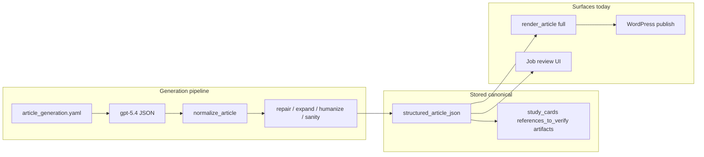
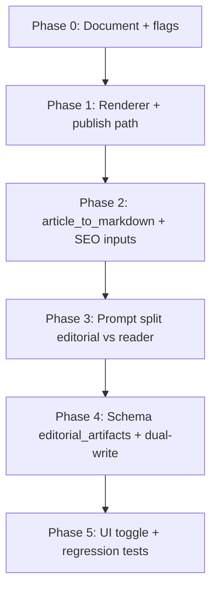

# Simplified publishable article mode — design plan

**Status:** Implemented (all batches complete — 2026-06-02).  
**Evidence base:** [Article generation trace — Bacteriostatic Water storage](../debug/ARTICLE_GENERATION_TRACE.md) (job `2509c670-0e5e-4284-a3b4-fb271be226b1`).  
**Related:** [Hardcoded niche rule cleanup](./HARDCODED_NICHE_RULE_CLEANUP.md) (compliance boundaries are unchanged by this plan).

---

## Implementation status

| Batch | Scope | Status |
|-------|--------|--------|
| **1** | `ArticleRenderSurface`, dual HTML artifacts, WordPress publishable boundary, legacy re-render | Done |
| **2** | `article_to_markdown(surface)`, publishable word counts, SEO excerpt, quality regression guard | Done |
| **3** | Prompt updates (`article_generation`, repair, humanization, sanity, section_expansion) | Done |
| **4** | `EditorialArtifacts` + `normalize_article` dual-read/dual-write | Done (safe; no DB migration) |
| **5** | UI public vs editorial preview links; API `?surface=editorial` | Done |

**Tests:** `pytest tests/` — 140 passed (includes `tests/test_article_render_surfaces.py`).

**Validation script:** `scripts/validate_publishable_surface.py` re-renders job `2509c670-0e5e-4284-a3b4-fb271be226b1` from SQLite.

### Bacteriostatic Water — before / after (re-render from `structured_article_json`)

| Block | Editorial full | Publishable |
|-------|----------------|-------------|
| Research Metadata | Yes | No |
| Research Insights | Yes | No |
| Research Notes To Verify | Yes | No |
| References to verify | Yes | No |
| Evidence gap (in study card titles) | Yes | No |
| Limitations and Safety Notes | Yes | Yes |
| FAQ | Yes | Yes |
| Product reference (CTA) | No (was “Research Material Reference”) | Yes |

Canonical JSON still contains `references_to_verify`, `study_cards`, `research_insights`, and `research_metadata_panel` (and nested `editorial_artifacts`).

### Artifacts

| Artifact | Content |
|----------|---------|
| `publishable_html` | Reader-facing HTML (WordPress + default preview) |
| `article_html` | Same as publishable (backward compatible) |
| `rendered_html` | Same as publishable |
| `article_html_editorial` | Full HTML including verification blocks |

### Config

- `ARTICLE_DEFAULT_RENDER_SURFACE=publishable` in [`.env.example`](../../.env.example)

### Skipped / not done

- No mandatory backfill of historical jobs (re-render on publish/preview when needed).
- No nested-only schema write (top-level verification fields remain for compatibility).

### Backward compatibility

- Old jobs with editorial HTML in `article_html` / `rendered_html`: `_resolve_publishable_html()` detects verification headings and re-renders publishable HTML from `structured_article_json`.
- API preview: `/jobs/{id}/preview` defaults to publishable; `?surface=editorial` shows full QA HTML.

---

## Executive summary

Completed generation jobs today produce **one canonical JSON** (`structured_article_json`) that mixes **reader-facing body content** with **editorial verification artifacts** (`study_cards`, `references_to_verify`, `research_insights`, `research_metadata_panel`). The trace shows **mixed origin (C)**: the model fills verification fields; [`render_article()`](../../app/rendering/article_renderer.py) turns them into public H2 blocks; WordPress publish sends that HTML verbatim via [`_publish_to_wordpress()`](../../app/services/jobs.py).

**Goal:** Keep full verification data in canonical JSON, job artifacts, and review UI — but **render and publish only reader-facing sections**.

**Mechanism:** Dual **render surfaces** (`editorial_full` vs `publishable`) on the existing schema, not a forked article type. Generation may still produce QA bundles; the **publish boundary** decides visibility.

**Conclusion:** Mixed origin remains acceptable in generation; simplified mode fixes what readers and WordPress see without removing internal QA.

---

## Problem statement (evidence)

From [ARTICLE_GENERATION_TRACE.md §5–7](../debug/ARTICLE_GENERATION_TRACE.md):

| Observation | Source |
|-------------|--------|
| Model returns `study_cards` with titles like `"Evidence gap: …"` | Raw LLM artifact `structured_article_initial` |
| Public H2 **"Research Notes To Verify"** | [`article_renderer._study_cards()`](../../app/rendering/article_renderer.py) |
| **"Evidence Gaps"** is not a schema field | Card titles inside `study_cards` under that H2 ([trace §6](../debug/ARTICLE_GENERATION_TRACE.md)) |
| **"References to verify"** on the live page | [`_references()`](../../app/rendering/article_renderer.py) + prompt requirement in [`article_generation.yaml`](../../app/prompts/templates/article_generation.yaml) |
| WordPress gets full `article_html` | [`jobs.py` `_run_generation_job` → `render_article` → `_publish_to_wordpress`](../../app/services/jobs.py) (`html_content=article_html`) |
| Compliance blocks (`limitations_and_safety`, cautions) | Appropriate to keep public |



**Target:** one canonical document, two render surfaces — **editorial** (review) and **publishable** (WordPress + public preview).

---

## Design principles

1. **Do not delete verification data** — retain in `structured_article_json`, per-field job artifacts (`study_cards`, `references_to_verify`, `research_metadata_panel`, `rich_components_json`), and review UI ([`app/ui.py`](../../app/ui.py) ~793–1161).
2. **Separate "generate for QA" from "show to readers"** — prompts may still produce verification bundles; renderer/publish path decides visibility.
3. **Compliance stays public** — `limitations_and_safety`, `caution_boxes`, RUO disclaimer in body or limitations block; no fabricated citations.
4. **SEO preserved** — public surface keeps title, excerpt, meta fields, body sections, FAQ, key takeaways, TOC, definitions/comparison/callouts when reader-useful, product internal links, optional related video; schema JSON-LD built from public-facing fields only.

---

## Public vs internal field taxonomy

| Field / section | Publishable | Rationale |
|-----------------|-------------|-----------|
| `title`, `slug`, `excerpt`, `meta_*`, keywords | Yes | SEO |
| `key_takeaways`, `table_of_contents`, `sections[]` | Yes | Core article |
| `definition_boxes`, `comparison_tables` | Yes | Reader utility |
| `callout_boxes` | Yes | Practical checklists (trace: "Daily storage checklist") |
| `caution_boxes`, `limitations_and_safety` | Yes | Compliance |
| `faq` | Yes | SEO + UX |
| `internal_links` + product CTA block | Yes | SEO; rename public H2 from **"Research Material Reference"** to **"Related product"** or **"Product reference"** (formatter-only) |
| `related_video` | Yes | Enrichment; trace notes non-factual |
| `research_context` | Yes (optional rename) | Reader overview; avoid "Research Metadata" tone — public H2 **"Overview"** or keep **"Research Context"** |
| `related_topics` | Configurable | Reader "Further reading" vs editorial; default **publishable** as related links if URLs present |
| `research_insights` | **Internal** | Meta commentary on evidence quality |
| `study_cards` ("Evidence gap" cards) | **Internal** | Verification backlog |
| `research_metadata_panel` | **Internal** | Editorial confidence / status |
| `references_to_verify` | **Internal** | Source leads, not citations |
| `backlink_plan` | **Internal** | Already advisory |
| `social_posts` | **Internal** | Separate artifacts today |
| `inline_citation_markers` | **Internal** | Tied to unverified refs |

**Not a schema field:** "Evidence Gaps" — card titles inside `study_cards` ([trace §6](../debug/ARTICLE_GENERATION_TRACE.md)); hiding `study_cards` removes them from public view.

---

## Recommended architecture: render surface (not schema fork)

**Primary mechanism:** `ArticleRenderSurface` enum passed to renderer and markdown exporters.

```python
# Conceptual — implementation in a later phase
from enum import StrEnum

class ArticleRenderSurface(StrEnum):
    EDITORIAL_FULL = "editorial_full"   # current behavior
    PUBLISHABLE = "publishable"         # reader-facing only
```

### Renderer

[`render_article(article, surface=..., ...)`](../../app/rendering/article_renderer.py):

| Surface | Behavior |
|---------|----------|
| `EDITORIAL_FULL` | Current assembly order (see [trace § Rendered document order](../debug/ARTICLE_GENERATION_TRACE.md)) |
| `PUBLISHABLE` | Skip `_research_metadata`, `_research_insights`, `_study_cards`, `_references`; optionally gate `related_topics`; heading map for CTA |

**Publishable assembly order (proposed):**

1. Hero → key takeaways → TOC → definitions → research_context (optional renamed H2) → body sections → comparison → callouts → cautions → limitations → product CTA → related topics (if enabled) → FAQ → related video

### Markdown export

[`article_to_markdown()`](../../app/article_schema.py) (lines 208–232 today append study cards + references):

- Add `surface` parameter; **publishable** omits `## Research Notes To Verify` and `## References to verify` blocks.
- Used by quality checks, SEO metadata, humanization — see [Backward compatibility](#backward-compatibility-concerns).

### Dual HTML artifacts (implementation phase)

| Artifact | Content |
|----------|---------|
| `article_html` or `publishable_html` | Reader-facing HTML (WordPress) |
| `article_html_editorial` | Full HTML for audit / review compare |

**Config:** `ARTICLE_DEFAULT_RENDER_SURFACE=publishable` in [`.env.example`](../../.env.example); job-level override for A/B.

### Optional schema grouping (phase 2)

Nest internal fields under `editorial_artifacts` in [`ArticleSchema`](../../app/article_schema.py); [`normalize_article()`](../../app/article_schema.py) accepts flat legacy keys and nested object (read-merge, dual-write during transition).

---

## 1. Prompt changes required

### Primary: [`app/prompts/templates/article_generation.yaml`](../../app/prompts/templates/article_generation.yaml)

**Today (problem):** Single list mixes reader and verification fields; line 38 requires *"References to verify"* in the article requirements — encouraging public-facing treatment.

**Proposed split:**

- **Reader content:** `sections`, `key_takeaways`, `faq`, `limitations_and_safety`, `caution_boxes`, optional `definition_boxes`, `comparison_tables`, `callout_boxes`, `research_context`, `internal_links`.
- **Editorial verification (internal, not for publication):** `references_to_verify`, `study_cards`, `research_insights`, `research_metadata_panel`, `inline_citation_markers`, `backlink_plan`.

**Replace** reader requirement *"Include … References to verify"* with:

> Populate `references_to_verify` and `study_cards` as internal verification leads only; do not duplicate them in `sections` or present as confirmed citations.

**Optional:** Instruct `study_cards` titles to use neutral internal labels (e.g. `"Gap: …"`); renderer hide is sufficient.

**Clarify:** `callout_boxes` are **reader-facing operational tips**, not verification logs.

### Downstream prompts

| File | Change |
|------|--------|
| [`article_repair.yaml`](../../app/prompts/templates/article_repair.yaml) | Keep "≥3 references_to_verify"; add "editorial-only, not for reader body" |
| [`humanization.yaml`](../../app/prompts/templates/humanization.yaml) | Preserve editorial keys; humanize **sections** only by default (exclude `study_cards` from rewrite targets or mark non-publishable) |
| [`sanity_check.yaml`](../../app/prompts/templates/sanity_check.yaml) | Preserve `references_to_verify` in JSON; sanity must not inject verification blocks into `sections` |
| Section expansion templates | Expand reader sections only; no verification appendices |

**System message** ([`content_generation.py`](../../app/content_generation.py)): optional line — *"Put verification material only in designated editorial fields."*

---

## 2. Schema changes required

### Phase 1 (minimal)

No Pydantic breaking changes — render surface only.

### Phase 2 (recommended)

```python
class EditorialArtifacts(BaseModel):
    references_to_verify: list[ReferenceToVerify] = []
    study_cards: list[StudyCard] = []
    research_insights: list[ResearchInsight] = []
    research_metadata_panel: ResearchMetadataPanel | None = None
    backlink_plan: list[BacklinkPlanItem] = []
    inline_citation_markers: list[InlineCitationMarker] = []

class ArticleSchema(BaseModel):
    # ... existing reader fields ...
    editorial_artifacts: EditorialArtifacts | None = None
    # Deprecated top-level mirrors during migration
```

- **`normalize_article()`:** If `editorial_artifacts` missing, lift top-level verification fields into nested object; dual-write top-level aliases for one release.
- **Job artifacts:** Continue storing `study_cards`, `references_to_verify` ([`jobs.py` ~1267–1311](../../app/services/jobs.py)); optionally add single `editorial_artifacts` artifact.
- **Version metadata:** `article_schema_version: 2` on new jobs (optional in `structured_article_json`).

---

## 3. Renderer and pipeline changes required

### [`app/rendering/article_renderer.py`](../../app/rendering/article_renderer.py)

| Function | Change |
|----------|--------|
| `render_article()` | `surface: ArticleRenderSurface` parameter |
| Publishable | Skip `_research_metadata`, `_research_insights`, `_study_cards`, `_references` |
| Heading map | `Research Material Reference` → `Product reference` (or site-configurable) |

### [`app/article_schema.py`](../../app/article_schema.py) — `article_to_markdown`

- `surface` parameter; publishable omits study cards and references sections.
- [`jobs.py`](../../app/services/jobs.py): prefer **publishable** markdown for SEO metadata prompt so meta reflects public text (tradeoff documented below).

### Legacy [`app/rendering/article_template.py`](../../app/rendering/article_template.py)

Audit callers; align or deprecate (may still render `_references` from legacy keys). **Do not use for publish** in main job path.

### Quality checks [`app/quality_checks.py`](../../app/quality_checks.py)

- `run_article_quality_checks`: validate `references_to_verify` on **canonical** article (unchanged).
- **New regression guard (optional):** `publishable_html` must not contain `References to verify`, `Research Notes To Verify`, `Evidence gap`.

### Review UI [`app/ui.py`](../../app/ui.py)

- Preview toggle: **Editorial** vs **Public** (`article_html` vs `publishable_html`).
- Keep study cards / references in detail panels (artifact loaders ~1078–1160).

### WordPress publish

[`_publish_to_wordpress()`](../../app/services/jobs.py): use **publishable** HTML only; store full HTML in `article_html_editorial` for audit.

Align with [WordPress draft publishing contract](../wordpress/DRAFT_PUBLISHING_CONTRACT.md) — published body hash should reflect publishable content.

---

## Compliance and SEO notes

- **RUO / limitations:** Remain on publishable surface ([`limitations_and_safety`](../../app/article_schema.py), [`quality_checks`](../../app/quality_checks.py) biomedical gates).
- **Word count gates:** Count **section** words only for publishable minimums — do not inflate counts with verification blocks.
- **Schema JSON-LD:** [`build_schema_jsonld()`](../../app/rendering/schema_jsonld.py) should use public fields only (title, excerpt, body from publishable markdown slice).
- **Internal links:** Product URL requirements in quality checks apply to canonical + publishable markdown ([`internal_links.enrich_markdown`](../../app/internal_links.py)).

---

## Backward compatibility concerns

| Concern | Mitigation |
|---------|------------|
| Existing jobs lack `publishable_html` | On read/publish, re-render from `structured_article_json` with `PUBLISHABLE` (deterministic, no LLM) |
| API consumers expect full `article_html` | Keep `article_html` as publishable **or** add `article_html_editorial`; preview endpoint `render_surface` query param |
| Flat JSON keys in DB | `normalize_article` dual-read; writers dual-write during migration |
| Humanization / sanity rewrite editorial fields | [`editorial_rewriter.py`](../../app/review/editorial_rewriter.py) / [`narrative_editor.py`](../../app/review/narrative_editor.py) target `study_cards` / `research_insights` — exclude from publishable rewrite targets |
| Quality warnings on empty rich components | Scope `_empty_rich_components` to publishable-relevant keys only |
| Sanity review input | Review **full** canonical JSON + publishable markdown for claim checks |
| `article_to_markdown` in pipeline | SEO/social: publishable; sanity: full canonical where needed |

**Rollout default:** `ARTICLE_DEFAULT_RENDER_SURFACE=editorial_full` for one release, then flip to `publishable`.

---

## Migration path



| Phase | Scope | Risk |
|-------|--------|------|
| **0** | Ship this document, env flags, field taxonomy | None |
| **1** | `render_article(PUBLISHABLE)` + WordPress uses it; artifact `publishable_html` | Low — largest user-visible win |
| **2** | Publishable `article_to_markdown`; SEO metadata from publishable text | Medium — verify meta still accurate |
| **3** | Prompt updates; reduce verification duplicated in `sections` | Medium — monitor token use |
| **4** | Nested `editorial_artifacts`; normalize dual-read | Medium — optional DB migration script |
| **5** | UI dual preview; quality regression strings; tests | Low |

**Re-render policy:** No mandatory backfill of old jobs; publish action re-renders on demand.

**Success metrics:**

- Public HTML has no verification H2s (`Research Notes To Verify`, `References to verify`, `Research Metadata`, `Research Insights`).
- Jobs still have ≥3 `references_to_verify` in canonical JSON.
- Biomedical disclaimer remains in public `limitations_and_safety`.
- Word-count gates use section body only.

---

## Key source file index

| Area | Path |
|------|------|
| Trace / evidence | [`docs/debug/ARTICLE_GENERATION_TRACE.md`](../debug/ARTICLE_GENERATION_TRACE.md) |
| Generation prompt | [`app/prompts/templates/article_generation.yaml`](../../app/prompts/templates/article_generation.yaml) |
| Schema + markdown | [`app/article_schema.py`](../../app/article_schema.py) |
| HTML renderer | [`app/rendering/article_renderer.py`](../../app/rendering/article_renderer.py) |
| Job pipeline + publish | [`app/services/jobs.py`](../../app/services/jobs.py) |
| Quality gates | [`app/quality_checks.py`](../../app/quality_checks.py) |
| Review UI | [`app/ui.py`](../../app/ui.py) |
| Humanization / repair | [`app/review/editorial_rewriter.py`](../../app/review/editorial_rewriter.py), [`app/review/narrative_editor.py`](../../app/review/narrative_editor.py), [`app/review/article_repair.py`](../../app/review/article_repair.py) |
| Prompt build | [`app/prompts/__init__.py`](../../app/prompts/__init__.py), [`app/content_generation.py`](../../app/content_generation.py) |

---

## Open decisions

Document owner should resolve before Phase 1 implementation:

1. **`research_context` public H2:** **"Overview"** vs **"Research Context"**?
2. **`related_topics`:** Appear on public posts by default?
3. **Env default:** `publishable` immediately vs one-release `editorial_full` default?
4. **`article_html` naming:** Rename stored field to `publishable_html` vs keep `article_html` as publishable and add `article_html_editorial`?

---

## Out of scope (this plan)

- Implementing `ArticleRenderSurface` in code (Phases 1–5).
- Changing the attached Cursor plan file (`.cursor/plans/simplified_article_mode_*.plan.md`).
- Removing verification fields from generation or job storage.
- Simplifying the full repair/humanization/sanity pipeline beyond publish-boundary gating.

---

## Trace cross-reference quick map

| User-visible section | Trace section | Renderer function |
|---------------------|---------------|-------------------|
| Research Insights | [§6](../debug/ARTICLE_GENERATION_TRACE.md) | `_research_insights()` |
| Research Notes To Verify | [§6](../debug/ARTICLE_GENERATION_TRACE.md) | `_study_cards()` |
| Evidence gap cards | [§6](../debug/ARTICLE_GENERATION_TRACE.md) | Inside `_study_cards()` |
| References to verify | [§6](../debug/ARTICLE_GENERATION_TRACE.md) | `_references()` |
| Research Metadata / Confidence notes | [§6](../debug/ARTICLE_GENERATION_TRACE.md) | `_research_metadata()` |
| Research Material Reference | [§6](../debug/ARTICLE_GENERATION_TRACE.md) | `_research_use_cta()` |
| Pipeline order | [Rendered document order](../debug/ARTICLE_GENERATION_TRACE.md) | `render_article()` parts list |

---

*Design plan version 1 — 2026-06-02. Implementation tracked separately from Phase 0 documentation.*
