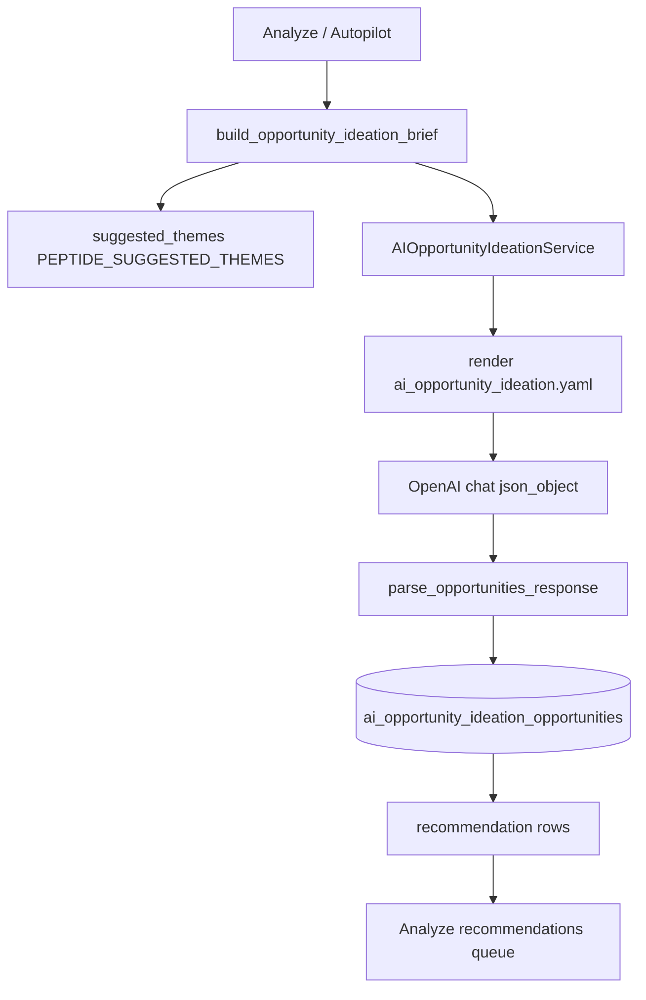

# AI ideation prompt trace

**Scope:** AI article opportunity ideation for analyze/autopilot (not article generation, not EOG deterministic seeds, not `ai_recommendation_reviewer`).  
**Investigated:** 2026-06-05  
**Example Lab workspace:** `48c761a6-2698-4a1d-8022-f23bfd1d5cb6` (`https://www.example.com/`)

---

## Part 1 — Prompt and source path

### Primary prompt

| Field | Value |
|-------|--------|
| **File** | [`app/prompts/templates/ai_opportunity_ideation.yaml`](../../app/prompts/templates/ai_opportunity_ideation.yaml) |
| **Prompt id** | `ai_opportunity_ideation` |
| **Version** | `1` |
| **Model task (registry)** | `CLASSIFICATION` |
| **Rendered by** | `get_default_prompt_registry().render("ai_opportunity_ideation", …)` in [`app/ai_opportunity_ideation/service.py`](../../app/ai_opportunity_ideation/service.py) `_call_model()` |

### Variables supplied to the template

| Variable | Source |
|----------|--------|
| `opportunity_ideation_brief_json` | `context_as_json(brief)` from [`build_opportunity_ideation_brief()`](../../app/ai_opportunity_ideation/brief.py) |
| `min_ideas` | `settings.ai_opportunity_ideation_min_ideas` (default **40**) |
| `max_ideas` | `settings.ai_opportunity_ideation_max_ideas` (default **60**) |

### Brief JSON fields (injected into prompt)

Built in [`app/ai_opportunity_ideation/brief.py`](../../app/ai_opportunity_ideation/brief.py):

`workspace_id`, `analysis_job_id`, `website_url`, `site_name`, `niche`, `site_description`, `business_type`, `catalog_products`, `products`, `sitemap_catalog`, `categories`, `entities`, `services`, `audiences`, `constraints`, `disclaimers`, `existing_page_titles`, `competitor_domains`, `competitor_gap_topics`, **`suggested_themes`**.

**`suggested_themes` is hardcoded by niche** (not from the LLM):

```python
# brief.py — PEPTIDE_SUGGESTED_THEMES (when niche/vertical is peptides)
["reconstitution", "storage", "handling", "stability", "concentration",
 "lab calculations", "comparison articles", "FAQ and guide articles"]
```

Generic non-peptide sites get: `storage`, `handling`, `comparison articles`, `FAQ`, `troubleshooting`, `buyer guides`, `research overviews`.

### Model and API call

| Setting | Default / effective |
|---------|---------------------|
| **Model** | `AI_OPPORTUNITY_IDEATION_MODEL` or fallback `OPENAI_LIGHT_MODEL` via `effective_ai_opportunity_ideation_model` |
| **Temperature** | `0.3` (`AI_OPPORTUNITY_IDEATION_TEMPERATURE`) |
| **Max output tokens** | `16384` |
| **Timeout** | `90s` |
| **Response format** | `json_object` |
| **System message** | Hardcoded in `service.py` `_SYSTEM_MESSAGE` — emphasizes catalog coverage and multiple opportunities per product |

Top-up rounds (when count &lt; min) use `_call_model_topup()` with a **second user message** (not the YAML template) listing themes: *"storage, comparison, FAQ, troubleshooting, calculators, research overviews, cross-product comparisons…"*.

### Output parser / schema

| Component | Location |
|-----------|----------|
| **Parser** | [`app/ai_opportunity_ideation/parser.py`](../../app/ai_opportunity_ideation/parser.py) `parse_opportunities_response()` |
| **Dataclass** | [`app/ai_opportunity_ideation/models.py`](../../app/ai_opportunity_ideation/models.py) `AIOpportunity` |
| **Allowed `search_intent`** | `informational`, `comparison`, `how_to`, `faq`, `calculator`, `research_overview`, **`product_handling`**, **`storage`**, **`reconstitution`** |
| **Allowed `content_type`** | `guide`, `comparison`, `faq`, `calculator_support`, `research_overview`, `how_to`, `troubleshooting` |
| **Safety filter** | Regex on headline+abstract for dosing/treatment/human-use phrases |

Parser does **not** enforce category mix — only count, dedupe, safety, and optional catalog coverage warnings.

### Persistence

| Table | Purpose |
|-------|---------|
| `ai_opportunity_ideation_runs` | Run metadata, `brief_cache_key`, warnings, `opportunities_created` |
| `ai_opportunity_ideation_opportunities` | One row per opportunity (`headline`, `abstract`, `search_intent`, `content_type`, `recommendation_type`, `related_products_json`, …) |

Written by `AIOpportunityIdeationService.generate_for_workspace()` → `replace_for_run()`.

Downstream: [`ideation_opportunities_to_recommendation_rows`](../../app/ai_opportunity_ideation/recommendations.py) → OI / analyze UI (`source_type: ai_opportunity_ideation`).

### Related but separate prompts

| Prompt | Role |
|--------|------|
| [`ai_recommendation_reviewer.yaml`](../../app/prompts/templates/ai_recommendation_reviewer.yaml) | Ranks/filters recommendations **after** ideation — does not generate ideas |
| EOG / `opportunities/generator.py` | Deterministic seeds when ideation disabled — **not** used when `AI_OPPORTUNITY_IDEATION_ENABLED=true` |

### Hidden hardcoded angle weights / category steering

| Source | Effect |
|--------|--------|
| **`PEPTIDE_SUGGESTED_THEMES`** in `brief.py` | Puts reconstitution/storage/handling **first** in brief `suggested_themes` for peptide sites |
| **`peptides.py` `compliance_profile.ideation_themes`** | Same handling-first list on vertical profile (used elsewhere, not directly injected into ideation brief today) |
| **`peptides.py` `opportunity_type_weights`** | Weights mechanism/comparison/lab_practice for **deterministic EOG**, not AI ideation LLM call |
| **Catalog coverage rule** in YAML | Forces **every** catalog product in ≥1 opportunity + **~4–5 opportunities per product** when catalog ≤75 — multiplies handling variants per SKU |
| **`search_intent` enum** in YAML output contract | Explicitly lists `product_handling`, `storage`, `reconstitution` as first-class intents — signals model toward lab-workflow angles |
| **Top-up user message** | Re-lists `storage` first when filling quota |
| **RUO safety block** | Steers headlines toward “lab handling (RUO)” phrasing |

**No explicit percentage quota for handling** exists in code, but the combination above strongly biases output.

### Call flow



---

## Part 2 — Current recommendation bias (Example Lab)

### Data source

The attached file `recommendations-example-lab-second-test (6).csv` was **not present in the repository** at investigation time.

Analysis uses the **equivalent latest completed ideation run** from SQLite:

- **Run id:** `6d10a29a-40b9-4129-88fd-e1008af04212`
- **Workspace:** `48c761a6-2698-4a1d-8022-f23bfd1d5cb6`
- **Created:** 2026-06-05
- **Count:** 52 opportunities (within default 40–60 band)

Classification method: keyword/heuristic classifier on `headline` + `abstract` + `search_intent` + `content_type` (same logic as [`scripts/_analyze_ideation_bias.py`](../../scripts/_analyze_ideation_bias.py)).

### Category distribution

| Category | Count | % |
|----------|------:|--:|
| **handling/storage/reconstitution** | 38 | **73.1%** |
| comparison | 5 | 9.6% |
| product/science overview | 5 | 9.6% |
| FAQ/resource/calculator | 2 | 3.8% |
| product relationship / paired-product | 1 | 1.9% |
| mechanism/background | 0 | 0.0% |
| trend/research landscape | 0 | 0.0% |
| other | 1 | 1.9% |

### `search_intent` field distribution (same run)

| search_intent | Count |
|---------------|------:|
| storage | 17 |
| reconstitution | 11 |
| product_handling | 5 |
| how_to | 4 |
| research_overview | 5 |
| comparison | 4 |
| informational | 4 |
| faq | 1 |
| calculator | 1 |

**Handling-related intents (storage + reconstitution + product_handling + likely how_to):** ~37–41 / 52 ≈ **71–79%**.

### Dominant repeated patterns

1. **Per-product lab workflow trilogy:** reconstitution → storage/stability → handling/checklist (repeated for BPC-157, GHK-CU, CJC-1295, MOTS-CU, etc.).
2. **Headline suffix:** `(RUO)` on most handling topics.
3. **Comparisons reframed as handling:** e.g. *"MOTS-C vs GHK-CU: RUO lab handling comparison by storage and inventory practices"* — comparison label, handling substance.
4. **“Research overview” used for handling:** e.g. *"GHRH RUO research overview: lab supply considerations and handling basics"* — `research_overview` intent but handling content.
5. **Meta/site topics** with handling angle (Telegram guide, Wellness category guide, Program & Peptide planning).

### Example headlines by category

**Handling/storage (dominant):**

- BPC-157 reconstitution workflow for lyophilized research materials (RUO)
- BPC-157 storage & stability checklist: temperature, light, and container considerations (RUO)
- GHK-CU reconstitution guide for copper peptide research materials (RUO)
- CJC-1295 storage & handling: minimizing freeze-thaw cycles (RUO)

**Comparison (often handling-framed):**

- CJC-1295 vs GHRH: RUO research supply comparison for lab workflow planning
- TRIPLE-G (Retatrutide) vs Tirzepatide: RUO storage and inventory rotation comparison

**Science/overview (weak):**

- GHRH RUO research overview: lab supply considerations and handling basics
- Wellness research peptides category guide: RUO handling and storage considerations

**Missing / underrepresented:**

- Mechanism/background explainers (BPC-157 mechanisms in literature, MOTS-C mitochondrial signaling, Kisspeptin/GnRH signaling)
- True product relationship articles (*why researchers discuss BPC-157 and TB-500 together*)
- Research landscape / trend pieces (Retatrutide vs Tirzepatide **research landscape**, not storage comparison)
- FAQ/calculator beyond reconstitution/storage checklists
- Ipamorelin vs GHRP-6, CJC-1295 DAC vs No DAC **as product/science comparisons**

### Cross-check: earlier Example Lab run

Run `81b2a505` (2026-06-04, 40 ideas): **23× `informational`** intent — broader titles, less storage-skewed. Latest run shifted heavily toward explicit `storage` / `reconstitution` intents, suggesting prompt + catalog-coverage pressure + theme ordering drove the regression.

---

## Part 3 — Prompt fragments that likely cause handling bias

### From `ai_opportunity_ideation.yaml`

| Lines / fragment | Bias mechanism |
|------------------|----------------|
| `generate multiple distinct opportunities per product … ~4–5 per product on average` | Forces **volume per SKU** → model repeats angle variants (storage, reconstitution, handling) |
| `Use angles from suggested_themes` | Brief themes are handling-first for peptides |
| `Content mix … handling/storage, comparisons, FAQ … research overviews` | Lists **handling/storage first**; no quotas for science/mechanism |
| `search_intent`: includes `product_handling`, `storage`, `reconstitution` | Expands schema toward lab-workflow taxonomy |
| Safety: `research/laboratory framing` + RUO | Model adds “lab handling (RUO)” to satisfy safety |

### From `brief.py`

```text
PEPTIDE_SUGGESTED_THEMES = [
  "reconstitution", "storage", "handling", "stability", "concentration",
  "lab calculations", "comparison articles", "FAQ and guide articles",
]
```

First five themes are **operational lab workflow**. `research overviews` appears only in generic (non-peptide) list, **not** in peptide list.

### From `service.py` system + top-up messages

```text
_SYSTEM_MESSAGE: "…multiple opportunities per catalog product are required…"
_TOPUP: "Vary angles using suggested_themes … (storage, comparison, FAQ, …)"
```

### From `peptides.py` vertical profile (contextual, not in prompt JSON today)

- `concept_hints`: `lab handling`, `peptide storage`
- `entity_expansion_map`: e.g. BPC-157 → `peptide handling`, `comparison discussions`
- `audiences[].concerns`: `storage`, `handling`, `documentation`
- `compliance_profile.ideation_themes`: same handling-first list

### What is **not** forcing handling

- No code sets `search_intent=storage` programmatically
- Parser does not rebalance categories
- `ai_recommendation_reviewer` prefers comparison/how-to but runs **after** ideation

---

## References

| Doc / module | Use |
|--------------|-----|
| [`docs/analysis/AI_OPPORTUNITY_IDEATION.md`](../analysis/AI_OPPORTUNITY_IDEATION.md) | Feature flags, integration |
| [`app/config.py`](../../app/config.py) | Ideation settings |
| [`app/opportunities/verticals/peptides.py`](../../app/opportunities/verticals/peptides.py) | Peptide vertical themes |
| [`docs/content/HARDCODED_NICHE_RULE_AUDIT.md`](../content/HARDCODED_NICHE_RULE_AUDIT.md) | Niche steering audit |
