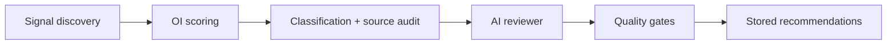

# Recommendation quality and review

## Overview

Recommendations flow through **Opportunity Intelligence (OI)** discovery and scoring, then an optional **AI Recommendation Reviewer** quality gate. This document covers reviewer inputs, outputs, and configurable gates.

## Pipeline



## Reviewer inputs

The reviewer (prompt `ai_recommendation_reviewer` v2) receives JSON built by `build_reviewer_context()`:

### Site context

| Field | Source |
|-------|--------|
| `workspace_url` | Autopilot workspace |
| `business_type`, `primary_niche` | Site Strategy Profile |
| `known_products`, `known_categories` | Niche profile / website analysis |
| `existing_articles` | Content inventory titles |
| `top_entities` | Known entities and products |
| `existing_coverage` | Publishing Memory coverage topics |

### Competitor context

| Field | Source |
|-------|--------|
| `competitor_domains` | Competitor snapshot URLs |
| `competitor_gap_topics` | Topics/products from competitor snapshots |

### Recommendation context (per item)

| Field | Description |
|-------|-------------|
| `title`, `topic`, `description` | Recommendation text |
| `classification` | e.g. `comparison`, `how_to`, `glossary` |
| `origin_bucket` | entity, demand, competitor, etc. |
| `supporting_evidence` | Compact evidence rows |
| `score`, `competitor_gap`, `coverage_gap` | OI scores |

## Reviewer outputs

Each review returns structured scores:

```json
{
  "recommendation_id": "...",
  "site_fit": 0.92,
  "search_value": 0.88,
  "competitor_gap_value": 0.90,
  "duplicate_risk": 0.05,
  "commercial_value": 0.80,
  "decision": "keep",
  "recommended_action": "create",
  "reason": "Strong competitor gap around peptide reconstitution."
}
```

### Decisions

| Decision | Effect |
|----------|--------|
| `keep` | Apply score gates; may promote CREATE |
| `reject` | Action → `ignore` |
| `downrank` | Action → `monitor` (refresh/expand preserved when site fit ≥ 0.35) |
| `flag` | Keeps action; sets `metadata.ai_review_flag` |

Scores are persisted in `metadata.ai_review` on each recommendation row.

## Quality gates

Applied in `apply_reviews_to_recommendations()` after the model response:

| Env variable | Default | Behavior |
|--------------|---------|----------|
| `RECOMMENDATION_MIN_SITE_FIT` | 0.60 | Below → `ignore` |
| `RECOMMENDATION_MIN_SEARCH_VALUE` | 0.50 | Below → `downrank` to monitor |
| `RECOMMENDATION_MAX_DUPLICATE_RISK` | 0.70 | Above → `ignore` |
| `AI_RECOMMENDATION_REVIEW_MIN_CREATE_SCORE` | 0.70 | Composite threshold for CREATE |
| `AI_RECOMMENDATION_REVIEW_MIN_MONITOR_SCORE` | 0.40 | Minimum composite to stay visible |

Additional heuristic: **glossary** recommendations with low `search_value` and `commercial_value` are downranked to monitor even when the model says keep.

## Fail-open behavior

When the reviewer is disabled, times out, or the OpenAI client is unavailable, OI recommendations pass through unchanged.

## UI

The Recommendations tab shows a compact metadata line:

```text
Type: Comparison · Origin: Competitor Gap · Commercial Value: High · Duplicate Risk: Low
```

Diagnostics tab includes full AI review scores and source composition from OI summary (`recommendation_sources`).

## Related

- Source buckets: [RECOMMENDATION_CLASSIFICATION.md](./RECOMMENDATION_CLASSIFICATION.md)
- Business alignment (ecommerce CREATE gate): `docs/analysis/BUSINESS_ALIGNMENT_SCORING.md`
