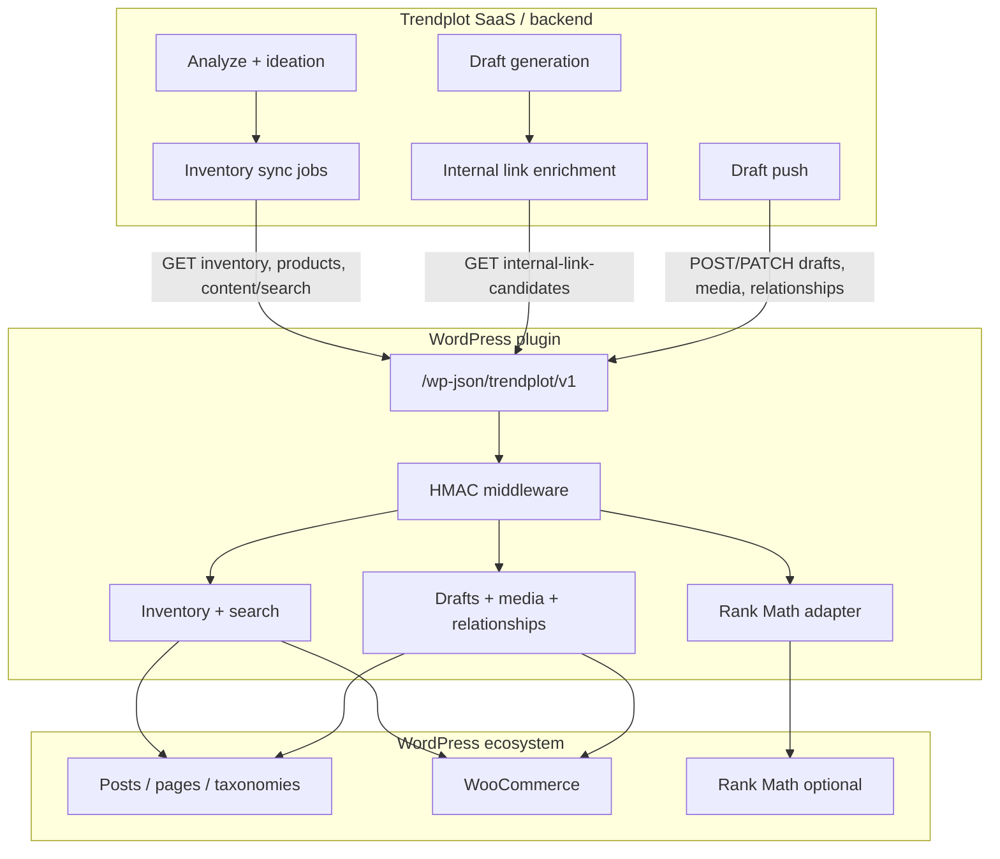

# Trendplot ↔ WordPress Connector — Architecture

## Primary value proposition

**The primary value of the plugin is inventory quality. Publishing is secondary.**

Inventory is the foundation; draft push is a delivery mechanism once recommendations exist.

### What inventory provides

- Accurate products (WooCommerce SKUs, categories, URLs)
- Accurate posts and pages (status, slugs, dates)
- Accurate categories and tags
- Accurate metadata (Rank Math when present)
- Lifecycle fields (`content_hash`, `generated_by_trendplot`, `related_products`) for long-term management

### What inventory enables

| Outcome | Mechanism |
|---------|-----------|
| Better website understanding | Niche profile + catalog from plugin, not crawl guesses |
| Better AI ideation | Valid `related_products`, topic gaps |
| Better scheduling | Know what exists vs what is missing |
| Duplicate avoidance | `GET /content/search` + `content_hash` |
| Refresh opportunities | Stale detection via inventory dates — [CONTENT_LIFECYCLE.md](./CONTENT_LIFECYCLE.md) |
| Product awareness | Product inventory + relationships (Phase 2+) |
| Internal linking (Phase 3) | Real URLs from inventory |

**Primary Phase 1 success metric:** Inventory quality on a WooCommerce site **without crawling**, plus `/content/search` for ideation-grade duplicate and cluster detection. Publishing is explicitly **not** the Phase 1 metric.

Phase 2 publishing, relationships, Phase 3 links/SEO, and Phase 4 licensing **depend on** inventory being correct first.

---

## Architectural principle: Trendplot-initiated (V1)

Trendplot initiates **almost everything**. The plugin responds.

### Preferred V1 interaction model

```text
Trendplot → GET  /inventory
Trendplot → GET  /products
Trendplot → GET  /posts
Trendplot → GET  /pages
Trendplot → GET  /content/search
Trendplot → POST /drafts
Trendplot → PATCH /drafts/{id}
Trendplot → POST /relationships
Trendplot → POST /media
Trendplot → GET  /internal-link-candidates   (Phase 3)

Plugin    → JSON responses only
```

No plugin-initiated analyze, ideation, or generation. No plugin queues.

### V1 complexity to avoid

| Do not build in V1 | Why |
|--------------------|-----|
| Event buses | Trendplot schedules pulls explicitly |
| Queue systems between WP and Trendplot | HTTP request/response is enough |
| Heavy webhook orchestration | Not required for inventory or publish |
| Bidirectional sync | Plugin does not push inventory; Trendplot pulls |
| Webhook-dependent core flows | Search + inventory work offline from events |

### Strictly Phase 4 (not V1)

The following must **not** block or complicate Phases 1–3:

| Capability | Phase |
|------------|-------|
| Heartbeat | 4 |
| Webhooks / event delivery | 4 |
| License validation | 4 |
| Bidirectional sync (plugin pushes inventory) | 4 |
| Domain enforcement | 4 |

V1 remains healthy with scheduled Trendplot pulls (`GET /inventory`, `/content/search`) only.

---

## System layers



| Layer | Responsibility |
|-------|----------------|
| **Trendplot** | When to sync, what to recommend, when to generate, when to push drafts |
| **Plugin** | Authenticate requests, read/write WordPress/Woo safely, normalize payloads |
| **WordPress / Woo / Rank Math** | Source of truth for content and products |

---

## Request direction by phase

| Phase | Trendplot → Plugin | Plugin → Trendplot |
|-------|-------------------|-------------------|
| **1** | `GET /health`, `/site-info`, `/inventory`, `/posts`, `/pages`, `/products`, `/content/search` | None required |
| **2** | `POST/PATCH /drafts`, `POST /media`, `POST /relationships` | None required |
| **3** | `GET /internal-link-candidates`, `GET/POST /rankmath/meta` | None required |
| **4** | Optional: license revoke callback | `POST` heartbeat, webhooks, license validation |

---

## Cross-cutting concerns

### Versioning

- REST namespace: `/wp-json/trendplot/v1`
- Response envelope includes `api_version` and `plugin_version`
- Breaking changes → `v2`; Trendplot negotiates via `/site-info` capabilities

### Authentication (Phase 1+)

- HMAC-signed requests (Trendplot holds signing secret; plugin verifies)
- Site binding via `site_id` header
- Full pairing and license lifecycle deferred to **Phase 4** (Phase 1 uses connect-time credential exchange only)

### Failure handling

| Failure | Behavior |
|---------|----------|
| Plugin unreachable | Fall back to crawl + direct WP REST where configured (`WORDPRESS_CONNECTOR_FALLBACK_TO_REST`) |
| Partial inventory | Return warnings in envelope; Trendplot merges with last-known snapshot |
| Rank Math absent | Capability flag `rankmath: false`; skip SEO read/write |
| Rate limit | Stable error `rate_limited`; retry with backoff |

### Retries and idempotency

- Trendplot retries idempotent **GET**s and **PATCH** drafts with same `external_job_id`
- **POST /drafts** accepts `external_job_id` for deduplication
- **POST /relationships** dedupes on `(post_id, product_id, relation_type)`

### Security model

- Least-privilege WordPress capabilities per endpoint (documented in API contract)
- Secrets never logged; plugin stores only verify key + site id
- Domain binding and license enforcement in Phase 4

---

## Product ↔ article relationships (core)

Relationships are **not** an optional enhancement. They are a **core connector feature** (Phase 2).

**Product page:** related guides, comparisons, storage articles  
**Article page:** related products  

Trendplot pushes and updates relationships via `POST /relationships`. The plugin persists bidirectional meta and may render optional front-end blocks.

See [PRODUCT_ARTICLE_RELATIONSHIPS.md](./PRODUCT_ARTICLE_RELATIONSHIPS.md).

---

## Inventory consolidation (Trendplot-side)

Today crawl writes `workspace_content_inventory` while connector sync partially updates `published_content`. Target state:

- **Plugin inventory is canonical** when connected
- Crawl fills gaps when plugin unavailable
- Single merged view feeds ideation and `GET /content/search` duplicate checks

See [TRENDPLOT_CONNECTOR_PREP_PLAN.md](./TRENDPLOT_CONNECTOR_PREP_PLAN.md).

---

## Related documents

| Document | Topic |
|----------|--------|
| [CONNECTOR_CURRENT_STATE.md](./CONNECTOR_CURRENT_STATE.md) | Existing Trendplot code audit |
| [CONNECTOR_API_CONTRACT.md](./CONNECTOR_API_CONTRACT.md) | Endpoint specifications |
| [CONNECTOR_AUTH_LICENSING.md](./CONNECTOR_AUTH_LICENSING.md) | Auth detail (Phase 4 licensing) |
| [CONNECTOR_INVENTORY_SCHEMA.md](./CONNECTOR_INVENTORY_SCHEMA.md) | Payload shapes |
| [DRAFT_PUBLISHING_CONTRACT.md](./DRAFT_PUBLISHING_CONTRACT.md) | Draft push + Trendplot meta |
| [CONTENT_LIFECYCLE.md](./CONTENT_LIFECYCLE.md) | Long-term content management |
| [PLUGIN_IMPLEMENTATION_ROADMAP.md](./PLUGIN_IMPLEMENTATION_ROADMAP.md) | Phased delivery |
