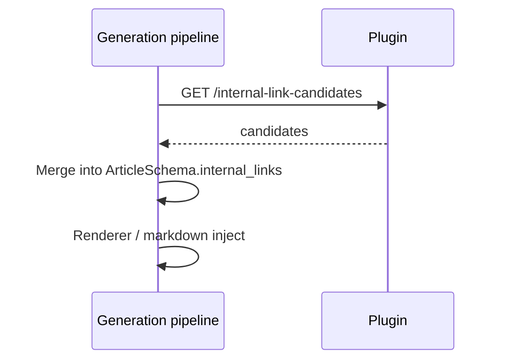

# Internal Linking

**Phase:** 3  
**Direction:** Trendplot `GET` → plugin responds. V1 does not use webhooks for link enrichment.

---

## Purpose

During article generation, Trendplot needs **real** internal link targets from the connected site—not only the product URL heuristic in [`app/internal_links.py`](../../app/internal_links.py).

The plugin searches inventory (posts, pages, products) and returns ranked candidates with suggested anchor text.

---

## GET /internal-link-candidates

### Request

Query or JSON body:

| Parameter | Type | Description |
|-----------|------|-------------|
| `topic` | string | Main topic / keyword |
| `title` | string | Planned article title |
| `content_type` | string | `guide`, `comparison`, etc. |
| `products` | string[] | Product names or IDs |
| `entities` | string[] | Peptides, compounds, concepts |
| `limit` | int | Default 10, max 25 |
| `exclude_urls` | string[] | URLs already in draft |

### Response `data.candidates[]`

| Field | Type | Description |
|-------|------|-------------|
| `id` | int | Post/product ID |
| `url` | string | |
| `title` | string | |
| `type` | string | `post`, `page`, `product` |
| `anchor_text_suggestions` | string[] | 1–3 options |
| `reason` | string | Human-readable match reason |
| `confidence` | float | 0–1 |

### Ranking signals (plugin-side)

1. Title/slug similarity to `topic`
2. Shared product category with `products`
3. Existing `_trendplot_related_products` overlap
4. Higher weight for published editorial vs product pages for in-article links
5. Penalize duplicate topics (same focus keyword via Rank Math if available)

### Capability

- `read` on posts/pages/products

### Errors

- `validation_failed` — empty `topic` and `title`
- `capability_not_supported` — never for this endpoint if inventory works

---

## Trendplot integration

**Fallback:** If connector disconnected, use crawl inventory + product URL only.

**Prerequisite:** Phase 1 inventory quality.

---

## Relation to `/content/search`

| Endpoint | When |
|----------|------|
| `/content/search` | Before generation — avoid duplicates |
| `/internal-link-candidates` | During generation — enrich links |

---

## Acceptance (Phase 3)

Generated draft HTML/markdown includes at least one contextual internal link to an existing site URL when inventory has relevant content, without manual URL entry.
