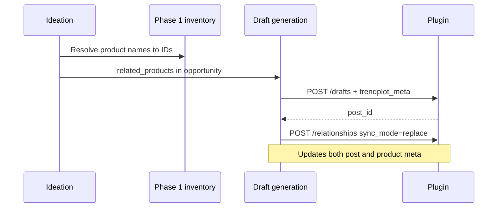

# Product ↔ Article Relationships

**Status: First-class connector feature (Phase 2)** — core to product-aware SEO, not an optional add-on.

Relationships connect WooCommerce products and editorial content. Trendplot **creates, updates, and reconciles** links automatically after inventory resolution and draft push.

---

## Why this is first-class

| Without relationships | With relationships |
|----------------------|-------------------|
| Ideation lists product names as text only | Product pages show real related guides |
| Articles lack commercial context | Readers see related SKUs on editorial content |
| Internal linking guesses URLs | Cluster anchored on product ID graph |

---

## Concrete examples

### Product page: BPC-157

**Product:** BPC-157 (WooCommerce)

**Related articles (maintained by Trendplot):**

- BPC-157 Reconstitution Guide
- BPC-157 Storage Guide
- BPC-157 vs TB-500

Stored on product: `_trendplot_related_articles` = post IDs.  
Stored on each article: `_trendplot_related_products` includes BPC-157 product ID.

### Article page: BPC-157 Storage Guide

**Article:** BPC-157 Storage Guide

**Related products:**

- BPC-157 (primary)
- Bacteriostatic Water (supporting reconstitution context)

Stored on post: `_trendplot_primary_product` = BPC-157, `_trendplot_related_products` = `[bpc157_id, bacteriostatic_water_id]`.

---

## Automatic maintenance by Trendplot



| Step | Action |
|------|--------|
| 1 | Phase 1 inventory maps ideation `related_products` strings → Woo **product IDs** |
| 2 | `POST /drafts` sets `trendplot_meta.related_products` |
| 3 | `POST /relationships` with `primary_product_id` + full `product_ids` list |
| 4 | On regeneration for same `recommendation_id`, `PATCH /drafts` + `relationships` with `sync_mode=replace` |
| 5 | Reassessment / calendar can add sibling articles to same product cluster without duplicates (`/content/search`) |

Trendplot does **not** require manual WP admin linking for standard flows.

---

## Expected outcomes

### Product page

- Related guides, comparisons, storage/handling articles, FAQ content

### Article page

- Related products (primary + secondary)

### Trendplot

- Resolve `related_products` from ideation → Woo IDs via Phase 1 inventory
- `POST /relationships` after every `POST /drafts`
- Update on `PATCH /drafts` when recommendation or product set changes

---

## Storage model (WordPress post meta)

| Meta key | On | Content |
|----------|-----|---------|
| `_trendplot_related_products` | `post` | JSON array of product IDs |
| `_trendplot_related_articles` | `product` | JSON array of post IDs |
| `_trendplot_primary_product` | `post` | Single product ID |
| `_trendplot_content_source` | `post` | `trendplot` |
| `_trendplot_generated` | `post` | boolean (mirrors inventory) |

### Bidirectional consistency

On every `POST /relationships`:

- Update article → products and product → articles
- `sync_mode=replace` removes stale links when cluster is regenerated

---

## POST /relationships

**Phase:** 2  
**Auth:** HMAC  
**Capabilities:** `edit_posts`, `edit_products`

### Request

```json
{
  "post_id": 12345,
  "product_ids": [101, 205],
  "primary_product_id": 101,
  "relation_type": "related",
  "sync_mode": "replace",
  "source": "trendplot",
  "external_job_id": "job-uuid"
}
```

### Response

```json
{
  "post_id": 12345,
  "linked_products": [101, 205],
  "updated_products": [101, 205]
}
```

**Idempotency:** Duplicate `(post_id, product_id)` → no duplicate meta.

---

## Optional front-end blocks (plugin)

- Product: “Related articles” block from `_trendplot_related_articles`
- Article: “Related products” block from `_trendplot_related_products`

---

## Inventory and search exposure

- `GET /inventory` and `/products` include `related_article_ids`
- `GET /content/search` returns `related_products` per hit for clustering

---

## Flow back into inventory and ideation

Relationships are not write-only. After each `POST /relationships`, data must appear on the next Trendplot pull:


| Direction | Data | Consumer |
|-----------|------|----------|
| Plugin → inventory | `related_article_ids` on products; `related_products` / `primary_product` on posts | Catalog, coverage maps |
| Plugin → search | `related_products` on each search hit | Clustering, duplicate checks |
| Inventory → ideation | “BPC-157 has 2 guides, missing comparison” | Opportunity prompts, `related_products` validation |
| Inventory → schedule | Cluster completeness per product | Avoid scheduling duplicate angles |

**Ideation rules enabled by relationship graph:**

- Do not recommend a third “storage” article if two storage posts already link to same `primary_product`
- Prefer `comparison` opportunity when product has guides but no `vs` article
- Pass resolved product **IDs** (not display names) into `opportunity_context.related_products`

**Sync timing:** Trendplot runs `GET /inventory` after relationship push (or on next scheduled sync). No webhook required in V1.

---

## Related documents

- [DRAFT_PUBLISHING_CONTRACT.md](./DRAFT_PUBLISHING_CONTRACT.md)
- [CONNECTOR_API_CONTRACT.md](./CONNECTOR_API_CONTRACT.md)
- [CONTENT_LIFECYCLE.md](./CONTENT_LIFECYCLE.md)
- [PLUGIN_IMPLEMENTATION_ROADMAP.md](./PLUGIN_IMPLEMENTATION_ROADMAP.md)
